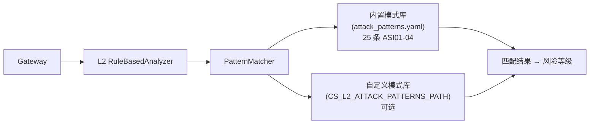

# 攻击模式定制（Attack Patterns）

!!! abstract "本页快速导航"
    [概述](#overview) · [内置模式总览](#builtin-patterns) · [YAML 结构详解](#pattern-structure) · [添加自定义模式](#custom-patterns) · [误报过滤](#false-positives) · [代码位置](#source-code)

## 概述 {#overview}

ClawSentry 的 L2 `RuleBasedAnalyzer` 使用 YAML 格式的**攻击模式库**对工具调用内容进行确定性正则检测。内置库（`attack_patterns.yaml`）涵盖 **25 条模式**，覆盖 OWASP Agentic AI Top 5（ASI01-04）四大类别。



!!! info "合并而非替换"
    自定义模式文件与内置模式**合并**使用，最终生效 = 内置 25 条 + 自定义 N 条。

---

## 内置模式总览 {#builtin-patterns}

共 25 条，分 4 大类别：

| 类别 | ID 前缀 | 条数 | 主要威胁类型 |
|------|---------|:----:|------------|
| **ASI01** | `ASI01-*` | 3 | 提示词注入 / 目标劫持 |
| **ASI02** | `ASI02-*` | 6 | 数据外传 / 凭证泄露 |
| **ASI03** | `ASI03-*` | 8 | 代码执行 / 混淆 |
| **ASI04** | `ASI04-*` | 8 | 供应链攻击 / 容器逃逸 |

### ASI01 — 提示词注入 / 目标劫持（3 条）

| 模式 ID | 触发条件 | 典型攻击场景 |
|---------|---------|------------|
| `ASI01-001` | 读取 .md/.txt 文件，内容含 `ignore previous instructions` 类指令 | README 中隐藏的覆写指令 |
| `ASI01-002` | 读取/请求 HTML/XML，含 `<!--... execute ...-->` 注释注入 | 网页 HTML 注释劫持 Agent |
| `ASI01-003` | 工具调用中含 Unicode 零宽字符 `\u200b \u200c \ufeff` | 不可见字符注入，绕过视觉检查 |

### ASI02 — 数据外传（6 条）

`wget --post-data`、`curl -F 文件上传`、DNS 隐蔽外传、S3/GCS 对象上传、SSH 外传、Git remote 外传

### ASI03 — 代码执行 / 混淆（8 条）

`eval+base64 一行脚本`、`chmod +x` 后即执行、Python subprocess shell=True、Node child_process、PowerShell -EncodedCommand、Perl exec、反弹 shell (`bash -i >& /dev/tcp/...`)、ICMP 隐蔽隧道

### ASI04 — 供应链 / 容器逃逸（8 条）

pip/npm/cargo 私有源替换劫持、容器 `nsenter --target 1`/`--privileged` 逃逸、`docker.sock` 挂载利用、内核模块强制加载、crontab 持久化驻留、systemd 服务安装、`LD_PRELOAD` 注入、`/proc/sys` 内核参数篡改

---

## YAML 模式结构 {#pattern-structure}

```yaml
version: "1.0"

patterns:
  - id: "MY-001"                   # 全局唯一 ID（字符串）
    category: "data_exfil"         # 分类标签（仅用于日志，不影响检测）
    description: "检测向未知域名上传文件"
    risk_level: "high"             # low / medium / high / critical

    triggers:                      # 触发条件（决定"什么情况下运行检测"）
      logic: "AND"                 # AND: 所有子条件同时满足
      conditions:
        - tool_names: ["bash", "exec"]      # 工具名白名单（任一匹配即满足）
        - OR:                               # OR: 子条件满足其一即可
            - file_extensions: [".sh"]
            - command_patterns: ["upload"]

    detection:                     # 检测内容（正则匹配）
      regex_patterns:
        - pattern: "curl.*--upload-file"   # Python re 兼容正则
          weight: 9                         # 权重 1-10，影响命中分数
        - pattern: "multipart/form-data"
          weight: 7

    false_positive_filters:        # 白名单（匹配时跳过该模式检测）
      - type: "whitelist_path"
        paths: ["/tmp/test_*", "*/fixtures/*"]

    references:                    # 可选：文献/CVE 溯源
      papers: ["owasp-aitop10-2025"]
      incidents: ["CVE-2024-XXXXX"]

    mitre_attack:                  # 可选：MITRE ATT&CK 映射
      tactics: ["TA0010"]          # Exfiltration
      techniques: ["T1048"]
```

### triggers 触发条件详解

**单工具过滤：**
```yaml
triggers:
  tool_names: ["read_file", "read"]  # 仅对 read_file/read 工具生效
```

**AND 复合条件（所有必须满足）：**
```yaml
triggers:
  logic: "AND"
  conditions:
    - tool_names: ["bash"]
    - OR:
        - file_extensions: [".pem", ".key"]
        - file_patterns: ["id_rsa*", "*.password"]
        - command_patterns: ["cat\\s+.*\\.env"]
```

**无 triggers**（省略时对所有事件生效）：
```yaml
# triggers 省略 → 所有工具调用都会经过该模式检测
```

---

## 添加自定义模式 {#custom-patterns}

**Step 1：创建自定义模式文件**

```yaml
# /opt/clawsentry/my_patterns.yaml
version: "1.0"

patterns:
  - id: "CORP-001"
    category: "internal_exfil"
    description: "检测向公司白名单外的 S3 桶上传数据"
    risk_level: "high"
    triggers:
      logic: "AND"
      conditions:
        - tool_names: ["bash", "exec"]
        - OR:
            - command_patterns: ["s3://(?!my-company-bucket)"]
            - command_patterns: ["aws s3 cp.*s3://(?!my-company)"]
    detection:
      regex_patterns:
        - pattern: "aws\\s+s3\\s+(cp|sync|mv).*s3://"
          weight: 8
    false_positive_filters:
      - type: "whitelist_path"
        paths: ["*/test_*", "*/mock_*"]

  - id: "CORP-002"
    category: "secret_access"
    description: "检测访问公司 Vault 以外的密钥服务"
    risk_level: "critical"
    triggers:
      tool_names: ["http_request", "web_fetch"]
    detection:
      regex_patterns:
        - pattern: "secretsmanager\\.(?!amazonaws\\.com)"
          weight: 10
```

**Step 2：配置环境变量**

```bash
export CS_L2_ATTACK_PATTERNS_PATH=/opt/clawsentry/my_patterns.yaml
```

或在 `.env` 文件中：
```dotenv
CS_L2_ATTACK_PATTERNS_PATH=/opt/clawsentry/my_patterns.yaml
```

**Step 3：重启 Gateway 使配置生效**

```bash
# 若使用 clawsentry stack
clawsentry stack  # Ctrl+C 后重新运行

# 若单独运行 gateway
clawsentry gateway
```

启动日志中会显示已加载的模式数量：
```
INFO  PatternMatcher loaded 25 core + 2 custom patterns (total: 27)
```

**Step 4：上线前做作者期治理检查**

```bash
clawsentry rules lint --attack-patterns /opt/clawsentry/my_patterns.yaml --json
clawsentry rules dry-run --attack-patterns /opt/clawsentry/my_patterns.yaml \
  --events examples/sample-events.jsonl --json
```

这一步不会修改运行时行为，但会给出当前 pattern surface 的 fingerprint、source summary、重复/冲突 findings 和 sample event 命中结果。完整治理面说明见：[CS-01 规则治理](rule-governance.md)。

---

## 误报过滤 {#false-positives}

`false_positive_filters` 允许为模式声明"已知安全"的路径，在这些路径下跳过该模式检测：

```yaml
false_positive_filters:
  - type: "whitelist_path"
    paths:
      - "/tmp/test_*"          # 临时测试文件
      - "*/node_modules/*"     # 依赖包目录
      - "*/test_fixtures/*"    # 测试夹具
      - "*/mock_data/*"        # 模拟数据目录
```

当事件的目标路径匹配任意白名单 glob 模式时，该模式**跳过检测**（不计入风险分数）。

!!! tip "生产环境建议"
    对于误报率较高的模式（如 ASI03-001 零宽字符），可在生产部署前先将其加入白名单，收集真实数据后再调整阈值，而非直接删除模式。

---

## 代码位置 {#source-code}

| 模块 | 路径 | 职责 |
|------|------|------|
| PatternMatcher | `src/clawsentry/gateway/pattern_matcher.py` | 加载 YAML、执行 AND/OR 触发逻辑、正则匹配 |
| 内置模式库 | `src/clawsentry/gateway/attack_patterns.yaml` | 25 条 ASI01-04 核心模式定义 |
| RuleBasedAnalyzer | `src/clawsentry/gateway/semantic_analyzer.py` | 集成 PatternMatcher，输出 L2 分析结果 |
| DetectionConfig | `src/clawsentry/gateway/detection_config.py` | `patterns_path` 字段（自定义文件路径） |

---

## 相关页面

- [L2 语义分析](../decision-layers/l2-semantic.md) — PatternMatcher 的集成点与 RuleBasedAnalyzer 工作机制
- [自进化模式库](pattern-evolution.md) — 从生产数据自动生成候选模式并晋升为稳定规则
- [检测管线配置](../configuration/detection-config.md) — `CS_L2_ATTACK_PATTERNS_PATH` 完整参数说明
- [环境变量参考](../configuration/env-vars.md) — 所有 `CS_*` 环境变量列表
