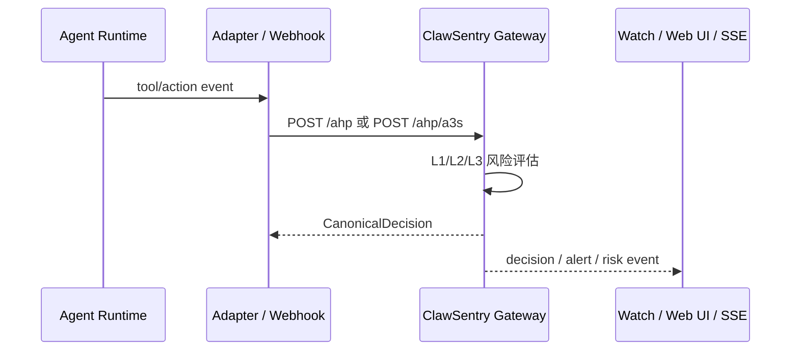

# API 概览

<section class="cs-doc-hero cs-doc-hero--api" markdown>
<div class="cs-eyebrow">ClawSentry API Surface</div>

## 面向企业 Web 接入的 API 地图

ClawSentry 的公开 API 分为决策入口、报表监控、实时 SSE、L3 advisory 和 OpenClaw Webhook。每个端点都由源码 route、覆盖矩阵、OpenAPI operation 与 Markdown anchor 共同校验。

<div class="cs-actions" markdown>
[查看交互 Reference](reference.md){ .md-button .md-button--primary }
[API 有效性报告](validity-report.md){ .md-button }
[下载 OpenAPI JSON](openapi.json){ .md-button }
</div>
</section>

<div class="cs-metric-grid" markdown>
<div class="cs-metric" markdown><span>Coverage entries</span><strong>47</strong><small>public / enterprise / excluded 全量纳入</small></div>
<div class="cs-metric" markdown><span>OpenAPI operations</span><strong>44</strong><small>排除静态 UI 与重复 service-local health</small></div>
<div class="cs-metric" markdown><span>Public routes</span><strong>35</strong><small>可供默认 API Reference 浏览</small></div>
<div class="cs-metric" markdown><span>Enterprise conditional</span><strong>9</strong><small>启用企业模式后注册</small></div>
</div>

## Web 前端应该先看什么

!!! tip "推荐接入顺序"
    1. 先用 `GET /health` 与 `GET /metrics` 确认 Gateway 可达性与指标边界。
    2. 再接 `GET /report/summary`、`GET /report/sessions`、`GET /report/session/{session_id}/page` 形成仪表板首屏。
    3. 需要实时 UI 时接 `GET /report/stream`，并通过 `?token=` 或 Bearer token 处理浏览器侧鉴权。
    4. 只有在需要处置动作时，再接 acknowledge、enforcement、quarantine 与 L3 advisory 的写入型端点。

| 目标 | 首选端点 | 说明 | 继续阅读 |
| --- | --- | --- | --- |
| 判断服务是否可用 | `GET /health` | Gateway 健康检查，不需要认证 | [健康检查](reporting.md#get-health) |
| 首屏运营概览 | `GET /report/summary` | 聚合统计、风险分布、活跃会话 | [报表摘要](reporting.md#get-report-summary) |
| 会话列表 | `GET /report/sessions` | 支持 Web UI 清单和筛选 | [会话列表](reporting.md#get-report-sessions) |
| 会话详情分页 | `GET /report/session/{session_id}/page` | 推荐给前端使用，避免一次性拉取过多事件 | [分页回放](reporting.md#get-report-session-page) |
| 实时事件 | `GET /report/stream` | SSE；支持浏览器 query token | [SSE 事件流](reporting.md#get-report-stream) |
| 告警处置 | `GET /report/alerts` / `POST /report/alerts/{alert_id}/acknowledge` | 查询和确认告警 | [告警端点](reporting.md#get-report-alerts) |

## API 分区

<div class="cs-card-grid cs-card-grid--compact" markdown>

<div class="cs-card" markdown>
### 决策入口
`POST /ahp`、`POST /ahp/a3s`、`POST /ahp/codex`、`POST /ahp/resolve`

把 Agent 事件提交给 Gateway，获得 `allow / block / defer / modify` 判决，或回写人工审批结果。
</div>

<div class="cs-card" markdown>
### 报表与监控
`GET /report/*`、`GET /metrics`、`GET /health`

查询聚合统计、会话轨迹、风险时间线、告警和 Prometheus 指标；`/report/*` 是文档分组别名，不是实际 route。
</div>

<div class="cs-card" markdown>
### 实时事件流
`GET /report/stream`

通过 SSE 接收 decision、alert、risk、DEFER、budget 和 L3 advisory 事件；浏览器可使用 query token。
</div>

<div class="cs-card" markdown>
### Webhook 接入
`POST /webhook/openclaw`

接收 OpenClaw Webhook，执行 token/HMAC/timestamp/IP/idempotency 检查后归一化为 ClawSentry 事件。
</div>

</div>

## 鉴权与运行边界

| 边界 | 适用范围 | 说明 |
| --- | --- | --- |
| `CS_AUTH_TOKEN` | Gateway HTTP API | 生产环境必须设置。为空时 Gateway Bearer 认证会被禁用，仅适合本地开发。 |
| `CS_METRICS_AUTH` | `GET /metrics` | 为 `true` 时 metrics 也要求 Bearer token。 |
| `?token=` | `GET /report/stream` / Web UI | 浏览器友好的 SSE 与 UI 登录路径；token 会进入 sessionStorage。 |
| `OPENCLAW_WEBHOOK_TOKEN` | `POST /webhook/openclaw` | Webhook 主令牌。 |
| `OPENCLAW_WEBHOOK_SECRET` | `POST /webhook/openclaw` | HMAC 密钥；配置后 strict 模式会拒绝缺失或无效签名。 |
| Enterprise mode | `/enterprise/*` | 条件注册端点；默认 Reference 标注为 enterprise，不承诺默认环境可用。 |

!!! warning "生产提示"
    `GET /health` 是公开健康检查；`GET /metrics` 是否需要认证由 `CS_METRICS_AUTH` 控制；其余 Gateway API 在 `CS_AUTH_TOKEN` 为空时也会变成无认证模式。生产环境不要依赖默认空 token。

## 典型调用流程



## 有效性与防漂移

本仓库维护三份机器可读产物，便于接入方复跑：

- [`api-coverage.json`](api-coverage.json)：逐端点语义覆盖矩阵，记录 service、method、path、auth、示例、错误、Markdown ref、OpenAPI ref。
- [`openapi.json`](openapi.json)：交互式 API Reference 使用的 OpenAPI artifact。
- [`api-validity.json`](api-validity.json)：源码 route、Markdown anchor、OpenAPI operation、文档端点提及的可溯源核验结果。

人类可读版本见 [API 有效性报告](validity-report.md)。生成/校验命令：

```bash
python scripts/docs_api_inventory.py validate
python scripts/docs_api_inventory.py report --output-dir .omx/reports --docs-output site-docs/api
```
