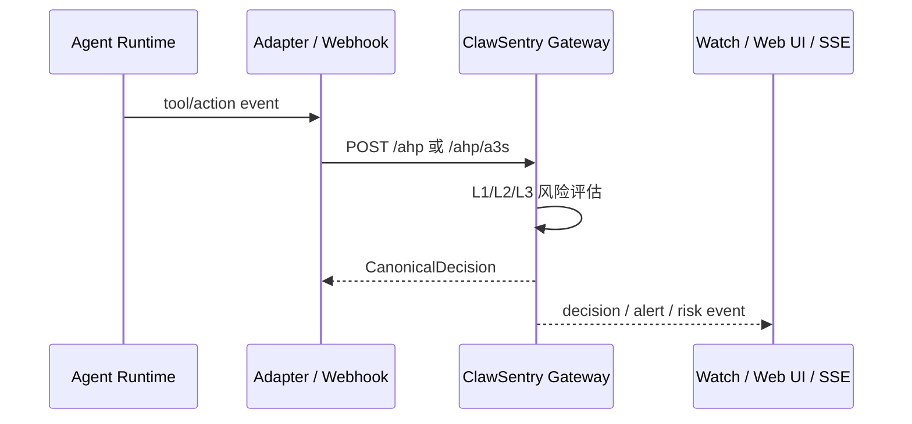

# API 概览

ClawSentry API 面向两类读者：

- **使用者 / 运维**：查看健康状态、会话、告警、风险趋势和 L3 advisory 结果。
- **二次开发者**：把新的 Agent 运行时、Webhook 或审批系统接入 ClawSentry。

如果你只想查字段、请求体或响应示例，直接打开 [交互式 API Reference](reference.md)。如果你想先知道“该调用哪一类 API”，从本页开始。

## API 分区

### 决策入口
`/ahp`、`/ahp/a3s`、`/ahp/codex`、`/ahp/resolve`

把 Agent 事件提交给 Gateway，获得 `allow / block / defer / modify` 判决，或回写人工审批结果。

### 监控与报表
`/report/*`、`/metrics`、`/health`

查询聚合统计、会话轨迹、风险时间线、告警和 Prometheus 指标。

### 实时事件流
`/report/stream`

通过 SSE 接收决策、告警、风险变化、L3 advisory job/review 等事件。

### Webhook 接入
`/webhook/openclaw`

接收 OpenClaw Webhook，执行 token/HMAC/timestamp/IP/idempotency 检查后归一化为 ClawSentry 事件。

## 先准备什么

| 准备项 | 适用范围 | 说明 |
| --- | --- | --- |
| `CS_AUTH_TOKEN` | Gateway HTTP API | 生产环境必须设置。为空时 Gateway Bearer 认证会被禁用，仅适合本地开发。 |
| `OPENCLAW_WEBHOOK_TOKEN` | OpenClaw Webhook receiver | Webhook 主令牌。 |
| `OPENCLAW_WEBHOOK_SECRET` | OpenClaw Webhook receiver | HMAC 密钥；配置后 strict 模式会拒绝缺失或无效签名。 |
| Gateway 地址 | 调用方 | 默认示例使用 `http://127.0.0.1:8080`。 |
| Webhook receiver 地址 | OpenClaw Webhook | 与 Gateway 是不同服务面，文档用 `service` 字段区分。 |

!!! warning "认证边界"
    `GET /health` 是公开健康检查；`GET /metrics` 是否需要认证由 `CS_METRICS_AUTH` 控制；其余 Gateway API 在 `CS_AUTH_TOKEN` 为空时也会变成无认证模式。生产环境不要依赖默认空 token。

## 端点地图

| 任务 | 端点 | 读者 | 继续阅读 |
| --- | --- | --- | --- |
| 提交同步决策 | `POST /ahp` | 二次开发者 | [决策端点](decisions.md#post-ahp) |
| 接入 a3s-code HTTP Transport | `POST /ahp/a3s` | 二次开发者 | [决策端点](decisions.md#post-ahp-a3s) |
| 接入 Codex hook preflight | `POST /ahp/codex` | 二次开发者 | [决策端点](decisions.md#post-ahp-codex) |
| 回写 DEFER 审批 | `POST /ahp/resolve` | 运维 / 审批系统 | [决策端点](decisions.md#post-ahp-resolve) |
| 查询健康状态 | `GET /health` | 运维 | [报表与监控](reporting.md#get-health) |
| 查询报表与会话 | `GET /report/*` | 运维 / UI | [报表与监控](reporting.md) |
| 订阅实时事件 | `GET /report/stream` | 前端 / CLI / 集成方 | [SSE 事件流](reporting.md#get-report-stream) |
| 接收 OpenClaw Webhook | `POST /webhook/openclaw` | OpenClaw 集成方 | [Webhook API](webhooks.md) |

## 典型调用流程

## 覆盖与防漂移

本仓库维护两份机器可读产物：

- [`api-coverage.json`](api-coverage.json)：逐端点语义覆盖矩阵，记录 service、method、path、auth、示例、错误、Markdown ref、OpenAPI ref。
- [`openapi.json`](openapi.json)：交互式 API Reference 使用的 OpenAPI artifact。

它们由 `scripts/docs_api_inventory.py` 生成/校验，并由测试保护，避免新增端点后文档静默漏掉。
