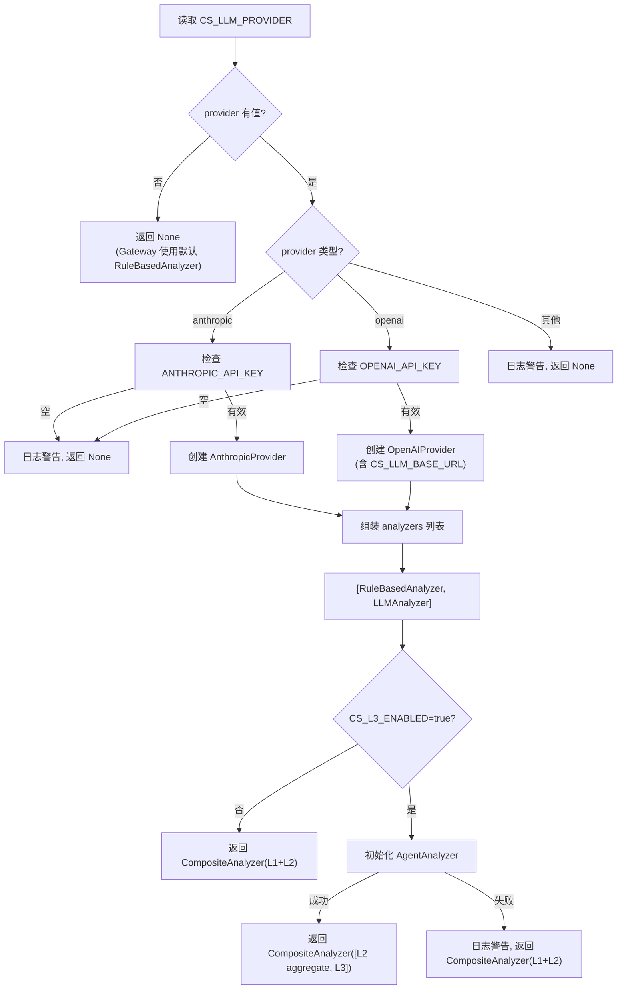

# LLM 配置

ClawSentry 的三层决策模型中，L2（语义分析）和 L3（审查 Agent）依赖 LLM 提供深度安全分析。本页介绍如何配置各种 LLM 提供商，以及各决策模式的特性和成本考量。

---

## 无 LLM 模式（纯 L1）

不配置任何 LLM 时，ClawSentry 仅运行 L1 规则引擎。

```bash title=".env.clawsentry"
# 不设置 CS_LLM_PROVIDER，或显式留空
CS_LLM_PROVIDER=
```

**特性**：

| 指标 | 数值 |
|------|------|
| 决策延迟 | < 1ms |
| API 成本 | 零 |
| 依赖 | 无（纯 Python 标准库） |
| 决策质量 | 基于规则的确定性判断 |

!!! success "适用场景"
    - 快速原型开发和测试
    - 对延迟极度敏感的场景
    - 不想引入 LLM 依赖的最小化部署
    - D1-D5 五维评分和短路规则已能满足安全需求

!!! info "内部工作原理"
    无 LLM 时，`build_analyzer_from_env()` 返回 `None`，Gateway 使用默认的 `RuleBasedAnalyzer`。L2 阶段在 `pre_action` + `medium` 风险事件触发时仍会运行，但使用的是纯规则语义分析（`RuleBasedAnalyzer`），检查 `risk_hints`、关键域模式和危险意图模式。

---

## Anthropic Claude

使用 Anthropic 的 Claude 系列模型进行 L2 语义分析。

### 配置

```bash title=".env.clawsentry"
CS_LLM_PROVIDER=anthropic
ANTHROPIC_API_KEY=sk-ant-api03-xxxxxxxxxxxxx
```

### 可选配置

```bash
# 覆盖默认模型（默认由 AnthropicProvider 决定）
CS_LLM_MODEL=claude-sonnet-4-20250514
```

### 安装依赖

```bash
pip install clawsentry[llm]
# 或单独安装
pip install anthropic
```

!!! tip "模型选择建议"
    - **Claude Sonnet**: 速度与质量平衡，推荐用于 L2 语义分析
    - **Claude Haiku**: 更快更便宜，适合高吞吐场景
    - **Claude Opus**: 最高质量，推荐用于 L3 审查 Agent（需更多推理能力）

---

## OpenAI GPT

使用 OpenAI 的 GPT 系列模型进行 L2 语义分析。

### 配置

```bash title=".env.clawsentry"
CS_LLM_PROVIDER=openai
OPENAI_API_KEY=sk-proj-xxxxxxxxxxxxx
```

### 可选配置

```bash
# 覆盖默认模型
CS_LLM_MODEL=gpt-4o
```

### 安装依赖

```bash
pip install clawsentry[llm]
# 或单独安装
pip install openai
```

---

## OpenAI 兼容 API

通过 `CS_LLM_BASE_URL` 可以连接任何兼容 OpenAI Chat Completions API 的服务，包括自托管模型和第三方中转。

### Ollama（本地模型）

```bash title=".env.clawsentry"
CS_LLM_PROVIDER=openai
OPENAI_API_KEY=ollama  # Ollama 不验证 key，但不能为空
CS_LLM_BASE_URL=http://localhost:11434/v1
CS_LLM_MODEL=qwen2.5:7b
```

### vLLM

```bash title=".env.clawsentry"
CS_LLM_PROVIDER=openai
OPENAI_API_KEY=token-xxx
CS_LLM_BASE_URL=http://gpu-server:8000/v1
CS_LLM_MODEL=Qwen/Qwen2.5-72B-Instruct
```

### LiteLLM Proxy

```bash title=".env.clawsentry"
CS_LLM_PROVIDER=openai
OPENAI_API_KEY=sk-litellm-xxx
CS_LLM_BASE_URL=http://litellm-proxy:4000/v1
CS_LLM_MODEL=gpt-4o  # 路由到 LiteLLM 配置的模型
```

### 其他兼容服务

任何实现了 OpenAI `POST /v1/chat/completions` 接口的服务均可使用，包括但不限于：

- **LocalAI** — 本地部署
- **LM Studio** — 桌面端
- **Azure OpenAI** — 需设置对应的 base URL 和 API key
- **DeepSeek** — `CS_LLM_BASE_URL=https://api.deepseek.com/v1`
- **Moonshot (Kimi)** — `CS_LLM_BASE_URL=https://api.moonshot.cn/v1`

!!! warning "API 兼容性要求"
    服务端必须支持以下参数：

    - `messages`（system + user 消息）
    - `max_tokens`
    - `temperature`（ClawSentry 固定使用 `0.0` 确保确定性输出）

    返回格式必须包含 `choices[0].message.content`。

---

## L2 语义分析器类型

ClawSentry 的 L2 层支持三种分析器实现，由 `build_analyzer_from_env()` 自动构建：

### RuleBasedAnalyzer（规则分析器）

无需 LLM，基于模式匹配的语义分析。

**触发条件**：
- `risk_hints` 中包含高危语义标记（如 `credential_exfiltration`、`privilege_escalation`）
- 文本匹配关键域模式（`prod`、`credential`、`secret`、`token`、`password` 等关键词）
- 文本匹配危险意图模式（`exfiltrate`、`bypass`、`disable security` 等）
- 存在手动 L2 升级标记

**特性**：
- 延迟 < 0.1ms
- 无外部依赖
- 始终作为 `CompositeAnalyzer` 的第一个分析器运行

### LLMAnalyzer（LLM 分析器）

调用配置的 LLM 进行深度语义分析。

**工作方式**：

1. 构建包含事件详情的 prompt（工具名、payload、risk_hints、L1 评分结果）
2. 要求 LLM 返回 JSON 格式的风险评估：
   ```json
   {
     "risk_assessment": "low|medium|high|critical",
     "reasons": ["reason1", "reason2"],
     "confidence": 0.85
   }
   ```
3. 解析响应并与 L1 结果合并（只升不降）

**超时和降级**：

| 参数 | 默认值 | 说明 |
|------|--------|------|
| 超时 | 3000ms | LLM 调用的最大等待时间 |
| max_tokens | 256 | LLM 响应的最大 token 数 |
| temperature | 0.0 | 确保确定性输出 |

!!! note "LLM 失败处理"
    当 LLM 调用超时、网络错误或响应解析失败时，`LLMAnalyzer` 返回 `confidence=0.0`，自动降级为 L1 结果。**决不会因为 LLM 错误而阻断正常流程**。

### CompositeAnalyzer（组合分析器）

链式组合多个分析器，按层级递进执行，取最高风险结果。

```
CompositeAnalyzer
  ├── CompositeAnalyzer  (L2 聚合层)
  │   ├── RuleBasedAnalyzer  (规则引擎, < 0.1ms)
  │   └── LLMAnalyzer        (LLM 语义分析, < 3s)
  └── AgentAnalyzer          (L3 审查 Agent, < 30s, 可选)
```

**合并策略**：

1. 先执行第一个 analyzer，并检查结果是否已对 HIGH+ 风险给出足够确定的结论
2. 若第一个 analyzer 不够确定，再执行后续 analyzer
3. 过滤掉 `confidence=0.0` 的降级结果
4. 按 `(risk_level, confidence)` 取最大值
5. 如果所有分析器都降级 → 回退到 L1 结果

!!! note "L3 启用时的工厂装配"
    `build_analyzer_from_env()` 在 `CS_L3_ENABLED=true` 时会返回嵌套结构：
    `CompositeAnalyzer([CompositeAnalyzer([RuleBasedAnalyzer, LLMAnalyzer]), AgentAnalyzer])`。
    这意味着外层是否进入 L3，取决于**聚合后的 L2 结果**，而不是单个 `RuleBasedAnalyzer` 或 `LLMAnalyzer`。

---

## L3 审查 Agent

L3 是最高决策层，启用后可对高风险事件进行多轮工具调用的深度审查。

### 启用条件

```bash title=".env.clawsentry"
# 必须先配置 LLM Provider
CS_LLM_PROVIDER=anthropic
ANTHROPIC_API_KEY=sk-ant-xxx

# 然后启用 L3
CS_L3_ENABLED=true
```

!!! warning "L3 依赖 LLM Provider"
    `CS_L3_ENABLED=true` 但未配置有效的 LLM Provider 时，L3 初始化会静默失败并记录警告日志，系统继续以 L1+L2 模式运行。

### 组件架构

L3 审查 Agent 由以下组件构成：

| 组件 | 说明 |
|------|------|
| `AgentAnalyzer` | L3 分析器主体，编排多轮对话 |
| `ReadOnlyToolkit` | 只读工具集，Agent 可安全调用（读取文件、查看轨迹、搜索代码等） |
| `SkillRegistry` | 技能注册表，加载内置和自定义审查技能 |

### 内置审查技能

ClawSentry 内置 6 个审查技能（YAML 定义），按优先级排序：

| 技能 | 优先级 | 说明 |
|------|--------|------|
| `shell-audit` | 10 | Shell 命令安全审查 |
| `credential-audit` | 10 | 凭据操作安全审查 |
| `code-review` | 8 | 代码变更安全审查 |
| `file-system-audit` | 8 | 文件系统操作审查 |
| `network-audit` | 8 | 网络操作安全审查 |
| `general-review` | 0 | 通用安全审查（兜底） |

### 自定义技能

通过 `AHP_SKILLS_DIR` 环境变量指定自定义技能目录：

```bash
AHP_SKILLS_DIR=/etc/clawsentry/custom-skills/
```

自定义技能与内置技能合并加载。技能定义格式为 YAML 文件，包含 `name`、`priority`、`enabled`、`triggers`、`system_prompt` 等字段。

### L3 性能特征

| 指标 | 典型值 | 说明 |
|------|--------|------|
| 延迟 | 5-30 秒 | 取决于模型速度和工具调用轮次 |
| 成本 | 中-高 | 多轮对话消耗更多 token |
| 触发频率 | 极低 | 仅在 L1/L2 判定为高危且需要深度审查时触发 |

!!! danger "L3 永不静默降级"
    与 L2 不同，L3 Agent 的任何失败都会显式标记为 `confidence=0.0`，但不会静默降低风险等级。这确保了审计完整性——如果 L3 被触发但失败了，审计日志会清楚记录这一事实。

---

## LLM Factory 工作原理

`build_analyzer_from_env()` 是 LLM 分析器的构建工厂函数，根据环境变量自动组装正确的分析器链。

### 构建流程



### Gateway 集成

```python
# stack.py 中的调用
analyzer = build_analyzer_from_env(trajectory_store=gateway.trajectory_store)
if analyzer is not None:
    gateway.policy_engine = L1PolicyEngine(analyzer=analyzer)
```

当 `build_analyzer_from_env()` 返回非 `None` 时，`L1PolicyEngine` 在 `_should_run_l2()` 条件满足时会调用该 analyzer 进行 L2/L3 分析。

---

## 成本控制

ClawSentry 的分层架构天然具备成本控制能力。

### 决策层触发条件

| 层级 | 触发条件 | 典型占比 |
|------|----------|----------|
| L1 规则引擎 | **所有事件** | 100% |
| L2 语义分析 | `pre_action` + `medium` 风险 + 关键域匹配 / 手动标记 | ~10-20% |
| L3 审查 Agent | L1/L2 升级为 `high`/`critical` + 需深度审查 | ~1-3% |

!!! success "零成本处理大部分事件"
    在典型工作负载中：

    - **70-80%** 的事件是只读操作或低风险写入 → L1 直接 ALLOW，零 LLM 成本
    - **10-20%** 的事件触发 L2 语义分析 → 单次 LLM 调用（<256 tokens）
    - **1-3%** 的事件触发 L3 审查 → 多轮 LLM 调用（可能消耗数千 tokens）

### 降低成本的策略

1. **使用本地模型**：通过 Ollama + `CS_LLM_BASE_URL` 将 LLM 调用保持在本地，消除 API 成本

    ```bash
    CS_LLM_PROVIDER=openai
    CS_LLM_BASE_URL=http://localhost:11434/v1
    CS_LLM_MODEL=qwen2.5:7b
    OPENAI_API_KEY=ollama
    ```

2. **禁用 L3**：L3 的 token 消耗远高于 L2。如果 L1+L2 已足够，保持 `CS_L3_ENABLED=false`

3. **选择高性价比模型**：

    | 提供商 | L2 推荐 | L3 推荐 |
    |--------|---------|---------|
    | Anthropic | Claude Haiku | Claude Sonnet |
    | OpenAI | GPT-4o mini | GPT-4o |
    | 本地 | Qwen2.5 7B | Qwen2.5 72B |

4. **L2 超时控制**：`CS_L2_TIMEOUT_MS` 默认采用 60 秒软超时，并受 `CS_HARD_TIMEOUT_MS` 兜底，避免 provider 长时间挂起

---

## 完整配置示例

### 纯规则引擎（零成本）

```bash title=".env.clawsentry"
# 不设置 CS_LLM_PROVIDER
# L1 规则引擎 + RuleBasedAnalyzer 语义规则
```

### Anthropic Claude 完整三层

```bash title=".env.clawsentry"
CS_LLM_PROVIDER=anthropic
ANTHROPIC_API_KEY=sk-ant-api03-xxxxxxxxxxxxx
CS_LLM_MODEL=claude-sonnet-4-20250514
CS_L3_ENABLED=true
AHP_SKILLS_DIR=/etc/clawsentry/custom-skills
```

### OpenAI GPT 仅 L2

```bash title=".env.clawsentry"
CS_LLM_PROVIDER=openai
OPENAI_API_KEY=sk-proj-xxxxxxxxxxxxx
CS_LLM_MODEL=gpt-4o
# CS_L3_ENABLED 保持默认 false
```

### Ollama 本地模型（零 API 成本）

```bash title=".env.clawsentry"
CS_LLM_PROVIDER=openai
OPENAI_API_KEY=ollama
CS_LLM_BASE_URL=http://localhost:11434/v1
CS_LLM_MODEL=qwen2.5:7b
CS_L3_ENABLED=true
```

### DeepSeek API

```bash title=".env.clawsentry"
CS_LLM_PROVIDER=openai
OPENAI_API_KEY=sk-deepseek-xxxxxxxxxxxxx
CS_LLM_BASE_URL=https://api.deepseek.com/v1
CS_LLM_MODEL=deepseek-chat
```

---

## InstrumentedProvider 可观测性包装器

当安装 `clawsentry[metrics]` 依赖后，Gateway 会自动将所有 LLM Provider 包装为 `InstrumentedProvider`，在每次 LLM 调用后记录指标到 Prometheus。

### LLMUsage 数据模型

```python
@dataclass(frozen=True)
class LLMUsage:
    input_tokens: int = 0      # 输入 token 数
    output_tokens: int = 0     # 输出 token 数
    provider: str = ""         # 提供商标识（anthropic/openai）
    model: str = ""            # 模型 ID
```

### 自动包装机制

`InstrumentedProvider` 透明地包装 LLM Provider：

1. 委托 `complete()` 调用给内部 Provider
2. 读取 `_last_usage` 获取 token 消耗
3. 调用 `MetricsCollector.record_llm_call()` 记录：
   - `clawsentry_llm_calls_total` — 按 provider/tier/status 计数
   - `clawsentry_llm_tokens_total` — 按 provider/direction 累计
   - `clawsentry_llm_cost_usd_total` — 按 provider 累计预估费用
4. 状态追踪：`ok`（成功）、`timeout`（超时）、`error`（异常）
5. 异常不被吞噬——记录指标后重新抛出

### Protocol 兼容性

`InstrumentedProvider` 实现 `LLMProvider` Protocol，对上层代码完全透明。`provider_id` 和 `_last_usage` 属性均委托给内部 Provider。

### 预估价格

| 提供商 | 输入价格 ($/M tokens) | 输出价格 ($/M tokens) |
|--------|:---------------------:|:---------------------:|
| Anthropic | $3.00 | $15.00 |
| OpenAI | $2.50 | $10.00 |
| 其他（默认） | $5.00 | $15.00 |

!!! note "价格仅为估算"
    预估价格仅用于 Prometheus/报表展示，不代表实际账单金额，也不应作为预算执法依据。实际费用请参考各提供商官方定价页面。

---

## LLM Token 预算控制

Token budget 使用 provider 返回的真实 `LLMUsage` 执法，避免把过期价格表或 OpenAI-compatible provider 估算误当作真实花费。

### 配置

```bash title=".env.clawsentry"
# 按每日总 token 限制 L2/L3
CS_LLM_TOKEN_BUDGET_ENABLED=true
CS_LLM_DAILY_TOKEN_BUDGET=200000
CS_LLM_TOKEN_BUDGET_SCOPE=total  # total | input | output

# 旧字段仅用于迁移提示/估算 telemetry，新部署不要依赖它执法
# CS_LLM_DAILY_BUDGET_USD=5.0
```

### 工作机制

1. **usage 记录**：每次 LLM 调用完成后，`InstrumentedProvider` 读取 provider 报告的 input/output token
2. **预算检查**：下一次 LLM 调用前检查所选 scope 的累计 token 是否超出上限
3. **自动降级/阻断**：预算耗尽后，L2/L3 调用被跳过或按当前模式策略阻断；benchmark mode 默认确定性 block
4. **UTC 日期翻转**：每天 UTC 00:00 自动重置累计 token 和状态
5. **unknown usage**：provider 未返回 usage 时增加 `unknown_usage_calls`，不使用估算价格伪造 token

### 降级行为

| 状态 | 行为 |
|------|------|
| 预算充足 | 正常 L1+L2(+L3) 决策流程 |
| Token 预算耗尽 | L2/L3 跳过或按模式策略阻断，并广播兼容 `budget_exhausted` 事件 |
| 新的 UTC 日期 | 自动重置，恢复完整决策流程 |

### SSE 通知

预算首次耗尽时，Gateway 通过 EventBus 广播事件通知运维人员；事件应包含 token limit、used/remaining、scope 和 source。

!!! tip "建议 token budget"
    先用 `config show --effective` 和报表观察真实 usage，再设置每日 token 上限。个人开发可从 `50000`-`200000` 开始，团队共享环境按用户数和 L3 使用率放大。

---

## 故障排除

### 常见问题

??? question "设置了 CS_LLM_PROVIDER 但日志显示 'falling back to rule-based'"
    检查对应的 API Key 是否正确设置：

    - `CS_LLM_PROVIDER=anthropic` → 需要 `ANTHROPIC_API_KEY`
    - `CS_LLM_PROVIDER=openai` → 需要 `OPENAI_API_KEY`

    注意 `.env.clawsentry` 中的值不能有多余空格或引号嵌套。

??? question "L3 启用了但日志显示 'Failed to initialize L3 AgentAnalyzer'"
    可能原因：

    1. 缺少 `anthropic` 或 `openai` Python 包 → `pip install clawsentry[llm]`
    2. 内置 skills YAML 文件缺失 → 确认 `clawsentry` 安装完整（包含 `gateway/skills/*.yaml`）
    3. 自定义 `AHP_SKILLS_DIR` 路径不存在或无读取权限

??? question "LLM 分析超时，决策延迟过高"
    - 检查 `CS_L2_TIMEOUT_MS` / `CS_L3_TIMEOUT_MS` / `CS_HARD_TIMEOUT_MS` 是否过低；默认软超时分别适合 L2/L3 较慢 provider
    - 如使用远程 API，检查网络连通性
    - 如使用本地模型，确认 GPU 资源是否充足
    - 考虑使用更小的模型以降低延迟

??? question "如何确认 LLM 分析器确实在工作?"
    检查 Gateway 启动日志：
    ```
    INFO [ahp.llm-factory] LLM provider configured: openai (model=gpt-4o, base_url=(default))
    INFO [ahp.llm-factory] L3 AgentAnalyzer enabled
    ```
    如果没有这些日志，说明 LLM 未正确配置。

    决策响应中的 `classified_by` 字段标识实际使用的决策层：

    - `L1` — 仅规则引擎
    - `L2` — L2 语义分析参与
