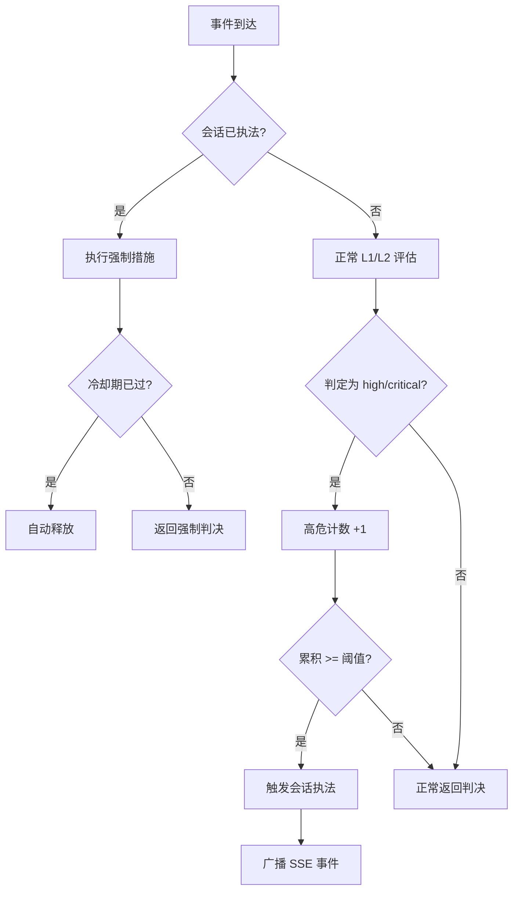
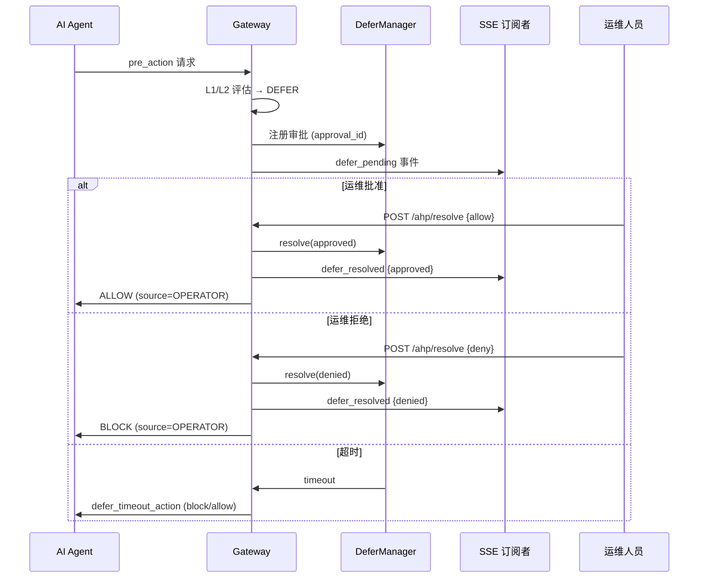

# 策略调优

ClawSentry 的三层决策模型提供了丰富的调优维度。本页详细介绍各层策略的工作原理和调优方法，帮助您在安全性和可用性之间找到最优平衡。

---

## L1 决策层：风险等级与判决映射

L1 是纯规则引擎，零延迟（<1ms），零成本，处理所有事件的第一道关卡。

### 事件类型与处理方式

不同事件类型有不同的默认处理策略：

| 事件类型 | 处理方式 | 说明 |
|----------|----------|------|
| `pre_action` | **根据风险等级决策** | 阻塞式，必须等待判决后才允许执行 |
| `pre_prompt` | **始终 ALLOW** | 用户输入阶段，fail-open 以避免阻断交互 |
| `post_action` | **始终 ALLOW** | 观察性事件，仅记录审计轨迹 |
| `post_response` | **始终 ALLOW** | 观察性事件，仅记录审计轨迹 |
| `error` | **始终 ALLOW** | 错误记录，仅用于审计 |
| `session` | **始终 ALLOW** | 会话生命周期事件 |

### pre_action 风险判决矩阵

对于 `pre_action` 事件，L1 根据风险等级做出判决：

| 风险等级 | 判决 | 行为 |
|----------|------|------|
| `low` | **ALLOW** | 安全操作，直接放行 |
| `medium` | **ALLOW** | 中等风险，放行但记录审计日志，并可触发 L2 分析 |
| `high` | **BLOCK** | 高危操作，直接阻断 |
| `critical` | **BLOCK** | 极危操作，直接阻断 |

!!! note "L2 自动触发条件"
    当 `pre_action` 事件的 L1 风险等级为 `medium` 时，系统会自动触发 L2 语义分析。L2 只能**升级**风险等级（从 medium 升到 high/critical），永不降级。这意味着 L1 判定为 medium 的事件，可能在 L2 分析后被升级为 BLOCK。

---

## D1-D6 六维风险评分

ClawSentry 使用六个独立维度对事件进行风险评估，D1-D5 产生整数分值，D6 为连续浮点值（注入乘数），最终由 v2 加权公式合成综合风险分数。

### 评分公式

\[
\text{base\_score} = 0.4 \times \max(D1, D2, D3) + 0.25 \times D4 + 0.15 \times D5
\]

\[
\text{composite\_score} = \text{base\_score} \times \left(1.0 + 0.5 \times \frac{D6}{3.0}\right)
\]

!!! note "D6=0 时的退化"
    当没有注入信号（D6=0.0）时，公式退化为纯 base_score，完全向后兼容。

综合分数到风险等级的映射：

| 合成分范围 | 风险等级 |
|------------|----------|
| < 0.8 | `low` |
| 0.8 – 1.5 | `medium` |
| 1.5 – 2.2 | `high` |
| ≥ 2.2 | `critical` |

### 短路规则（Short-Circuit）

在计算综合分数之前，系统会先检查短路规则。短路规则的优先级高于综合评分：

| 规则 ID | 条件 | 直接判定 | 说明 |
|---------|------|----------|------|
| **SC-1** | D1=3 且 D2>=2 | `critical` | 高危工具操作敏感路径 |
| **SC-2** | D3=3 | `critical` | 存在高危命令模式 |
| **SC-3** | D1=0 且 D2=0 且 D3=0 | `low` | 纯只读操作 |

### D1：工具类型危险度 (0-3)

评估被调用工具本身的固有危险等级。

| 分值 | 工具类型 | 示例 |
|------|----------|------|
| **0** | 只读工具 | `read_file`、`list_dir`、`search`、`grep`、`glob`、`cat`、`head`、`tail` |
| **1** | 受限写入工具 | `write_file`、`edit_file`、`create_file`、`edit`、`write` |
| **2** | 系统交互工具 / 未知工具 | `http_request`、`install_package`、`fetch`、`web_fetch`；或无法识别的工具名 |
| **3** | 高危工具 | `exec`、`sudo`、`chmod`、`chown`、`mount`、`kill`、`pkill` |

!!! info "bash/shell 工具的特殊处理"
    `bash`、`shell`、`terminal`、`command` 类工具的 D1 分值取决于命令内容：

    - 匹配高危命令模式（`rm -rf`、`sudo` 等）: **D1=3**
    - 操作系统路径（`/etc/`、`/usr/`、`/var/` 等）: **D1=3**
    - 其他命令: **D1=2**

!!! tip "保守降级原则"
    当工具名为空或无法识别时，D1 默认为 **2**（保守降级），确保未知工具不会被低估风险。

### D2：目标路径敏感度 (0-3)

分析操作涉及的文件路径的敏感程度。

| 分值 | 路径类型 | 匹配模式 |
|------|----------|----------|
| **0** | 普通路径 | 用户工作空间内的常规文件 |
| **1** | 配置文件 | `.config.`、`.env`、`Makefile`、`Dockerfile`、`docker-compose` 等 |
| **2** | 凭据文件 | `.ssh/`、`.gnupg/`、`credentials`、`.pem`、`.key`、`.p12`、`.pfx`、`.jks` |
| **3** | 系统关键路径 | `/etc/`、`/usr/`、`/var/`、`/sys/`、`/proc/`、`/boot/` |

!!! info "路径提取"
    系统从事件 payload 的以下字段提取路径信息：`path`、`file_path`、`file`、`target`、`destination`、`source`。对于 bash/shell 命令，还会从命令字符串中提取以 `/` 或 `~` 开头的 token。当未提取到任何路径时，D2 默认为 **1**（保守降级）。

### D3：命令模式危险度 (0-3)

仅对 `bash`/`shell`/`terminal`/`command`/`exec` 类工具生效，分析命令字符串中的危险模式。

| 分值 | 命令类型 | 匹配模式 |
|------|----------|----------|
| **0** | 安全命令 | `ls`、`cat`、`echo`、`pwd`、`whoami`、`date`、`env`、`hostname`、`uname` 等 |
| **1** | 常规写入 | `cp`、`mv`、`mkdir`、`touch`、`git add`、`git commit`、`ln` 等 |
| **2** | 潜在破坏性 | `rm`、`git push`、`git reset`、`npm install`、`pip install`、`apt install` 等 |
| **3** | 高度危险 | `rm -rf`、`dd`、`mkfs`、fork bomb、`curl|bash`、`chmod 777`、`sudo`、`git push --force` 等 |

高危命令模式的完整正则匹配列表：

```python
# 递归强制删除
rm -rf / rm -fr

# 直接磁盘写入
dd / mkfs

# Fork bomb
:() { :|:& };:

# 远程代码执行
curl ... | sh / wget ... | bash

# 设备写入
> /dev/...

# 强制推送
git push --force

# 危险权限变更
chmod 777

# 特权提升
sudo
```

!!! tip "非 bash 工具的 D3"
    对于非 bash/exec 类工具（如 `read_file`、`write_file` 等），D3 固定为 **0**，不参与命令模式分析。

### D4：会话历史行为 (0-2)

评估当前会话的高危事件累积情况，体现"屡犯加重"的安全原则。

| 分值 | 条件 | 说明 |
|------|------|------|
| **0** | 会话高危事件 < 2 次 | 正常会话 |
| **1** | 会话高危事件 2 - 4 次 | 存在可疑行为趋势 |
| **2** | 会话高危事件 >= 5 次 | 高风险会话，需要额外关注 |

!!! info "高危事件计数"
    当 L1 判定结果为 `high` 或 `critical` 时，计入会话高危事件计数。如果 L2 将非高危事件升级为 `high`/`critical`，也会追加计数。每个会话独立跟踪，系统最多跟踪 10,000 个活跃会话（LRU 淘汰）。

### D5：Agent 信任等级 (0-2)

基于 Agent 的信任等级评估额外风险权重。

| 分值 | 信任等级 | 说明 |
|------|----------|------|
| **0** | `privileged` / `elevated` | 受信任 Agent，享有最低风险加成 |
| **1** | `standard` | 标准 Agent |
| **2** | `untrusted` / 未指定 | 不受信任或未提供信任等级（保守降级） |

!!! warning "默认不信任"
    当 `DecisionContext` 为空或未设置 `agent_trust_level` 时，D5 默认为 **2**（最不信任）。这是安全优先的设计选择。

### D6：注入检测评分 (0.0-3.0)

D6 是 E-4 引入的第六个风险维度，采用连续浮点值，专门检测提示词注入（Prompt Injection）和命令注入（Command Injection）企图。与 D1-D5 直接参与加权求和不同，D6 作为**乘数**放大 base_score。

| D6 值 | 乘数公式 `1.0 + 0.5×(D6/3.0)` | 乘数 | 效果 |
|:-----:|-------------------------------|:----:|------|
| 0.0 | 1.0 + 0.5 × 0.00 | **1.00** | 无影响（公式退化为纯 base_score） |
| 1.5 | 1.0 + 0.5 × 0.50 | **1.25** | 基础评分提升 25% |
| 3.0 | 1.0 + 0.5 × 1.00 | **1.50** | 基础评分提升 50%（最大放大倍数） |

D6 由三层检测架构综合评分（详见 [L1 规则引擎 → D6](../decision-layers/l1-rules.md#d6)）：

- **Layer 1 启发式正则**：弱模式 22 条（含中文，+0.3/条，上限 1.5）+ 强模式 17 条（含中文，+0.8/条，上限 2.4）+ 工具特定模式
- **Layer 2 Canary Token**：在载荷中嵌入随机 token，检测是否泄露到外部（+1.5）
- **Layer 3 向量相似度**：可插拔 `EmbeddingBackend`，与已知攻击语料比较（0.0–2.0，默认禁用）

!!! info "D6 最低保证"
    当 D6 ≥ 2.0 且当前风险为 LOW 时，系统强制升级为 MEDIUM，防止高置信度注入因基础分低而被漏过。

### 评分示例

以下是一些典型场景的评分演示：

=== "安全读取"

    ```
    工具: read_file    路径: ./src/main.py    会话高危: 0    信任: standard

    D1=0 (只读工具)   D2=0 (普通路径)   D3=0 (非bash)   D4=0 (无高危)   D5=1 (标准)   D6=0.0

    短路规则 SC-3 命中: D1=0, D2=0, D3=0 → 直接判定 low → ALLOW
    （无短路时: base = 0.4×0 + 0.25×0 + 0.15×1 = 0.15 → LOW）
    ```

=== "删除系统文件"

    ```
    工具: bash    命令: rm -rf /etc/important    会话高危: 1    信任: untrusted

    D1=3 (高危命令)   D2=3 (系统路径)   D3=3 (rm -rf)   D4=0 (<2次)   D5=2 (不信任)   D6=0.0

    短路规则 SC-1 命中: D1=3, D2=3(≥2) → 直接判定 critical → BLOCK
    短路规则 SC-2 命中: D3=3 → 直接判定 critical → BLOCK
    ```

=== "安装包"

    ```
    工具: bash    命令: pip install requests    会话高危: 0    信任: standard

    D1=2 (bash工具)   D2=1 (默认)   D3=2 (pip install)   D4=0 (无高危)   D5=1 (标准)   D6=0.0

    base_score = 0.4×max(2,1,2) + 0.25×0 + 0.15×1 = 0.80 + 0 + 0.15 = 0.95
    composite_score = 0.95 × (1.0 + 0.5×0.0) = 0.95
    风险等级: medium → ALLOW (触发 L2 分析)
    ```

---

## 会话执法策略

会话执法是一种**累积响应**机制：当某个会话反复触发高危决策时，自动升级该会话的安全管控级别。

### 工作流程



### 配置调优

| 参数 | 推荐开发环境 | 推荐生产环境 | 说明 |
|------|-------------|-------------|------|
| `ENABLED` | `false` | `true` | 开发时可关闭以减少干扰 |
| `THRESHOLD` | `5` | `3` | 生产环境更低的阈值提供更强的保护 |
| `ACTION` | `defer` | `block` 或 `defer` | `block` 最严格，`defer` 允许运维介入 |
| `COOLDOWN_SECONDS` | `60` | `600` | 生产环境更长的冷却期防止快速绕过 |

### 三种措施对比

| 措施 | 严格程度 | 适用场景 |
|------|----------|----------|
| `defer` | 中 | 需要人工确认，适合有运维值守的场景 |
| `block` | 高 | 直接阻断，适合无人值守或高安全要求场景 |
| `l3_require` | 最高 | 强制 L3 审查 Agent 深度分析，适合需要 AI 二次审查的场景 |

!!! tip "手动释放"
    被执法的会话可通过 REST API 手动释放：
    ```bash
    curl -X POST http://localhost:8080/report/session/{session_id}/enforcement \
      -H "Content-Type: application/json" \
      -d '{"action": "release"}'
    ```

---

## 速率限制

速率限制保护 Gateway 免受过载攻击，基于滑动窗口算法实现。

### 配置

| 变量 | 默认值 | 说明 |
|------|--------|------|
| `CS_RATE_LIMIT_PER_MINUTE` | `300` | 每分钟每客户端最大请求数 |

### 行为

- 当请求速率超过限制时，返回 **HTTP 429 Too Many Requests**
- 按客户端 IP 独立计数
- 设为 `0` 可完全禁用速率限制（仅建议在开发环境使用）

!!! info "滑动窗口算法"
    使用 60 秒滑动窗口统计请求次数，过期记录自动清理。这比固定窗口更平滑，避免窗口边界处的突发放行。

---

## 重试预算

重试预算控制每个审批请求在超时/失败后的最大重试次数。不同风险等级的事件有不同的重试限额，体现"高危严控"原则。

### 按风险等级的重试配置

| 风险等级 | 最大重试次数 | 退避序列 (ms) | 最大延迟窗口 (ms) | 预算耗尽行为 |
|----------|-------------|---------------|-------------------|-------------|
| `critical` | 1 | [150] | 400 | 终态阻断 (`terminal_block`) |
| `high` | 1 | [150] | 400 | 终态阻断 (`terminal_block`) |
| `medium` | 2 | [200, 400] | 1500 | 终态延迟 (`terminal_defer`) |
| `low` | 3 | [250, 500, 1000] | 4000 | 终态延迟 (`terminal_defer`) |

!!! abstract "设计原理"
    - **CRITICAL/HIGH**: 仅允许 1 次重试，且退避时间最短 (150ms)。高危事件不应长时间悬而未决，快速失败后直接阻断
    - **MEDIUM**: 允许 2 次重试，退避从 200ms 递增到 400ms。中等风险事件有一定容错空间
    - **LOW**: 允许 3 次重试，退避从 250ms 递增到 1000ms。低风险事件可以更宽容地等待

---

## Fail-Safe 原则

ClawSentry 遵循两条核心安全原则：

### 高危 Fail-Closed

当 Gateway 不可达时，对于 `pre_action` 事件：

- 包含高危标记（已知危险工具）的操作 → **BLOCK**
- 无高危标记的操作 → **DEFER**

```python
# 已知危险工具列表
DANGEROUS_TOOLS = {"bash", "shell", "exec", "sudo", "chmod", "chown", "kill", "pkill"}
```

### 低危 Fail-Open

对于非阻塞性事件类型：

- `pre_prompt` → **ALLOW**（避免阻断用户输入）
- `post_action` / `post_response` / `error` / `session` → **ALLOW**（观察性事件）

!!! danger "降级永不跳过"
    任何决策层（L1/L2/L3）的失败都会触发降级：

    - L3 失败 → 降级为 confidence=0.0（L3 永不静默降级，总是显式标记）
    - L2 LLM 调用失败 → 回退到 L1 结果
    - L1 评分维度缺失 → 使用保守默认值

    **L2 只升不降**：L2 分析只能将风险等级从低升高，永远不会将 L1 已标记的高风险降级为低风险。

### 维度缺失时的默认值

当无法计算某个评分维度时，采用保守默认值：

| 维度 | 缺失默认值 | 说明 |
|------|-----------|------|
| D1 | 2 | 工具名为空时，按"系统交互"级别处理 |
| D2 | 1 | 无路径信息时，按"配置文件"级别处理 |
| D3 | 2 | 命令为空时，按"潜在破坏性"级别处理 |
| D4 | 1 | 会话信息缺失时（极少发生） |
| D5 | 2 | 无信任信息时，按"不信任"处理 |

---

## 最佳实践

### 开发环境

```bash title=".env.clawsentry"
# 禁用速率限制，方便测试
CS_RATE_LIMIT_PER_MINUTE=0

# 禁用认证，简化调试
# CS_AUTH_TOKEN=  (不设置)

# 禁用会话执法，减少干扰
AHP_SESSION_ENFORCEMENT_ENABLED=false

# 可选: 启用 LLM 语义分析 (本地模型)
CS_LLM_PROVIDER=openai
CS_LLM_BASE_URL=http://localhost:11434/v1
CS_LLM_MODEL=qwen2.5:7b
OPENAI_API_KEY=ollama
```

!!! tip "开发小技巧"
    开发阶段建议保持纯 L1 模式（不设 `CS_LLM_PROVIDER`），这样所有决策都是确定性的且零延迟，便于编写测试和调试策略逻辑。

### 预发布环境

```bash title=".env.clawsentry"
# 启用认证
CS_AUTH_TOKEN=staging-token-xxx

# 适中的速率限制
CS_RATE_LIMIT_PER_MINUTE=300

# 宽松的会话执法
AHP_SESSION_ENFORCEMENT_ENABLED=true
AHP_SESSION_ENFORCEMENT_THRESHOLD=5
AHP_SESSION_ENFORCEMENT_ACTION=defer
AHP_SESSION_ENFORCEMENT_COOLDOWN_SECONDS=120

# 完整三层决策
CS_LLM_PROVIDER=anthropic
ANTHROPIC_API_KEY=sk-ant-xxx
CS_L3_ENABLED=true

# 持久化轨迹
CS_TRAJECTORY_DB_PATH=/data/clawsentry/trajectory.db
```

### 生产环境

```bash title=".env.clawsentry"
# 强认证
CS_AUTH_TOKEN=prod-high-entropy-token-64chars

# 严格速率限制
CS_RATE_LIMIT_PER_MINUTE=200

# 严格的会话执法
AHP_SESSION_ENFORCEMENT_ENABLED=true
AHP_SESSION_ENFORCEMENT_THRESHOLD=3
AHP_SESSION_ENFORCEMENT_ACTION=block
AHP_SESSION_ENFORCEMENT_COOLDOWN_SECONDS=600

# TLS 加密
AHP_SSL_CERTFILE=/etc/ssl/certs/clawsentry.pem
AHP_SSL_KEYFILE=/etc/ssl/private/clawsentry-key.pem

# 完整三层决策
CS_LLM_PROVIDER=anthropic
ANTHROPIC_API_KEY=sk-ant-xxx
CS_L3_ENABLED=true

# Webhook 安全加固
AHP_WEBHOOK_IP_WHITELIST=10.0.0.1,10.0.0.2
AHP_WEBHOOK_TOKEN_TTL_SECONDS=3600

# 长期持久化
CS_TRAJECTORY_DB_PATH=/var/lib/clawsentry/trajectory.db
AHP_TRAJECTORY_RETENTION_SECONDS=7776000  # 90 天
```

!!! warning "生产环境检查清单"
    - [x] `CS_AUTH_TOKEN` 已设置且为高熵随机值
    - [x] TLS 已启用（`AHP_SSL_CERTFILE` + `AHP_SSL_KEYFILE`）
    - [x] 轨迹数据库路径指向持久化存储
    - [x] 会话执法已启用
    - [x] Webhook IP 白名单已配置
    - [x] 速率限制已配置

---

## DEFER 审批桥接

当 L1/L2 决策为 DEFER 且 `defer_bridge_enabled=true` 时，Gateway 会将审批请求注册到 DeferManager，等待运维人员通过 CLI、Web UI 或移动端做出允许/拒绝决定。

### 生命周期



### 触发条件

DEFER 桥接在以下**所有条件**同时满足时激活：

1. `defer_bridge_enabled = true`（DetectionConfig / 项目预设）
2. 决策结果为 `DEFER`
3. 事件类型为 `pre_action`
4. 未被会话强制策略覆盖

### 决策来源（DecisionSource）

| 来源 | 说明 |
|------|------|
| `POLICY` | L1/L2/L3 引擎自动决策 |
| `MANUAL` | 手动覆盖 |
| `SYSTEM` | 系统级决策（如速率限制） |
| `OPERATOR` | **运维人员通过 DEFER 桥接做出的决策** |

### SSE 事件对

| 事件 | 触发时机 | 关键字段 |
|------|----------|----------|
| `defer_pending` | DEFER 注册时 | `approval_id`, `defer_timeout_s` |
| `defer_resolved` | 运维响应时 | `approval_id`, `resolution` (approved/denied) |

### 解决端点

`POST /ahp/resolve` 接受以下请求：

```json
{
  "approval_id": "apr-xxx",
  "action": "allow-once"
}
```

或拒绝：

```json
{
  "approval_id": "apr-xxx",
  "action": "deny",
  "reason": "operator rejected"
}
```

**双重检查**：Gateway 在解决 DEFER 时会验证 approval_id 是否仍然有效（未超时、未重复解决）。

### 配置

| 变量 | 默认值 | 说明 |
|------|--------|------|
| `CS_DEFER_BRIDGE_ENABLED` | `true` | 启用 DEFER 桥接 |
| `CS_DEFER_TIMEOUT_S` | `300` | 超时时间（秒） |
| `CS_DEFER_TIMEOUT_ACTION` | `block` | 超时动作：`block` 或 `allow` |

### 完整示例

```bash title=".env.clawsentry"
# 启用 DEFER 桥接
CS_DEFER_BRIDGE_ENABLED=true
CS_DEFER_TIMEOUT_S=180          # 3 分钟超时
CS_DEFER_TIMEOUT_ACTION=block   # 超时阻断

# 使用 watch CLI 交互审批
# 终端 1: clawsentry gateway
# 终端 2: clawsentry watch --interactive --token $CS_AUTH_TOKEN
```

!!! tip "交互式审批"
    `clawsentry watch --interactive` 可直接在终端中对 DEFER 做出 Allow/Deny 决策：
    ```
    Command: sudo rm -rf /var/log
    Reason:  Destructive operation on system logs
    [A]llow  [D]eny  [S]kip (timeout in 175s) >
    ```

---

## Latch Hub 事件转发

LatchHubBridge 将 Gateway 的 SSE 事件通过 HTTP 转发至 Latch Hub，实现移动端/远程运维人员的实时监控和 DEFER 推送审批。

### 架构

```
Gateway EventBus
    │
    ├─ decision
    ├─ session_start
    ├─ session_risk_change
    ├─ alert
    ├─ defer_pending
    ├─ defer_resolved
    ├─ post_action_finding
    └─ session_enforcement_change
         │
         ▼
    LatchHubBridge
    (订阅 EventBus → HTTP POST)
         │
         ▼
    Latch Hub CLI Session API
    (推送到 Web / PWA / 移动端)
```

### 启动条件

LatchHubBridge 在以下条件满足时自动启动：

- `CS_HUB_BRIDGE_ENABLED=true`（或 `auto` 且检测到 Hub 运行）
- Hub 基础 URL 可达（`CS_LATCH_HUB_URL` 或 `http://127.0.0.1:{CS_LATCH_HUB_PORT}`）

### 事件格式化

Bridge 将 ClawSentry 事件转换为人类可读的消息格式：

| 事件 | 消息格式 |
|------|----------|
| `decision` | `[ALLOW/BLOCK/DEFER] tool_name (risk: level)` |
| `alert` | `[ALERT:severity] message` |
| `defer_pending` | `[DEFER PENDING] tool — awaiting approval (timeout: Ns)` |
| `defer_resolved` | `[DEFER RESOLVED] allow/block` |
| `session_start` | `[SESSION START] Agent: id (framework)` |
| `session_risk_change` | `[RISK CHANGE] prev → curr` |

### 配置

| 变量 | 默认值 | 说明 |
|------|--------|------|
| `CS_HUB_BRIDGE_ENABLED` | `auto` | `auto`/`true`/`false` |
| `CS_LATCH_HUB_URL` | (空) | Hub 基础 URL |
| `CS_LATCH_HUB_PORT` | `3006` | Hub 端口（URL 未设置时回退） |

### 使用示例

```bash title=".env.clawsentry"
# 启用 Hub 转发
CS_HUB_BRIDGE_ENABLED=true
CS_LATCH_HUB_URL=http://127.0.0.1:3006

# 一键启动（含 Latch）
clawsentry start --with-latch
```

!!! info "Hub 会话映射"
    Bridge 自动为每个 ClawSentry 会话创建对应的 Hub CLI 会话，无需手动配置。
