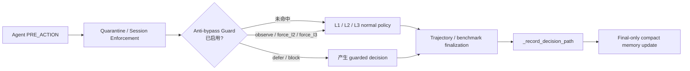

# Anti-bypass Follow-up Guard

<div class="cs-doc-hero" markdown>
<div class="cs-eyebrow">Decision Engine · v0.6.0 docs baseline</div>

## 识别“换个说法再试一次”的高风险操作

Anti-bypass Follow-up Guard 是 ClawSentry 的**前置反绕过保护层**。它默认关闭；启用后，会在同一 session 内记住已经做出最终高风险判决的操作指纹。当 Agent 随后把同一危险动作换成相似命令、脚本包装或另一个工具重试时，Guard 会把这次 follow-up 尝试标记出来，并按你的 rollout 策略观察、升级到 L2/L3、进入人工确认，或在精确重复时直接阻断。

<div class="cs-pill-row" markdown>
<span class="cs-pill">默认关闭</span>
<span class="cs-pill">仅 PRE_ACTION</span>
<span class="cs-pill">Final decision memory</span>
<span class="cs-pill">不保存 raw command</span>
<span class="cs-pill">Cross-tool 不本地 hard-block</span>
</div>

</div>

!!! tip "一句话理解"
    L1/L2/L3 判断“这次操作危险吗”；Anti-bypass Guard 额外判断“这是不是刚刚被拦截/延后后，换个形式又试了一次”。

---

## 适用场景 {#when-to-use}

<div class="cs-card-grid" markdown>

<div class="cs-card" markdown>
### 重复提交同一危险命令

第一次 `rm -rf /important` 已被 `block` 或 `defer`，Agent 立即用同一工具、同一 payload 再提交一次。Guard 可识别为 `exact_raw_repeat`。
</div>

<div class="cs-card" markdown>
### 改写命令但意图相同

第一次是直接删除；第二次改成变量、别名或轻微格式变化，但归一化后仍是同一个破坏性动作。Guard 可识别为 `normalized_destructive_repeat`。
</div>

<div class="cs-card" markdown>
### 跨工具或脚本包装绕过

第一次用 shell 被拦，第二次改成脚本、另一个工具或相似 feature 集合。Guard 可识别为 `cross_tool_script_similarity`，但不会本地 hard-block。
</div>

</div>

---

## 它在决策链路里的位置 {#pipeline-position}

Anti-bypass Guard 只参与 `PRE_ACTION`。它位于 session 级强制策略之后、普通 policy 之前，因此不会绕过更高优先级的 quarantine / session enforcement，也不会在工具执行后才补救。



<div class="cs-flow-strip" markdown>
**顺序保证：** quarantine / session enforcement → anti-bypass guard → normal policy → trajectory / benchmark finalization → decision record → final-only memory update
</div>

---

## 工作原理 {#how-it-works}

Guard 的核心是“**只记住可比较的安全指纹，不记住敏感原文**”。它不会保存 raw payload、raw command、secret、完整路径内容或 L3 trace；只保存 hashes、fingerprints、tool label、policy id、risk level、record id 与时间戳。

### 1. 什么时候写入记忆？ {#memory-write}

一次事件只有满足以下条件才会进入 anti-bypass memory：

1. Guard 已启用：`CS_ANTI_BYPASS_GUARD_ENABLED=true`
2. 事件类型是 `PRE_ACTION`
3. 判决是最终判决：`final=true`
4. 判决属于可记忆 verdict：默认 `block,defer`
5. 风险等级达到阈值：默认 `high` 或 `critical`
6. 如果是 `allow`，必须显式开启 `CS_ANTI_BYPASS_RECORD_ALLOW_DECISIONS=true`

!!! note "这里的 final 指什么？"
    Guard 记录的是 Gateway 已生成并持久化的 final canonical decision（`decision.final=true`），写入发生在 `_record_decision_path` 之后。若该 final decision 是 `defer`，后续 operator / timeout resolution 可能再把审批结果解析为 allow/deny；当前 memory 不等待这个后续 resolution，也不会回溯删除已记录的 compact fingerprint。

### 2. 记住哪些指纹？ {#fingerprints}

| 记忆字段 | 用途 | 是否含原文 |
|----------|------|------------|
| `raw_payload_hash` | 判断同一工具、同一 canonical payload 是否原样重复 | 否 |
| `normalized_action_fingerprint` | 判断格式变化后是否仍是同一破坏性动作 | 否 |
| `destructive_intent_fingerprint` / label | 判断删除、外传、提权、远程执行等意图类别 | 否 |
| `normalized_feature_hashes` | 用 Jaccard similarity 判断跨工具/脚本相似度 | 否 |
| `prior_event_id` / `prior_record_id` / `policy_id` | 让审计人员追溯 prior final decision | 否 |

### 3. 如何匹配 follow-up？ {#match-types}

| Match type | 典型含义 | 默认动作 | 本地 BLOCK 权限 |
|------------|----------|----------|----------------|
| `exact_raw_repeat` | 同一 session、同一 tool、同一 raw payload hash | `block` | 可以 |
| `normalized_destructive_repeat` | 同一 tool，归一化后是同一破坏性动作 | `defer` | 显式配置后可以 |
| `cross_tool_script_similarity` | 换工具/脚本包装，但意图或 feature 集合相似 | `force_l3` | **不可以** |

!!! warning "Cross-tool/script 永不本地 hard-block"
    跨工具/脚本相似度更容易受上下文影响。为了避免误杀，`CS_ANTI_BYPASS_CROSS_TOOL_SIMILARITY_ACTION=block` 会被配置校验拒绝并回退到 `force_l3`。如需更严格处理，请用 `defer` 交给 operator 确认。

---

## 决策动作怎么理解？ {#actions}

| 动作 | 效果 | 适合阶段 |
|------|------|----------|
| `observe` | 只写 metadata / counters，不改变判决 | 观察期、误报评估 |
| `force_l2` | 继续走 normal policy，但要求语义层参与 | 低成本 review |
| `force_l3` | 继续走 normal policy，但要求 L3 深度审查 | 高风险灰区 |
| `defer` | 当前 follow-up 进入人工确认 | 生产灰度、需要 operator 判断 |
| `block` | 当前 follow-up 本地阻断 | 仅 exact / normalized 明确重复 |

<div class="cs-before-after" markdown>

<div markdown>
### 没有 Guard 时

1. Agent 被阻止一次  
2. Agent 改写命令或换工具  
3. 普通 policy 重新从单次事件角度判断  
4. 审计人员需要手动关联两次尝试
</div>

<div markdown>
### 启用 Guard 后

1. 第一次最终高风险判决写入 compact memory  
2. 后续 `PRE_ACTION` 先查同 session 指纹  
3. 命中后附带 prior record id / match type  
4. 按 rollout 策略 observe / review / enforce
</div>

</div>

---

## 快速启用 {#quickstart}

建议按“三段式”灰度：先观察，再人工确认，最后只对精确重复启用阻断。

=== "Observe only"

    适合第一周上线：验证是否有误报，不改变任何 verdict。

    ```bash title=".env.clawsentry"
    CS_ANTI_BYPASS_GUARD_ENABLED=true
    CS_ANTI_BYPASS_EXACT_REPEAT_ACTION=observe
    CS_ANTI_BYPASS_NORMALIZED_DESTRUCTIVE_REPEAT_ACTION=observe
    CS_ANTI_BYPASS_CROSS_TOOL_SIMILARITY_ACTION=observe
    ```

=== "Review mode"

    适合生产灰度：重复危险动作进入人工确认，跨工具相似请求 L3 复核。

    ```bash title=".env.clawsentry"
    CS_ANTI_BYPASS_GUARD_ENABLED=true
    CS_ANTI_BYPASS_EXACT_REPEAT_ACTION=defer
    CS_ANTI_BYPASS_NORMALIZED_DESTRUCTIVE_REPEAT_ACTION=defer
    CS_ANTI_BYPASS_CROSS_TOOL_SIMILARITY_ACTION=force_l3
    ```

=== "Focused enforce"

    适合已经观察过误报的环境：只对 exact repeat 本地阻断，其他变体仍走 review。

    ```bash title=".env.clawsentry"
    CS_ANTI_BYPASS_GUARD_ENABLED=true
    CS_ANTI_BYPASS_EXACT_REPEAT_ACTION=block
    CS_ANTI_BYPASS_NORMALIZED_DESTRUCTIVE_REPEAT_ACTION=defer
    CS_ANTI_BYPASS_CROSS_TOOL_SIMILARITY_ACTION=force_l3
    ```

启动或重启 Gateway 后，使用 `clawsentry config show --effective` 或环境变量输出确认配置生效。

---

## 配置速查 {#configuration}

| 变量 | 默认值 | 说明 |
|------|--------|------|
| `CS_ANTI_BYPASS_GUARD_ENABLED` | `false` | 总开关；默认不改变现有行为 |
| `CS_ANTI_BYPASS_MEMORY_TTL_S` | `86400` | compact memory 保留秒数 |
| `CS_ANTI_BYPASS_MEMORY_MAX_RECORDS_PER_SESSION` | `256` | 每个 session 最多保留多少条 prior final decision |
| `CS_ANTI_BYPASS_MIN_PRIOR_RISK` | `high` | 只有达到该风险等级的 prior decision 才参与匹配 |
| `CS_ANTI_BYPASS_PRIOR_VERDICTS` | `block,defer` | 哪些 prior verdict 会被记住 |
| `CS_ANTI_BYPASS_EXACT_REPEAT_ACTION` | `block` | exact raw repeat 的动作 |
| `CS_ANTI_BYPASS_NORMALIZED_DESTRUCTIVE_REPEAT_ACTION` | `defer` | normalized destructive repeat 的动作 |
| `CS_ANTI_BYPASS_CROSS_TOOL_SIMILARITY_ACTION` | `force_l3` | cross-tool/script similarity 的动作；不可为 `block` |
| `CS_ANTI_BYPASS_SIMILARITY_THRESHOLD` | `0.92` | Jaccard similarity 阈值，范围 `0.0..1.0` |
| `CS_ANTI_BYPASS_RECORD_ALLOW_DECISIONS` | `false` | 是否也记录 allow 决策的 compact fingerprints |

完整字段说明见 [DetectionConfig：Anti-bypass Follow-up Guard](../configuration/detection-config.md#anti-bypass-guard) 和 [环境变量参考](../configuration/env-vars.md#anti-bypass-guard-env)。

---

## 可观测性与审计 {#observability}

命中后，decision metadata / SSE / replay buffer 会包含 `anti_bypass` 字段。字段只包含审计所需的紧凑信息：

```json
{
  "anti_bypass": {
    "matched": true,
    "match_type": "exact_raw_repeat",
    "action": "block",
    "prior_event_id": "evt-previous",
    "prior_record_id": 42,
    "prior_policy_id": "anti-bypass-exact-repeat",
    "prior_risk_level": "critical",
    "raw_payload_hash": "sha256:...",
    "normalized_action_fingerprint": "sha256:...",
    "destructive_intent_fingerprint": "sha256:...",
    "similarity": 1.0
  }
}
```

!!! success "Redaction contract"
    `anti_bypass` metadata 不包含 `command`、raw payload、secret、环境变量值或 L3 trace。`defer_pending` SSE 不携带 anti-bypass fingerprints；当命中 anti-bypass 时，它会把 retry `command` 字段降级为 tool name，避免把 secret-bearing retry command 推送到 operator UI。

---

## 与其他决策层的关系 {#relationship}

| 功能 | 关注点 | 是否同步影响当前判决 | 是否记忆历史 |
|------|--------|----------------------|--------------|
| L1 规则引擎 | 当前事件的工具、路径、命令、D1-D6 分数 | 是 | D4 有会话计数 |
| L2 语义分析 | 当前事件的语义风险 | 是 | 否 |
| L3 审查 Agent | 当前高风险事件的上下文证据 | 是 | 可写 trace，但 Guard 不保存 trace |
| Trajectory Analyzer | 多事件攻击链告警 | 通常异步告警 | 滑动窗口 |
| Anti-bypass Guard | prior final risky decision 后的重复/变形 follow-up | 是，仅 `PRE_ACTION` | compact per-session memory |

---

## 边界与注意事项 {#boundaries}

- **默认关闭**：升级到 v0.6.0 不会自动改变你的阻断策略。
- **进程内记忆**：当前 memory 是 Gateway process-local volatile memory；重启后清空。
- **同 session 范围**：匹配按 session 隔离，不做跨 session 用户画像。
- **不替代 L1/L2/L3**：Guard 是 follow-up detector，不是独立风险评分器。
- **不新增 `AHP_*` anti-bypass 变量**：配置统一使用 `CS_ANTI_BYPASS_*`。
- **优先低风险 rollout**：第一次启用建议先 `observe`，再逐步切到 `defer` / focused `block`。

---

## 代码位置 {#source-code}

| 模块 | 路径 | 职责 |
|------|------|------|
| Guard | `src/clawsentry/gateway/anti_bypass_guard.py` | compact memory、fingerprints、match types、metadata redaction |
| DetectionConfig | `src/clawsentry/gateway/detection_config.py` | `CS_ANTI_BYPASS_*` 解析与校验 |
| Gateway | `src/clawsentry/gateway/server.py` | 决策链路集成、forced tier / defer / block、SSE metadata |
| Tests | `src/clawsentry/tests/test_anti_bypass_guard.py` | 配置、匹配、redaction、final-only memory 回归测试 |

## 相关页面 {#related}

- [L1 规则引擎](l1-rules.md) — 单次事件的确定性风险评分
- [L2 语义分析](l2-semantic.md) — 语义升级与 LLM/RuleBased analyzer
- [L3 审查 Agent](l3-agent.md) — 高风险事件的只读深度审查
- [检测管线配置](../configuration/detection-config.md#anti-bypass-guard) — 完整参数参考
- [环境变量](../configuration/env-vars.md#anti-bypass-guard-env) — 部署时可用的 `CS_ANTI_BYPASS_*` 变量
