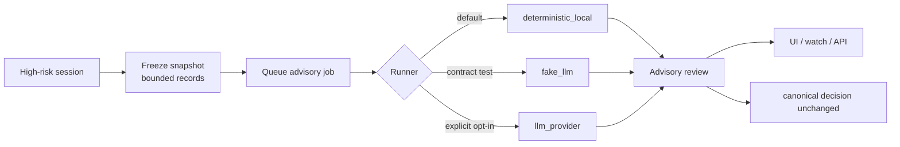

<style>
  .l3-hero {
    border: 1px solid var(--md-default-fg-color--lightest);
    border-radius: 18px;
    padding: 1.6rem;
    margin: 1rem 0 1.5rem;
    background: linear-gradient(135deg, rgba(3,105,161,.14), rgba(34,197,94,.08));
  }
  .l3-hero h2 { margin-top: 0; }
  .l3-hero p { max-width: 52rem; }
  .l3-card-grid {
    display: grid;
    grid-template-columns: repeat(auto-fit, minmax(230px, 1fr));
    gap: .9rem;
    margin: 1rem 0 1.4rem;
  }
  .l3-card {
    border: 1px solid var(--md-default-fg-color--lightest);
    border-radius: 14px;
    padding: 1rem 1.05rem;
    background: var(--md-default-bg-color);
  }
  .l3-card h3 { margin: 0 0 .45rem; font-size: 1rem; }
  .l3-card p { margin: 0; font-size: .88rem; }
  .l3-pill-row { display: flex; flex-wrap: wrap; gap: .45rem; margin: .8rem 0 0; }
  .l3-pill {
    display: inline-block;
    border-radius: 999px;
    padding: .16rem .55rem;
    font-size: .78rem;
    border: 1px solid var(--md-accent-fg-color--transparent);
    background: var(--md-code-bg-color);
  }
  .l3-flow {
    border-left: 4px solid var(--md-primary-fg-color);
    padding: .8rem 1rem;
    background: var(--md-code-bg-color);
    border-radius: 8px;
    margin: 1rem 0;
  }
</style>

# L3 咨询审查

<div class="l3-hero" markdown>

## 高风险 session 的只读复盘报告

当 ClawSentry 发现一个 session 风险很高时，L3 咨询审查会把当时已记录的证据固定下来，生成只读复盘报告，帮助 operator 判断：**发生了什么、风险为什么高、下一步该 inspect / escalate / pause 还是继续观察**。

它不是新的拦截器，也不会重判历史事件；它只是基于固定证据做一次可追溯复盘，辅助后续处置。

<div class="l3-pill-row" markdown>
<span class="l3-pill">只读复盘</span>
<span class="l3-pill">不改写 allow/block/defer</span>
<span class="l3-pill">可在 Web UI 点击触发</span>
<span class="l3-pill">CLI / API 可自动化</span>
</div>

</div>

---

## 先看一个场景

你在 Web UI 里看到一个 session 变成 **high risk**：

1. 这个 agent 先读取了 `.env` 或 SSH key；
2. 后面又执行了 `curl` / `scp` / archive packaging；
3. Dashboard 和 `clawsentry watch` 都提示风险升高；
4. 你想知道：这到底是正常部署，还是准备外传？

这时可以在 Session Detail 点 **Request L3 full review**，也可以运行：

```bash
clawsentry l3 full-review --session sess-001 --token "$CS_AUTH_TOKEN"
```

ClawSentry 会生成一份结果，例如：

```text
review:   l3adv-... (completed, risk=high)
action:   inspect
boundary: advisory only; canonical decision unchanged
```

意思是：系统已经基于固定证据做完复盘，建议 operator 进一步检查；但它没有把过去的判决改掉。

---

## 它解决什么问题？

<div class="l3-card-grid" markdown>

<div class="l3-card" markdown>
### 1. 证据固定
高风险 session 还在继续产生事件时，审查输入必须稳定。L3 咨询审查会冻结一段 record range，例如 `Records 4–8`。
</div>

<div class="l3-card" markdown>
### 2. 结果可追溯
每次复盘都有 `snapshot_id`、`job_id`、`review_id`。你可以在 UI、SSE、API、日志里追踪同一份报告。
</div>

<div class="l3-card" markdown>
### 3. 不改历史判决
报告始终是 `advisory_only=true`。full-review 响应会明确返回 `canonical_decision_mutated=false`。
</div>

<div class="l3-card" markdown>
### 4. 可按需升级
默认用本地确定性 runner；需要时才显式打开 provider runner。不会因为配置了同步 LLM 就自动联网。
</div>

</div>

---

## 工作流程

<div class="l3-flow" markdown>

**高风险 session** → **冻结证据 Snapshot** → **排队 Job** → **运行 Runner** → **生成 Review** → **展示结果**

</div>



### 三个对象

| 对象 | 普通理解 | 典型 ID | 你会在哪里看到 |
|------|----------|---------|----------------|
| Snapshot | 固定下来的证据包 | `l3snap-...` | Session Detail、SSE、API |
| Job | 这次复盘任务 | `l3job-...` | `watch` 里的 queued/running/completed |
| Review | 最终咨询报告 | `l3adv-...` | Session Detail 的 L3 advisory review 卡片 |

---

## 在 Web UI 里怎么用

1. 打开 **Sessions**，进入一个 high / critical session；
2. 在 **Session Detail** 点击 **Request L3 full review**；
3. 等待状态从 queued / running 变成 completed；
4. 查看 L3 advisory review 卡片：

| 字段 | 你该怎么看 |
|------|------------|
| `Risk` | 复盘后的风险等级 |
| `Action` | 建议动作：`Inspect` / `Escalate` / `Pause` / `None` |
| `Runner` | 这次报告由哪个 runner 生成 |
| `Records 4–8` | 本次复盘只看了这段固定证据 |
| `canonical decision unchanged` | 原始判决没有被修改 |

!!! tip "建议的值守路径"
    先看 `Action`，再看 frozen record boundary，最后根据 `review_id` 去 API / replay 里查细节。不要把 advisory review 当成新的 block/allow 判决。

---

## 在 CLI 里怎么用

### 默认：立即生成一份本地咨询报告

```bash
clawsentry l3 full-review --session sess-001 --token "$CS_AUTH_TOKEN"
```

典型输出：

```text
L3 advisory full review requested
snapshot: l3snap-...
job:      l3job-... (completed)
review:   l3adv-... (completed, risk=high)
advisory_only: true
canonical_decision_mutated: false
```

### 只排队，不运行

```bash
clawsentry l3 full-review \
  --session sess-001 \
  --queue-only \
  --json
```

适合先冻结证据，再由另一个流程决定何时运行 worker。

### Phase 3：查看并有界执行 queued jobs

Phase 3 增加的是 **bounded one-shot execution**，不是 daemon。你可以查看当前 queued jobs：

```bash
clawsentry l3 jobs list --state queued --json
```

执行最旧的一条 queued job：

```bash
clawsentry l3 jobs run-next \
  --runner deterministic_local \
  --json
```

或一次最多 drain N 条（硬上限 10）：

```bash
clawsentry l3 jobs drain \
  --runner deterministic_local \
  --max-jobs 2
```

这些命令只 claim `job_state=queued` 的 job；`running` / `completed` / `failed` 不会被 rerun。`llm_provider` runner 仍需要显式 advisory provider gates，默认不会真实联网。

### Phase 3：heartbeat / idle aggregate queueing

当同时启用：

```bash
CS_L3_ADVISORY_ASYNC_ENABLED=true
CS_L3_HEARTBEAT_REVIEW_ENABLED=true
```

并且同一 session 在最新 terminal heartbeat review 后出现新的 high/critical evidence delta 时，`heartbeat` / `idle` / `success` / `rate_limit` 兼容事件可以创建一份 `trigger_reason=heartbeat_aggregate` 的 frozen snapshot，并排队一个 advisory job。

安全边界：

- 不启动 background scheduler / daemon；
- 不自动运行 job；
- 同一 `(session_id, runner)` 同时最多一个 queued/running `heartbeat_aggregate` job；
- 输出始终标记 `advisory_only=true` 和 `canonical_decision_mutated=false`。

### 固定审查范围

```bash
clawsentry l3 full-review \
  --session sess-001 \
  --from-record-id 4 \
  --to-record-id 8 \
  --runner deterministic_local
```

适合你已经看到关键事件，只想复盘那一段。

---

## Runner 怎么选？

| Runner | 是否联网 | 适合谁 | 说明 |
|--------|----------|--------|------|
| `deterministic_local` | 否 | 大多数用户 | 默认选择，稳定、可重复、无外部依赖 |
| `fake_llm` | 否 | 集成测试 / 平台验证 | 验证 job/review 流程，不代表真实模型判断 |
| `llm_provider` | 默认不联网；显式打开后可联网 | 需要 LLM 审查的安全团队 | 需要独立 `CS_L3_ADVISORY_PROVIDER_*` 配置，不继承同步 L2/L3 LLM 配置 |

!!! warning "provider runner 必须显式打开"
    即使你已经配置了 `CS_LLM_PROVIDER`，L3 咨询审查也不会自动用它联网。`llm_provider` 仍需要独立设置 provider、model、key，并把 `CS_L3_ADVISORY_PROVIDER_DRY_RUN=false`。

    ```bash
    CS_L3_ADVISORY_PROVIDER_ENABLED=true
    CS_L3_ADVISORY_PROVIDER=openai        # 或 anthropic
    CS_L3_ADVISORY_MODEL=<model>
    CS_L3_ADVISORY_PROVIDER_DRY_RUN=false
    OPENAI_API_KEY=<key>                  # 或 CS_L3_ADVISORY_API_KEY
    ```

### 手动 readiness / smoke 验证

先用随包 devtools 模块验证 provider runner 配置，避免直接在真实 session 上试。
它会构造 frozen snapshot、排队一个 `llm_provider` job、执行一次受闸门保护的 review，并输出 Markdown 证据。

```bash
python -m clawsentry.devtools.l3_advisory_provider_smoke \
  --output-report artifacts/l3-provider-smoke.md \
  --json
```

预期边界：

- 默认 dry-run 或缺少 provider/key/model 时，结果应安全降级为 `degraded`，不会发起真实网络调用；
- 只有显式配置 `CS_L3_ADVISORY_PROVIDER_ENABLED=true`、provider/model/key，并设置
  `CS_L3_ADVISORY_PROVIDER_DRY_RUN=false` 后，`llm_provider` 才可能调用真实 provider；
- 需要把真实 provider smoke 作为发布 gate 时，再加 `--require-completed`，让未完成的
  review 以失败退出；
- readiness check 不启动 scheduler，不修改 canonical decision，仍只写
  `advisory_only=true` 的 review 证据。

---

## API 速查

最常用端点：

```http
POST /report/session/{session_id}/l3-advisory/full-review
```

请求：

```json
{
  "trigger_detail": "operator_requested_full_review",
  "from_record_id": 4,
  "to_record_id": 8,
  "max_records": 100,
  "max_tool_calls": 0,
  "runner": "deterministic_local",
  "run": true
}
```

响应：

```json
{
  "snapshot": {"snapshot_id": "l3snap-..."},
  "job": {"job_id": "l3job-...", "job_state": "completed"},
  "review": {"review_id": "l3adv-...", "l3_state": "completed"},
  "advisory_only": true,
  "canonical_decision_mutated": false
}
```

更多端点：

- 创建 snapshot：`POST /report/session/{id}/l3-advisory/snapshots`
- 创建 job：`POST /report/l3-advisory/snapshot/{snapshot_id}/jobs`
- 运行本地 job：`POST /report/l3-advisory/job/{job_id}/run-local`
- 运行 worker：`POST /report/l3-advisory/job/{job_id}/run-worker`
- 更新 review lifecycle：`PATCH /report/l3-advisory/review/{review_id}`

完整字段见 [报表与监控端点](../api/reporting.md#l3-advisory-endpoints)。

---

## `clawsentry watch` 里会看到什么？

```text
L3 ADVISORY SNAPSHOT  l3snap-...  Range=4->8
L3 ADVISORY JOB       l3job-...   State=Completed Runner=Deterministic local
L3 ADVISORY REVIEW    l3adv-...   State=Completed Action=Inspect
```

这三行对应：证据已冻结、任务已运行、报告已生成。

---

## 边界与常见误解

| 误解 | 实际行为 |
|------|----------|
| “它会重新决定 allow/block 吗？” | 不会。它只生成 advisory review。 |
| “它会自动联网调用 LLM 吗？” | 不会。provider runner 默认 dry-run，必须显式打开。 |
| “它会一直后台扫描所有 session 吗？” | 不会。full review 是 operator 显式触发；自动 snapshot 也不会自动运行后台 review。 |
| “它会读取最新 live 文件吗？” | 默认只读 frozen trajectory records；范围由 snapshot 固定。 |
| “失败会伪装成成功吗？” | 不会。配置缺失或 provider 不可用会显示 `degraded` / `failed`。 |

---

## 和同步 L3 Agent 有什么区别？

| 能力 | 同步 L3 Agent | L3 咨询审查 |
|------|---------------|--------------|
| 触发时机 | 在实时决策链中按策略触发 | operator 手动触发，或只自动冻结 snapshot |
| 目标 | 帮助当前事件得出安全评估 | 对已记录 session 做复盘报告 |
| 输入 | 当前事件 + bounded context | frozen trajectory record range |
| 输出 | 决策路径中的 L3 结果 / trace | advisory review / recommended operator action |
| 是否改历史判决 | 不适用 | 明确不改，`canonical_decision_mutated=false` |

如果你想了解同步决策链里的 L3 审查器，继续看 [L3 审查 Agent](l3-agent.md)。
