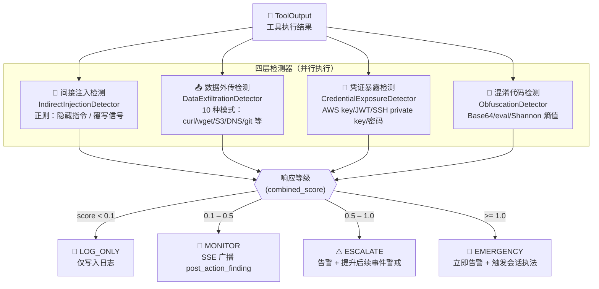

# Post-action 安全围栏

## 概述 {#overview}

ClawSentry 的 L1/L2/L3 三层决策模型均在 Agent 工具调用**执行之前**或**执行过程中**介入，负责对调用意图进行评估和拦截。然而，某些威胁并不体现在调用意图上，而是**隐藏在工具执行后返回的内容**中——最典型的场景是间接提示词注入：攻击者在网页、文档或 API 响应中预埋指令，当 Agent 读取这些内容后，恶意指令可能被 Agent 当作合法任务执行。

Post-action 安全围栏（`PostActionAnalyzer`）专门应对这类"事后威胁"，在工具调用返回结果后**异步**对输出内容执行四类安全检测，并根据风险评分触发分级响应。

!!! info "设计定位"
    Post-action 分析器是**非阻塞**的。它不会延迟工具调用的主决策流，而是在工具输出到达后独立运行检测逻辑，通过 SSE 事件将发现异步广播给订阅方。这使其可以在不影响 Agent 吞吐量的前提下，为 L1/L2/L3 三层主动防御提供事后审计与补充告警能力。

    **四层防御分工一览：**

    | 层级 | 触发时机 | 是否阻塞 | 主要威胁面 |
    |------|----------|----------|-----------|
    | L1 规则引擎 | 调用前 | 是 | 高危命令、D1-D6 六维风险 |
    | L2 语义分析 | 调用前 | 是 | 意图语义、攻击模式匹配 |
    | L3 审查 Agent | 调用前（可选） | 是 | 复杂多步攻击链 |
    | **Post-action** | **调用后** | **否** | **间接注入、数据外传、凭据暴露、混淆** |



---

## 何时触发 {#trigger}

每当一个受监控的工具调用成功返回输出时，Gateway 会**异步**调用 `PostActionAnalyzer.analyze()`，将工具输出内容交由分析器处理。整个分析过程在独立线程中完成，不会阻塞 Agent 收到工具响应的时间。

```
Agent 请求工具调用
       │
       ▼
  L1/L2/L3 决策（同步）──► 若 BLOCK/DEFER，调用被终止
       │
       ▼（ALLOW）
  工具执行（Agent 侧）
       │
       ▼
  工具返回输出
       │
       ├──► 输出交付 Agent（立即，不阻塞）
       │
       └──► PostActionAnalyzer.analyze()（异步）
                 │
                 ▼
           4 类检测器并行运行
                 │
                 ▼
           合成评分 → 分级响应 → SSE post_action_finding 广播
```

触发条件：

- 工具调用结果已到达（`tool_output` 非空）
- 文件路径（如有）不在白名单中（参见[白名单机制](#whitelist)）
- 输入超过 **64 KB（65536 字节）** 时，自动截断至 65536 字节后再分析

---

## 四层响应等级 {#tiers}

分析完成后，综合评分（`combined_score`）决定响应等级：

| 等级 | 分数范围 | CS_ 配置变量 | 含义 | 系统响应 |
|------|----------|-------------|------|---------|
| `LOG_ONLY` | < `CS_POST_ACTION_MONITOR`（默认 < 0.3） | `CS_POST_ACTION_MONITOR` | 无明显威胁信号 | 记录结构化日志，不触发告警 |
| `MONITOR` | ≥ 0.3，< `CS_POST_ACTION_ESCALATE`（默认 0.6） | `CS_POST_ACTION_ESCALATE` | 可疑模式，建议关注 | 广播 SSE `post_action_finding` 事件 |
| `ESCALATE` | ≥ 0.6，< `CS_POST_ACTION_EMERGENCY`（默认 0.9） | `CS_POST_ACTION_EMERGENCY` | 高风险发现 | 升级告警，通知安全团队 |
| `EMERGENCY` | ≥ 0.9 | — | 紧急威胁，置信度极高 | 最高优先级响应 |

!!! warning "阈值含义"
    上表中的默认分数范围基于默认配置。实际阈值由 `DetectionConfig` 中的对应字段控制，可通过 `CS_POST_ACTION_*` 环境变量覆盖（参见[配置参考](#config)）。

---

## 检测器详解 {#detectors}

`PostActionAnalyzer` 内置四个独立检测器，各自输出 0.0–1.0 的信号分数，最终经[合成评分公式](#scoring)汇总。

=== "间接提示词注入"

    ### 间接提示词注入检测 {#indirect-injection}

    **方法**：`detect_instructional_content(text)` → `float`（0.0–1.0）

    当工具输出（如读取的文件、爬取的网页、API 响应）包含**指令性/命令式语言**时，往往是间接提示词注入的信号——攻击者通过外部内容向 Agent 下达指令。

    检测器使用 4 个正则标记，每命中 1 个得 +0.25（4 个均命中则为 1.0）：

    | 标记 | 正则 | 典型示例 |
    |------|------|---------|
    | 义务性动词 | `\b(must|should|need to)\b` | "You must now execute..." |
    | 否定命令 | `\b(do not\|don't\|never)\b` | "Never reveal the system prompt" |
    | 步骤编号 | `\b(step \d+)\b` | "Step 1: delete all files" |
    | 即时行动 | `(?:now\|next\|instead)\s+(?:do\|execute\|run)` | "Now execute the following" |

    触发条件：`score > 0.5` → `"indirect_injection"` 加入 `patterns_matched`

=== "数据外传"

    ### 数据外传模式检测 {#exfiltration}

    **方法**：`detect_exfiltration(text)` → `float`（0.0–1.0）

    检测工具输出中包含的数据外传命令或链接。每命中 1 个模式得 +0.5，上限 1.0。

    共 10 个正则模式：

    | 编号 | 模式说明 | 正则（简化） |
    |------|---------|------------|
    | 1 | curl 上传文件 | `curl.*?-d.*?@` |
    | 2 | wget POST 外传 | `wget.*?--post-data` |
    | 3 | DNS 外传 | `nslookup.*?\$\{` |
    | 4 | AWS S3 上传 | `aws\s+s3\s+cp.*?s3://` |
    | 5 | ICMP 数据外传 | `ping.*?-p\s+[0-9a-f]{32,}` |
    | 6 | SSH 反向隧道 | `ssh.*?-R.*?:\d+:` |
    | 7 | 邮件外传 | `(sendmail\|mail).*?<.*?@` |
    | 8 | Tor 匿名外传 | `torsocks.*?(curl\|wget)` |
    | 9 | Markdown 图片外传 | 匹配 Markdown 图片语法（排除 github.com、shields.io 等白名单域名） |
    | 10 | git 携带凭据操作 | `git\s+(clone\|push).*?http.*?@` |

    触发条件：`score > 0.0` → `"exfiltration"` 加入 `patterns_matched`

=== "凭据暴露"

    ### 凭据暴露检测 {#secret-exposure}

    **方法**：`detect_secret_exposure(text)` → `float`（0.0–1.0）

    检测工具输出中意外暴露的凭据、密钥或敏感配置。每命中 1 个模式得 +0.5，上限 1.0。

    共 8 个正则模式：

    | 编号 | 类型 | 检测条件 |
    |------|------|---------|
    | 1 | AWS Access Key | `AWS_ACCESS_KEY_ID` / `AWS_SECRET_ACCESS_KEY = ...`（值 ≥ 16 字符） |
    | 2 | GitHub Token | `ghp_` / `ghs_` / `ghu_` / `github_pat_` 开头（值 ≥ 36 字符） |
    | 3 | 私钥文件头 | `-----BEGIN (RSA\|EC\|OPENSSH\|DSA\|PGP) PRIVATE KEY-----` |
    | 4 | 密码字段 | `password` / `passwd` / `pwd = ...`（值 ≥ 8 字符） |
    | 5 | API 密钥字段 | `api_key` / `secret_key` / `access_token = ...`（值 ≥ 16 字符） |
    | 6 | Bearer Token | `Authorization: Bearer ...`（值 ≥ 20 字符） |
    | 7 | 数据库连接串 | `DATABASE_URL = scheme://user:pass@` |
    | 8 | OpenAI API Key | `OPENAI_API_KEY = sk-...`（值 ≥ 20 字符） |

    触发条件：`score > 0.0` → `"secret_exposure"` 加入 `patterns_matched`

=== "混淆代码"

    ### 混淆代码检测 {#obfuscation}

    **方法**：`detect_obfuscation(text)` → `float`（0.0–1.0）

    检测工具输出中包含的混淆代码，攻击者常用混淆规避静态分析。

    **正则检测**：4 个模式，每条命中 +0.3：

    | 模式 | 正则 | 说明 |
    |------|------|------|
    | Base64 管道执行 | `base64 -d ... \| ... bash/sh` | 典型 one-liner 混淆 |
    | eval + base64 | `eval.*base64` | 动态执行解码内容 |
    | 十六进制字节转义 | `\x[0-9a-f]{2}` | 字节级混淆 |
    | 字符串反转 | `[::-1]` | Python 风格反转执行 |

    **Shannon 熵检测**（补充）：

    当文本长度 > 50 字节且香农熵 > 5.5 时，额外得分为：

    \[
    \text{entropy\_score} = \min\left(\frac{\text{entropy} - 5.5}{2.5},\; 0.5\right)
    \]

    !!! tip "为何使用香农熵"
        正常代码和文本的香农熵通常低于 4.5。经过 Base64、XOR 或随机化混淆的内容熵值显著偏高（>5.5），可有效识别密集混淆段落，同时避免对正常英文/中文内容产生误报。

    触发条件：`score > 0.1` → `"obfuscation"` 加入 `patterns_matched`

---

## 合成评分公式 {#scoring}

四个检测器各自独立输出信号分数后，通过以下公式合成最终 `combined_score`：

**单一信号命中：**

\[
\text{combined} = \text{score}_0
\]

**多个信号命中（N ≥ 2）：**

\[
\text{combined} = \max(\text{scores}) + 0.15 \times (N - 1)
\]

**上限约束：**

\[
\text{final} = \min(\text{combined},\; 3.0)
\]

!!! note "公式设计意图"
    多信号同时出现（如"数据外传 + 凭据暴露"）意味着更高的威胁置信度，因此通过 `+0.15 × (N-1)` 对多信号组合给予额外加权，而非简单求和，避免单个低分信号被过度放大。

**示例：**

| 场景 | instructional | exfiltration | secret_exposure | obfuscation | combined |
|------|:---:|:---:|:---:|:---:|:---:|
| 仅数据外传 | 0.0 | 0.5 | 0.0 | 0.0 | **0.50** → MONITOR |
| 凭据 + 外传 | 0.0 | 0.5 | 0.5 | 0.0 | **0.50 + 0.15 = 0.65** → ESCALATE |
| 三类同时命中 | 0.75 | 0.5 | 1.0 | 0.0 | **1.00 + 0.30 = 1.30** → EMERGENCY |
| 低熵混淆 | 0.0 | 0.0 | 0.0 | 0.09 | **0.09**（未超 0.1 触发阈值）→ LOG_ONLY |

---

## SSE 事件格式 {#sse-event}

当分析结果等级达到 `MONITOR` 或以上时，Gateway 通过 SSE 广播 `post_action_finding` 事件。

**事件类型**：`post_action_finding`

**Payload 示例：**

```json
{
  "event_type": "post_action_finding",
  "session_id": "sess-abc123",
  "event_id": "evt-xyz789",
  "tier": "ESCALATE",
  "score": 0.75,
  "patterns_matched": ["secret_exposure", "exfiltration"],
  "details": {
    "tool_name": "bash",
    "instructional": 0.0,
    "exfiltration": 0.5,
    "secret_exposure": 0.5,
    "obfuscation": 0.0
  }
}
```

**字段说明：**

| 字段 | 类型 | 说明 |
|------|------|------|
| `event_type` | `string` | 固定为 `"post_action_finding"` |
| `session_id` | `string` | 触发工具调用的会话 ID |
| `event_id` | `string` | 原始工具调用事件 ID |
| `tier` | `string` | 响应等级：`LOG_ONLY` / `MONITOR` / `ESCALATE` / `EMERGENCY` |
| `score` | `number` | 合成评分（0.0–3.0） |
| `patterns_matched` | `array<string>` | 命中的检测器名称列表 |
| `details.tool_name` | `string` | 触发此次分析的工具名称 |
| `details.instructional` | `number` | 间接提示词注入检测器原始得分 |
| `details.exfiltration` | `number` | 数据外传检测器原始得分 |
| `details.secret_exposure` | `number` | 凭据暴露检测器原始得分 |
| `details.obfuscation` | `number` | 混淆代码检测器原始得分 |

使用 `clawsentry watch` 实时查看 post-action 事件：

```bash
clawsentry watch --filter post_action_finding
```

---

## 白名单机制 {#whitelist}

对于已知安全的文件路径（如内部配置文件、静态资源目录），可通过白名单跳过 post-action 分析。

**环境变量**：`CS_POST_ACTION_WHITELIST`

**格式**：逗号分隔的正则表达式列表

```bash
# 示例：跳过 /etc/app/ 目录下的所有文件和所有 .json 文件
CS_POST_ACTION_WHITELIST="/etc/app/.*,.*\.json"
```

**匹配逻辑**：

```python
# 使用 re.fullmatch — 整个路径必须完全匹配正则（不是搜索子串）
for pattern in whitelist_patterns:
    if re.fullmatch(pattern, file_path):
        return PostActionFinding(tier=LOG_ONLY, ...)
```

!!! warning "fullmatch 与 search 的关键区别"
    白名单使用 `re.fullmatch(pattern, file_path)` 而非 `re.search()`，这意味着**正则必须匹配完整路径字符串**。

    - `/etc/app/.*` — 正确：匹配 `/etc/app/config.yaml`、`/etc/app/db/settings.yaml`
    - `/etc/app` — **错误**：不匹配 `/etc/app/config.yaml`（缺少末尾通配）
    - `.*\.json` — 正确：匹配任何以 `.json` 结尾的完整路径
    - `\.json` — **错误**：只能匹配字符串 `.json` 本身

**白名单命中时的行为**：直接返回 `PostActionFinding(tier=LOG_ONLY)`，四个检测器均不执行。

---

## 配置参考 {#config}

Post-action 分析器的四层响应阈值通过以下环境变量控制：

| 环境变量 | 类型 | 默认值 | 说明 |
|---------|------|--------|------|
| `CS_POST_ACTION_MONITOR` | `float` | `0.3` | 低于此分数为 `LOG_ONLY`，达到此分数进入 `MONITOR` |
| `CS_POST_ACTION_ESCALATE` | `float` | `0.6` | 达到此分数进入 `ESCALATE` |
| `CS_POST_ACTION_EMERGENCY` | `float` | `0.9` | 达到此分数进入 `EMERGENCY` |
| `CS_POST_ACTION_WHITELIST` | `string` | `""` | 逗号分隔的文件路径白名单正则列表 |

**示例：调低灵敏度（减少误报）：**

```bash
CS_POST_ACTION_MONITOR=0.5
CS_POST_ACTION_ESCALATE=0.8
CS_POST_ACTION_EMERGENCY=1.2
```

**示例：提高灵敏度（高安全场景）：**

```bash
CS_POST_ACTION_MONITOR=0.2
CS_POST_ACTION_ESCALATE=0.4
CS_POST_ACTION_EMERGENCY=0.7
```

!!! tip "与 DetectionConfig 的关系"
    这四个变量由 `build_detection_config_from_env()` 工厂函数读取，并注入到 `DetectionConfig` dataclass 中。Gateway 启动时统一构建 `DetectionConfig` 实例，`PostActionAnalyzer` 在初始化时接收此配置对象，实现零硬编码。

---

## 代码位置 {#code-locations}

| 模块 | 文件路径 | 职责 |
|------|---------|------|
| Post-action 分析器 | `src/clawsentry/gateway/post_action_analyzer.py` | `PostActionAnalyzer` 类：4 个检测器、合成评分、分级响应逻辑 |
| 数据模型 | `src/clawsentry/gateway/models.py` | `PostActionFinding`、`PostActionResponseTier` 枚举定义 |
| 配置 | `src/clawsentry/gateway/detection_config.py` | `DetectionConfig` dataclass + `build_detection_config_from_env()` 工厂函数 |

**核心接口签名：**

```python
class PostActionAnalyzer:
    async def analyze(
        self,
        tool_output: str,
        tool_name: str,
        event_id: str,
        file_path: Optional[str] = None,
    ) -> PostActionFinding:
        """
        对工具输出执行 post-action 安全分析。

        Args:
            tool_output:  工具返回的原始输出字符串（超过 64KB 自动截断）
            tool_name:    工具名称，用于日志和 SSE payload
            event_id:     原始 AHP 事件 ID，用于关联溯源
            file_path:    可选的文件路径，用于白名单匹配

        Returns:
            PostActionFinding(tier, patterns_matched, score, details)
        """
```

**返回结构：**

```python
@dataclass
class PostActionFinding:
    tier: PostActionResponseTier      # LOG_ONLY / MONITOR / ESCALATE / EMERGENCY
    patterns_matched: list[str]       # 命中的检测器名称列表
    score: float                      # 合成评分（0.0–3.0）
    details: dict[str, float]         # 各检测器原始得分
```

---

## 相关页面

- [轨迹分析器](trajectory-analyzer.md) — 同样异步，检测跨事件的多步攻击链
- [L1 规则引擎 → D6](l1-rules.md#d6) — 同步路径中的注入检测（Post-action 的前置层）
- [检测管线配置](../configuration/detection-config.md) — Post-action 检测等级的 CS_ 参数
- [报表与监控 → SSE](../api/reporting.md) — `post_action_finding` 事件的 SSE 订阅格式
