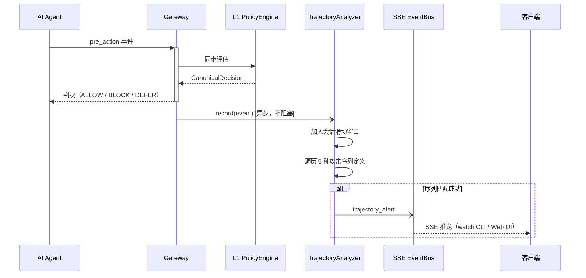
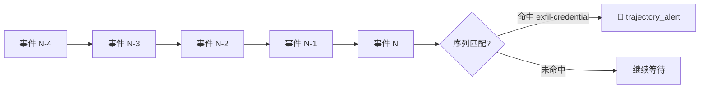

# 轨迹分析器（Trajectory Analyzer）

!!! abstract "本页快速导航"
    [概述](#overview) · [工作原理](#how-it-works) · [5 种内置攻击序列](#builtin-sequences) · [SSE 事件格式](#sse-event) · [配置](#configuration) · [代码位置](#source-code)

## 概述 {#overview}

单个事件的风险评分（D1-D6）只能捕捉"当前操作"的危险程度，但真实的 APT（高级持续威胁）往往表现为跨多个操作的**有序攻击链**——例如先读取凭证文件、再发起网络请求外传。每步孤立判断时可能都不触发高危，但将其作为整体序列分析时就能识别出完整的攻击意图。

`TrajectoryAnalyzer` 是 ClawSentry 的跨事件序列检测引擎。它为每个会话维护一个**滑动窗口事件缓冲区**，每当新事件被记录后，检查最近 N 个事件是否形成了已知攻击链。

!!! info "定位：异步、非阻塞"
    TrajectoryAnalyzer **不参与** pre_action 的同步决策流程。它在事件被 L1/L2/L3 评估**之后**由 Gateway 异步调用。检测到攻击链时通过 SSE 广播 `trajectory_alert` 事件，不直接修改当前判决。

---

## 工作原理 {#how-it-works}



### 滑动窗口匹配

每个会话维护一个固定大小的**环形事件缓冲区**（默认 50 个事件）。`record()` 每次被调用时：

1. 将新事件压入缓冲区（满时自动淘汰最旧事件）
2. 对所有已注册的攻击序列逐一检查
3. 在 `within_events` 个最近事件和 `within_seconds` 时间窗口内寻找步骤匹配
4. 匹配成功 → 广播 SSE `trajectory_alert`



---

## 5 种内置攻击序列 {#builtin-sequences}

| ID | 描述 | 触发步骤 | 窗口 | 风险等级 |
|----|------|---------|------|---------|
| **exfil-credential** | 读取敏感文件后发起网络请求 | ① 读 `.env/.pem/.key/id_rsa` 等 → ② `http_request`/`curl`/`wget` | 5 事件 / 60s | `CRITICAL` |
| **backdoor-install** | 下载远程脚本后赋予执行权限或写入 Shell 配置 | ① `curl/wget http(s)://...` → ② `chmod +x` 或写 `.bashrc/.zshrc` 等 | 5 事件 / 60s | `CRITICAL` |
| **recon-then-exploit** | 系统侦查后跟随提权操作 | ① `uname/id/whoami/hostname/cat /etc/os-release` → ② `sudo chmod/chown/useradd/passwd` | 8 事件 / 120s | `CRITICAL` |
| **secret-harvest** | 短时间内多次读取凭证文件 | ≥ 3 次读取 `.env/.key/.ssh/.aws/.p12` 等凭证文件 | 10 事件 / 30s | `HIGH` |
| **staged-exfil** | 写入临时目录后从临时目录外传 | ① 写入 `/tmp/` 或 `/var/tmp/` → ② `curl/wget` 引用 `/tmp/` 路径 | 10 事件 / 120s | `HIGH` |

### 敏感文件匹配范围

**exfil-credential**（较窄，精度优先）：
```
\.env$  \.pem$  \.key$  id_rsa  id_ed25519  credentials  \.secret  \.token  \.password
```

**secret-harvest**（较宽，覆盖优先，额外包含）：
```
\.p12$  \.pfx$  \.jks$  \.keystore$  .aws/  .ssh/
```

---

## SSE 事件格式 {#sse-event}

检测到攻击序列时，Gateway 通过 SSE 广播 `trajectory_alert` 事件：

```json
{
  "type": "trajectory_alert",
  "sequence_id": "exfil-credential",
  "risk_level": "critical",
  "matched_event_ids": ["evt-a1b2c3", "evt-d4e5f6"],
  "reason": "Sensitive file read followed by network request within 5 events",
  "session_id": "session-001",
  "agent_id": "agent-main"
}
```

在 `clawsentry watch` 中，`trajectory_alert` 默认以 `ALERT` 类型显示（橙色高亮）。可通过 `--filter alert` 单独筛选。

---

## 配置 {#configuration}

| 环境变量 | 说明 | 默认值 |
|----------|------|:------:|
| `CS_TRAJECTORY_MAX_EVENTS` | 每会话缓冲区大小（事件数） | `50` |
| `CS_TRAJECTORY_MAX_SESSIONS` | 最大并发会话数（LRU 淘汰超额） | `10000` |

这两个参数也可通过 `DetectionConfig` 的对应字段在代码中配置，详见[检测管线配置](../configuration/detection-config.md)。

!!! tip "始终启用，无开关"
    TrajectoryAnalyzer 随 Gateway 自动启动，无需额外配置。若需完全禁用，将 `CS_TRAJECTORY_MAX_SESSIONS` 设为 `0`（不推荐）。

---

## 代码位置 {#source-code}

| 模块 | 路径 | 职责 |
|------|------|------|
| TrajectoryAnalyzer | `src/clawsentry/gateway/trajectory_analyzer.py` | 核心检测引擎、滑动窗口、攻击序列定义 |
| Gateway 集成 | `src/clawsentry/gateway/server.py` | 异步调用 `trajectory_analyzer.record()`、SSE 广播 |
| DetectionConfig | `src/clawsentry/gateway/detection_config.py` | `trajectory_max_events` / `trajectory_max_sessions` 字段 |

---

## 相关页面

- [Post-action 围栏](post-action.md) — 同样异步、检测工具输出中的即时威胁
- [L2 语义分析](l2-semantic.md) — 同步的语义理解层，可与轨迹分析互补
- [检测管线配置](../configuration/detection-config.md) — `CS_TRAJECTORY_*` 完整参数参考
- [报表与监控 → SSE](../api/reporting.md#get-report-stream) — `trajectory_alert` 事件的 SSE 订阅方式
