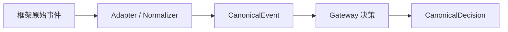

# 核心概念

如果你只想先理解 ClawSentry 怎么工作，记住这句话：**事件进入系统，经过分层判断，最后返回或记录 `allow / block / defer / modify`。**

## 先记住 3 件事

### 1. ClawSentry 监控事件
事件可能来自 Claude Code Hook、a3s-code Transport、OpenClaw Webhook/WebSocket、Codex session watcher 或自定义 Adapter。

### 2. ClawSentry 评估风险
系统先走快速规则，再按需要升级到 L2 语义分析、同步 L3 审查或 L3 advisory 复盘。

### 3. ClawSentry 输出结果
结果可能是允许、阻断、等待审批、修改载荷，或仅作为审计/告警事件记录。

## AHP 是什么

AHP（Agent Harness Protocol）是 ClawSentry 用来统一不同 Agent 运行时事件和判决的协议。它解决的问题是：不同框架的原始事件不一样，但进入安全引擎后应该有统一模型。

## 三种最常见结果

| 结果 | 含义 | 用户会看到什么 |
| --- | --- | --- |
| `allow` | 风险可接受 | 工具调用继续，watch/UI 记录一次低风险或正常事件。 |
| `block` | 风险过高 | 支持前置决策的框架会被阻断；监控模式会产生高风险告警。 |
| `defer` | 需要人工判断 | 进入审批/延后流程，等待 operator 处理。 |
| `modify` | 允许但修改参数 | 高级场景使用；是否生效取决于接入框架是否支持修改载荷。 |

## L1 / L2 / L3 分层判断

| 层级 | 作用 | 什么时候触发 | 输出会改变什么 |
| --- | --- | --- | --- |
| L1 deterministic rules | 快速识别明显安全/危险模式 | 大多数事件都会先经过 L1。 | 直接给出 allow/block/defer/modify 的基础判决。 |
| L2 semantic analysis | 需要理解上下文和意图时，用 RuleBased 或 LLM analyzer 补充语义判断 | 命令不明显、风险为 medium+、或命中特定语义信号时。 | 可升级风险等级并影响同步判决；LLM 失败时降级为 L1。 |
| synchronous L3 review agent | 对高风险或显式触发事件做只读、多轮证据审查 | HIGH+、累积风险、显式 L3 trigger 或 suspicious sequence。 | 属于同步决策路径，可返回更高置信度/更高风险；工具只读，预算耗尽会诚实降级。 |
| L3 advisory full-review | 对已记录 session 冻结证据并生成复盘报告 | Operator 在 Web UI / CLI / API 手动触发，或队列/worker 明确运行。 | advisory-only：生成 snapshot/job/review/action，不改写历史 canonical decision。 |

!!! tip "第一次该开哪一层？"
    只想确认接入时先用 L1 observe-first；团队仓库通常从 L2 + token budget 开始；安全敏感任务再打开同步 L3 或在 Session Detail 触发 L3 advisory full-review。

## 事件、判决、审计的区别

- **事件（Event）**：Agent 发生了什么，例如一次 shell 命令、一次 session start、一次 post-action finding。
- **判决（Decision）**：Gateway 对事件的结果，例如 `block`。
- **审计（Audit）**：事件和判决被保存、聚合、展示，用于事后追踪和报表。
- **实时流（SSE）**：Gateway 会把决策、告警、风险变化、L3 advisory job/review 等事件广播到 EventBus，并通过 `GET /report/stream` 提供给 `clawsentry watch`、Web UI 和二次开发前端。

## 什么时候需要 LLM

不配置 LLM 时，ClawSentry 仍可使用 L1 规则、审计、报表、Webhook 和 UI。只有 L2/L3 语义分析、复杂 advisory 审查等能力需要 LLM provider 配置。

## 术语速查

| 术语 | 说明 |
| --- | --- |
| `DEFER` | 延后/审批结果：系统暂停自动放行，等待 operator allow/deny；不是最终 block。 |
| `L3 advisory` | 深度证据审查，生成 snapshot/job/review 供 operator 判断。 |
| `advisory-only` | L3 结论只提供建议和证据，不改写既有 canonical decision。 |
| `toolkit evidence budget` | L3 审查可调用工具收集证据的上限；耗尽时会展示证据边界和降级原因。 |
| `framework` | 事件来源的 Agent 运行时，例如 `codex`、`claude-code`、`a3s-code`、`openclaw`。 |
| `workspace` | Agent 正在操作的项目目录或工作区。 |
| `session` | 某个 workspace 中的一次 Agent 会话，通常对应一段 transcript / event stream。 |
| `CanonicalEvent` | 归一化后的 Agent 事件。 |
| `CanonicalDecision` | Gateway 输出的安全判决。 |
| `approval_id` | DEFER/审批流程里的操作标识。 |
| `SSE` | `/report/stream` 实时事件流。 |

继续阅读：[API 概览](../api/overview.md) 或 [快速开始](quickstart.md)。

## 风险维度 {#risk-dimensions}

ClawSentry 的规则层会综合工具类型、目标资源、命令模式、上下文累积和信任等级等信号。你不需要在第一次接入时调参；当误报或漏报出现时，再阅读 [策略调优](../configuration/policy-tuning.md)。

## EventBus 与 SSE {#eventbus-sse}

实时流是事件、判决和审计进入 watch/UI/API 的通道。详情见上方“事件、判决、审计的区别”，API 调用见 [API 概览](../api/overview.md)。
