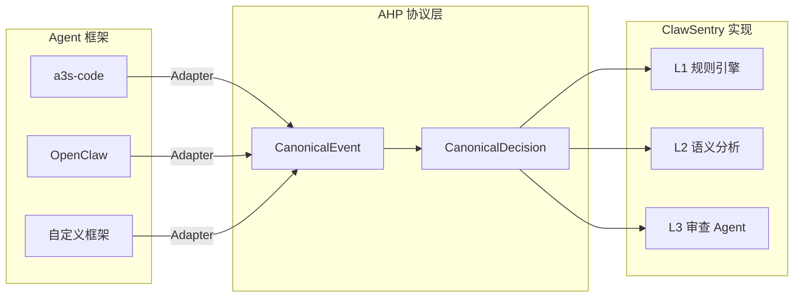
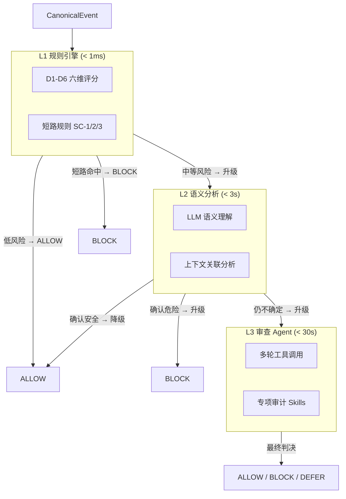
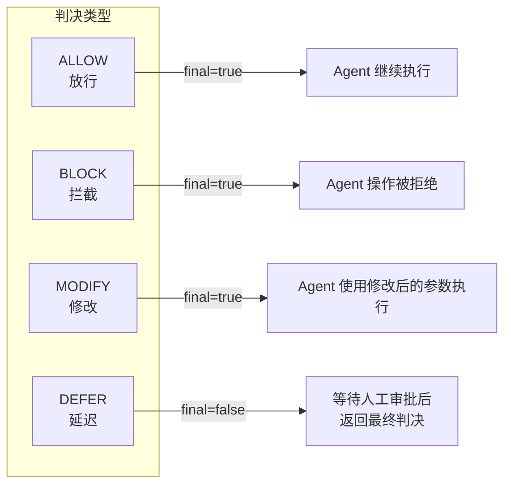
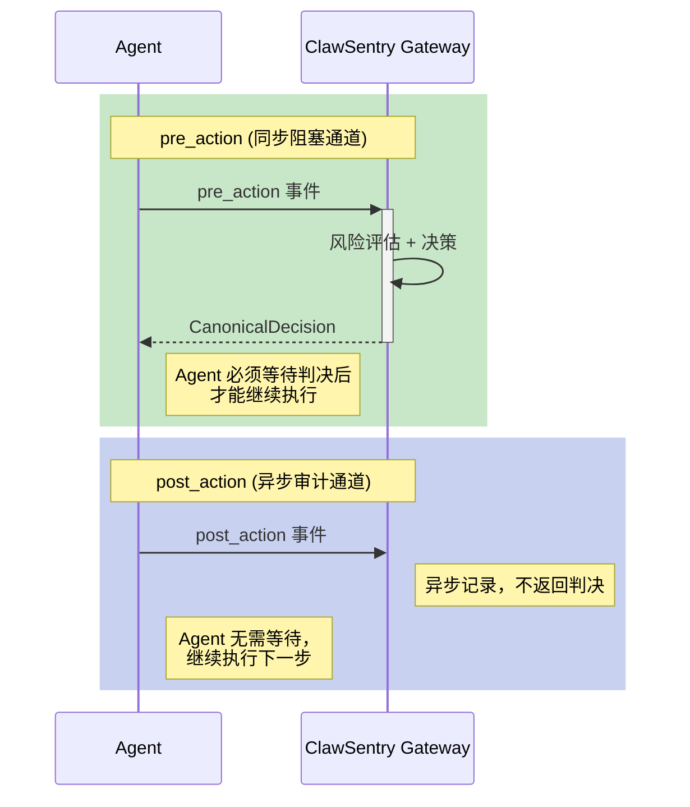
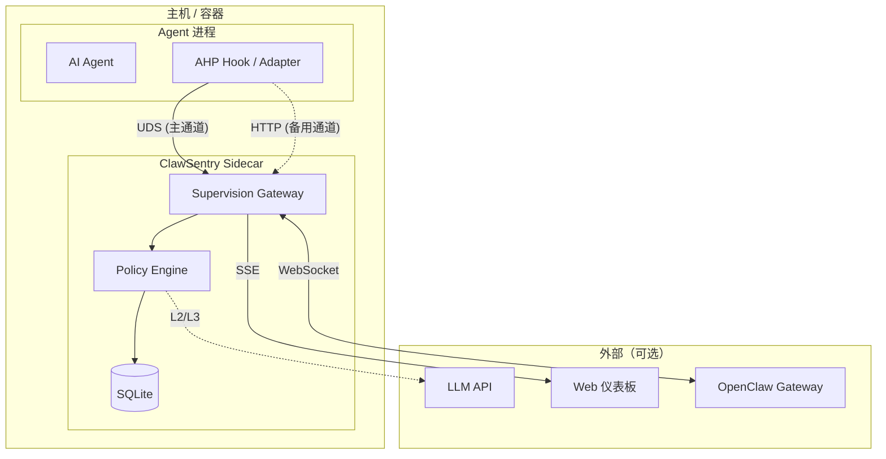
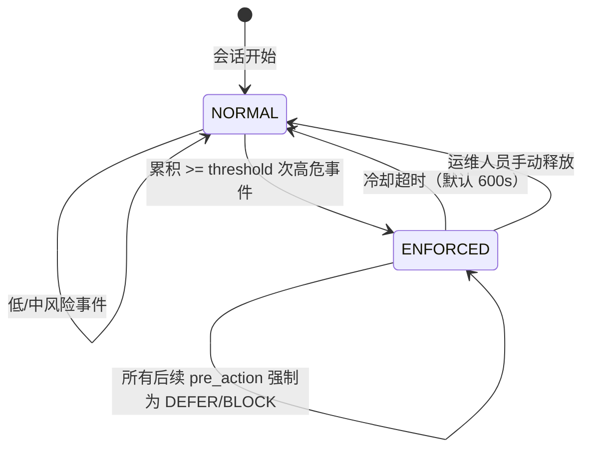
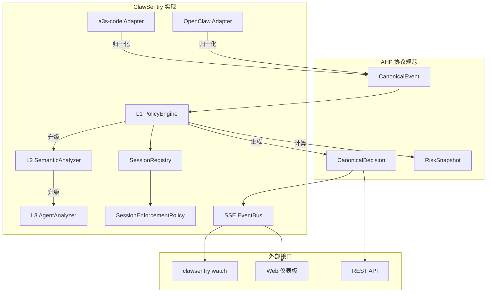

# 核心概念

本页介绍 ClawSentry 的核心概念和设计原理。理解这些概念将帮助你更高效地配置和使用 ClawSentry 监督网关。

---

## 1. AHP 协议 {#ahp-protocol}

**AHP (Agent Harness Protocol)** 是一套面向 AI Agent 运行时的通用安全监督协议。它定义了统一的事件格式和决策模型，使得不同 Agent 框架可以使用相同的监督基础设施。

ClawSentry 是 AHP 协议的 Python 参考实现。



**协议核心要素：**

| 要素 | 说明 |
|------|------|
| 协议版本 | `ahp.1.0`（schema_version 字段） |
| 事件模型 | `CanonicalEvent` — 归一化的 Agent 事件 |
| 决策模型 | `CanonicalDecision` — 监督引擎的裁决 |
| 传输通道 | UDS (Unix Domain Socket) 为主，HTTP 为备 |
| RPC 协议 | `sync_decision.1.0` — 同步决策请求/响应 |

!!! abstract "协议先行，策略后置"
    AHP 协议只定义事件格式和决策接口，不绑定具体的策略逻辑。任何实现都可以自由定义自己的风险评估规则和决策策略。

---

## 2. CanonicalEvent — 归一化事件 {#canonical-event}

`CanonicalEvent` 是 AHP 协议的核心数据模型，将来自不同 Agent 框架的原始事件归一化为统一格式。无论事件来自 a3s-code 还是 OpenClaw，在进入决策引擎时都是同一结构。

### 字段说明

```python
class CanonicalEvent(BaseModel):
    # --- 必填字段 ---
    schema_version: str    # 协议版本，如 "ahp.1.0"
    event_id: str          # 事件唯一标识
    trace_id: str          # 跨组件追踪 ID
    event_type: EventType  # 事件类型（见下方）
    session_id: str        # 会话标识
    agent_id: str          # Agent 标识
    source_framework: str  # 来源框架（"a3s-code" / "openclaw"）
    occurred_at: str       # UTC ISO8601 时间戳
    payload: dict          # 事件载荷（命令、参数等）

    # --- 可选字段 ---
    tool_name: str         # 工具名称（如 "bash", "exec"）
    risk_hints: list[str]  # 来源端提供的风险提示
    approval_id: str       # 审批 ID（用于 DEFER 回调）
    event_subtype: str     # 事件子类型
    framework_meta: dict   # 框架特定元数据
```

### 事件类型

| 类型 | 说明 | 处理方式 |
|------|------|---------|
| `pre_action` | 工具调用前 | **同步阻塞** — 必须等待决策返回 |
| `post_action` | 工具调用后 | 异步审计 — 不阻塞 Agent |
| `pre_prompt` | 提示词发送前 | 可选拦截 |
| `post_response` | LLM 响应后 | 可选审计 |
| `error` | 错误事件 | 日志记录 |
| `session` | 会话生命周期 | 会话追踪 |

### 示例

一个 a3s-code Agent 尝试执行 `rm -rf /tmp/test` 时生成的事件：

```json
{
  "schema_version": "ahp.1.0",
  "event_id": "evt-a1b2c3d4",
  "trace_id": "tr-e5f6g7h8",
  "event_type": "pre_action",
  "session_id": "session-001",
  "agent_id": "agent-main",
  "source_framework": "a3s-code",
  "occurred_at": "2026-03-23T10:30:00Z",
  "tool_name": "bash",
  "event_subtype": "tool_call",
  "payload": {
    "command": "rm -rf /tmp/test",
    "type": "bash"
  }
}
```

---

## 3. CanonicalDecision — 统一判决 {#canonical-decision}

`CanonicalDecision` 是监督引擎对事件的裁决结果。判决由策略引擎产生，永远不会由 Adapter 产生。

### 字段说明

```python
class CanonicalDecision(BaseModel):
    decision: DecisionVerdict      # 判决：allow / block / modify / defer
    reason: str                    # 判决理由（人类可读）
    policy_id: str                 # 产生判决的策略 ID
    risk_level: RiskLevel          # 风险等级：low / medium / high / critical
    decision_source: DecisionSource  # 来源：policy / manual / system
    policy_version: str            # 策略版本
    decision_latency_ms: float     # 决策耗时（毫秒）
    modified_payload: dict         # 修改后的载荷（仅 modify 判决）
    failure_class: FailureClass    # 失败分类（正常为 "none"）
    final: bool                    # 是否为最终判决
```

### 示例

```json
{
  "decision": "block",
  "reason": "Destructive file deletion targeting system path (SC-1 short-circuit)",
  "policy_id": "L1-rule-engine",
  "risk_level": "high",
  "decision_source": "policy",
  "policy_version": "1.0",
  "decision_latency_ms": 0.42,
  "failure_class": "none",
  "final": true
}
```

---

## 4. 三层决策模型 {#three-tier-model}

ClawSentry 实现了渐进式三层决策架构。低层级快速处理简单场景，只有当风险无法在当前层级确定时才向上升级。



### 层级对比

| 层级 | 延迟 | 技术 | 适用场景 | 是否需要 LLM |
|------|------|------|---------|-------------|
| **L1** | < 1ms | 规则引擎 + 模式匹配 | 明确的白名单/黑名单命令 | 否 |
| **L2** | < 3s | LLM 语义分析 | 需要理解命令意图的模糊场景 | 是 |
| **L3** | < 30s | 多轮 Agent + 工具调用 | 复杂场景需要主动调查（读文件、查历史） | 是 |

!!! info "L1 覆盖大多数场景"
    在实际使用中，L1 规则引擎可以处理约 80% 的事件。只有真正需要语义理解的模糊场景才会触发 L2/L3。不配置 LLM 也能获得完整的 L1 防护能力。

### L1 短路规则

L1 引擎内置三条短路规则，命中时立即产生判决，不进行完整的六维评分：

| 规则 | 条件 | 判决 |
|------|------|------|
| **SC-1** | D1=3（高危工具）且 D2 ≥ 2（敏感路径） | 立即 CRITICAL |
| **SC-2** | D3=3（高危命令模式，如 `rm -rf /`、`:(){ :\|:& };:`） | 立即 CRITICAL |
| **SC-3** | D1=0 且 D2=0 且 D3=0（纯只读操作） | 立即 LOW |

### L3 审查 Agent

L3 是最强大的分析层级。它运行一个独立的审查 Agent，可以使用只读工具（ReadOnlyToolkit）进行多轮调查：

- 读取相关文件以理解命令上下文
- 查询会话历史以发现行为模式
- 调用专项审计 Skill（shell 审计、凭证检查、代码审查等）
- 综合所有信息生成最终判决

!!! warning "L3 永不降级"
    如果 L3 执行过程中出现任何错误（LLM 调用失败、工具执行异常等），系统不会回退到低层级。而是返回 `confidence=0.0`，由 Gateway 根据 fail-safe 原则做出保守决策。

---

## 5. D1-D6 六维风险评分 {#risk-dimensions}

ClawSentry 通过六个维度对每个事件进行定量风险评估，生成不可变的 `RiskSnapshot`。

| 维度 | 名称 | 范围 | 评估内容 |
|------|------|------|---------|
| **D1** | 命令危险度 | 0-3 | 工具类型的固有危险性 |
| **D2** | 参数敏感度 | 0-3 | 目标路径或参数是否涉及敏感区域 |
| **D3** | 命令模式危险度 | 0-3 | 命令字符串中的危险模式 |
| **D4** | 历史行为累积 | 0-2 | 当前会话的风险累积程度 |
| **D5** | 作用域权限 | 0-2 | Agent 的信任等级 |
| **D6** | 注入检测 | 0.0-3.0（连续值） | 提示词注入/命令注入/凭证泄露检测（三层：正则 + Canary + 向量相似度） |

**综合评分公式：**

\[
\text{base\_score} = 0.4 \times \max(D1, D2, D3) + 0.25 \times D4 + 0.15 \times D5
\]

\[
\text{composite\_score} = \text{base\_score} \times \left(1.0 + 0.5 \times \frac{D6}{3.0}\right)
\]

**风险等级映射：**

| 合成分范围 | 风险等级 | 默认判决 |
|-----------|---------|---------|
| < 0.8 | `low` | ALLOW |
| 0.8 – 1.5 | `medium` | DEFER（或升级到 L2） |
| 1.5 – 2.2 | `high` | BLOCK |
| >= 2.2 | `critical` | BLOCK |

### D1 评分示例

| 工具类型 | D1 评分 | 示例 |
|---------|--------|------|
| 只读工具 | 0 | `read_file`, `grep`, `list_dir` |
| 有限写入 | 1 | `write_file`, `edit_file` |
| 系统交互 | 2 | `http_request`, `install_package` |
| 高危工具 | 3 | `exec`, `sudo`, `chmod`, `kill` |

### D2 评分示例

| 目标路径 | D2 评分 | 说明 |
|---------|--------|------|
| 项目工作区 | 0 | `./src/app.py` |
| 配置/dotenv 文件 | 1 | `~/.bashrc`, `.env.local`, `Makefile` |
| 凭证/密钥文件 | 2 | `~/.ssh/id_rsa`, `server.pem` |
| 系统关键路径 | 3 | `/etc/hosts`, `/etc/shadow`, `/boot/` |

### D6 — 注入检测 (Injection Detection) {#d6}

**取值范围：0.0-3.0（连续浮点值）**

D6 是 ClawSentry E-4 新增的第六个风险维度，专门检测提示词注入（Prompt Injection）和命令注入（Command Injection）企图。与 D1-D5 的整数评分不同，D6 采用连续浮点值，精度更高。

**三层检测架构：**

| 层级 | 名称 | 机制 | 分值贡献 |
|:----:|------|------|---------|
| **Layer 1** | 启发式正则 | 弱模式 10 条（+0.3/条，上限 1.5）+ 强模式 8 条（+0.8/条，上限 2.4）+ 工具特定模式 | 0.0–3.0 |
| **Layer 2** | Canary Token | 在载荷中嵌入随机 token，检测是否被外泄 | +1.5（若命中） |
| **Layer 3** | 向量相似度 | 可插拔 `EmbeddingBackend` Protocol，与已知攻击语料比较相似度 | 0.0–2.0 |

最终 D6 = min(Layer1 + Layer2 + Layer3, 3.0)。

**弱模式示例（ignore previous instructions、forget everything 等）：** 偏误导性话术，每条 +0.3 分，10 条上限 1.5

**强模式示例（`<script`、`eval(`、Unicode 零宽字符、`data:text/html;base64,` 等）：** 明确的注入技术特征，每条 +0.8 分，8 条上限 2.4

**D6 全局放大效应：**

D6 通过乘数公式放大基础评分，而不是简单累加。例如 D6=3.0 时，基础评分放大 1.5 倍（1.0 + 0.5×1.0 = 1.5）。这使得注入尝试能够将原本中等风险的操作提升到高危区间。

**D6 最低保证：** 当 D6 >= 2.0 且当前风险等级为 LOW 时，强制升级为 MEDIUM，防止高置信度注入被低评分掩盖。

!!! example "D6 放大效应示例"
    假设一个有历史高危记录会话中的 `pip install` 命令（D4=1，base_score = 1.20，MEDIUM 区间）：

    | 场景 | D6 分值 | 乘数 | composite_score | 最终判决 |
    |------|:-------:|:----:|:---------------:|:-------:|
    | 无注入特征 | 0.0 | 1.00 | 1.20 | MEDIUM → L2 分析 |
    | 含 2 条弱注入模式（+0.6） | 0.6 | 1.10 | 1.32 | MEDIUM → L2 分析 |
    | 强注入 + Canary 泄露（+2.3） | 2.3 | 1.38 | 1.66 | HIGH → BLOCK |
    | Layer 3 向量命中 + 强模式（3.0） | 3.0 | 1.50 | 1.80 | HIGH → BLOCK |

    D6 达到强注入强度（≥ 1.5）后，将原本处于 MEDIUM 区间的操作直接提升为 HIGH 拦截。

---

## 6. 四种判决 {#verdicts}

每个 `CanonicalDecision` 包含以下四种判决之一：



| 判决 | 语义 | `final` | 适用场景 |
|------|------|---------|---------|
| **ALLOW** | 放行，允许 Agent 执行该操作 | `true` | 低风险的安全操作 |
| **BLOCK** | 拦截，拒绝 Agent 执行该操作 | `true` | 高危或违规操作 |
| **MODIFY** | 修改参数后放行 | `true` | 需要自动脱敏或参数校正的操作 |
| **DEFER** | 延迟等待人工审批 | `false` | 中等风险，需运维人员确认 |

!!! note "MODIFY 判决"
    当判决为 `MODIFY` 时，`CanonicalDecision` 必须包含 `modified_payload` 字段，Agent 应使用修改后的参数执行操作。例如，自动将明文密码替换为环境变量引用。

!!! warning "DEFER 有时间限制"
    DEFER 判决带有 `expires_at` 时间戳。如果运维人员在超时前未做出选择，系统将根据 fail-safe 原则自动拒绝（fail-closed）。

---

## 7. 双通道处理 {#dual-channel}

AHP 协议区分两种处理模式，分别对应不同的时效要求：



| 通道 | 事件类型 | 行为 | SLA |
|------|---------|------|-----|
| **同步阻塞** | `pre_action` | Agent 发送事件后必须等待判决返回 | L1 < 1ms, L2 < 3s, L3 < 30s |
| **异步审计** | `post_action` | Agent 发送事件后立即继续，Gateway 异步处理 | 无硬性限制 |

!!! tip "为什么需要双通道？"
    `pre_action` 通道是安全防线 — 它在操作执行前进行拦截决策。`post_action` 通道用于事后审计和行为分析，不影响 Agent 的执行速度，但提供完整的操作轨迹用于安全审查和 D4 历史行为累积评分。

---

## 8. Sidecar 架构 {#sidecar}

ClawSentry 采用 Sidecar 模式部署，作为 Agent 的伴随进程运行，通过本地通信通道进行交互。



### 双传输通道

| 通道 | 协议 | 优先级 | 特点 |
|------|------|--------|------|
| **UDS** | Unix Domain Socket | 主通道 | 低延迟、无网络开销、文件权限隔离 |
| **HTTP** | REST API | 备用通道 | 支持跨网络访问、便于调试 |

!!! info "UDS 安全加固"
    ClawSentry 在创建 UDS 文件后会设置 `chmod 600` 权限，确保只有同一用户的进程可以访问。结合 Bearer Token 认证，提供双重安全保障。

---

## 9. 会话累积与强制策略 {#session-enforcement}

ClawSentry 通过 `SessionRegistry` 追踪每个会话的风险累积，通过 `SessionEnforcementPolicy` 在阈值触发时强制执行安全策略。

### 会话风险追踪

每次事件评估后，会话的风险统计会更新：

- 累计高危事件数
- 最近 N 次事件的风险等级分布
- 会话持续时间和活跃度

### 强制策略（Session Enforcement）

当一个会话累积了 N 次高危事件后（默认阈值为 3），强制策略会被触发：



| 配置项 | 环境变量 | 默认值 | 说明 |
|--------|---------|--------|------|
| 启用开关 | `AHP_SESSION_ENFORCEMENT_ENABLED` | `false` | 是否启用会话强制策略 |
| 触发阈值 | `AHP_SESSION_ENFORCEMENT_THRESHOLD` | `3` | 累积多少次高危事件后触发 |
| 强制动作 | `AHP_SESSION_ENFORCEMENT_ACTION` | `defer` | 触发后的动作：`defer` / `block` / `l3_require` |
| 冷却时间 | `AHP_SESSION_ENFORCEMENT_COOLDOWN_SECONDS` | `600` | 自动释放的等待时间（秒） |

---

## 10. Fail-safe 原则 {#fail-safe}

ClawSentry 遵循分级别的 fail-safe 策略，确保在系统异常时仍能维持安全基线：

| 风险等级 | 异常时行为 | 原则名称 |
|---------|----------|---------|
| `high` / `critical` | **阻断** — 拒绝执行 | Fail-closed |
| `low` | **放行** — 允许执行 | Fail-open |
| `medium` | **延迟** — 等待人工确认 | Fail-defer |

!!! danger "高危操作永远不会因系统故障而被放行"
    这是 ClawSentry 最核心的安全承诺。即使策略引擎崩溃、LLM 调用超时、数据库不可用，高危操作也会被拦截。

**具体场景：**

| 故障场景 | 低风险事件 | 高风险事件 |
|---------|----------|----------|
| L2 LLM 调用超时 | 使用 L1 结果（ALLOW） | 使用 L1 结果（BLOCK） |
| L3 Agent 执行失败 | 回退到 L2 结果 | 返回 `confidence=0.0`，保守拦截 |
| 策略引擎不可达 | ALLOW（fail-open） | BLOCK（fail-closed） |
| 数据库写入失败 | 正常决策，日志告警 | 正常决策，日志告警 |

---

## 概念关系总览



---

## 下一步

- 阅读 [常见问题](faq.md) 获取常见疑问的解答
- 前往 [a3s-code 集成指南](../integration/a3s-code.md) 了解完整的集成细节
- 查看 [L1 规则引擎](../decision-layers/l1-rules.md) 深入理解三层决策的策略配置
