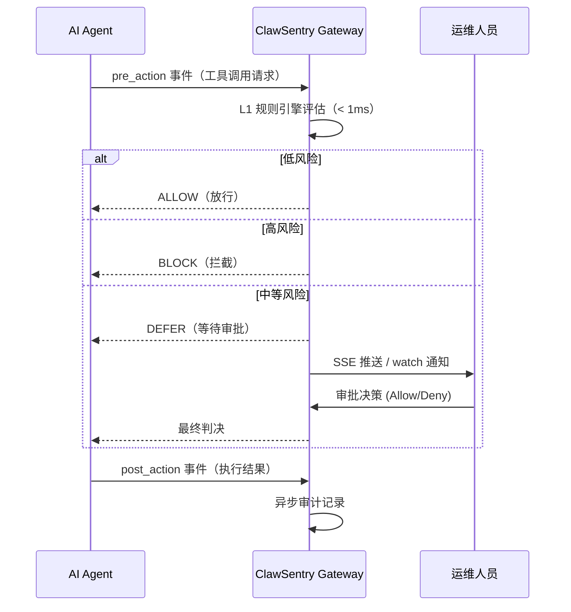

# 快速开始

本指南将带你在 5 分钟内完成 ClawSentry 的配置与启动。ClawSentry 是 AHP 协议的参考实现，支持多种 AI Agent 框架的安全监督。

## :zap: 一键启动（推荐）

最简单的启动方式，自动检测框架并完成所有配置：

```bash
clawsentry start
```

该命令会自动：

1. 检测你的 Agent 框架（Claude Code、a3s-code、OpenClaw 或 Codex）
2. 初始化配置（如果尚未初始化）
3. 加载环境变量
4. 后台启动 Gateway
5. 前台显示实时监控

??? example "终端输出示例"
    ```
    [clawsentry] Detected framework: openclaw
    [clawsentry] Configuration already initialized
    [clawsentry] Starting gateway...
    INFO:     ahp-stack: === ClawSentry Supervision Gateway ===
    INFO:     ahp-stack: HTTP      : 127.0.0.1:8080
    INFO:     ahp-stack: OpenClaw  : WS ws://127.0.0.1:18789
    INFO:     openclaw-ws: Connected to OpenClaw Gateway

    Web UI: http://127.0.0.1:8080/ui?token=xK7m9p2Q...

    ──────────────────────────────────────────────────────────────
    [14:23:05] DECISION  session=my-session
      verdict : ALLOW
      risk    : low
      command : cat README.md
    ──────────────────────────────────────────────────────────────
    ```

!!! tip "可选参数"
    ```bash
    clawsentry start --framework openclaw    # 指定框架
    clawsentry start --interactive           # 启用 DEFER 交互式审批
    clawsentry start --no-watch              # 仅启动 Gateway，不显示监控
    ```

按 `Ctrl+C` 优雅关闭 Gateway 和监控。

---

## 框架集成能力对比

| 能力 | Claude Code | a3s-code | OpenClaw | Codex |
|------|:-----------:|:--------:|:--------:|:-----:|
| 实时风险评估 | :white_check_mark: | :white_check_mark: | :white_check_mark: | :white_check_mark: |
| **自动拦截高危操作** | :white_check_mark: | :white_check_mark: | :white_check_mark: | :x: |
| 审计记录 | :white_check_mark: | :white_check_mark: | :white_check_mark: | :white_check_mark: |
| clawsentry watch 监控 | :white_check_mark: | :white_check_mark: | :white_check_mark: | :white_check_mark: |
| Web UI 仪表板 | :white_check_mark: | :white_check_mark: | :white_check_mark: | :white_check_mark: |
| DEFER 交互审批 | :white_check_mark: | :white_check_mark: | :white_check_mark: | :x: |
| 集成方式 | Hook 注入 | Hook 配置 | WebSocket | Session 日志监控 |

!!! info "为什么 Codex 不能自动拦截？"
    Codex CLI 目前没有提供原生 hook 机制。Claude Code 和 a3s-code 支持在工具执行前调用外部程序（hook），ClawSentry 利用这个机制实现阻塞式安全审查。Codex 不支持此功能，ClawSentry 通过监控其 session 日志文件实现实时评估和推荐。

## 分步操作（高级用户）

如果你需要更精细的控制，可以选择分步操作。根据你使用的 Agent 框架，选择对应的集成路径：

<div class="grid cards" markdown>

-   :material-console-line:{ .lg .middle } **Claude Code 集成**

    ---

    通过原生 Hook 系统对接 Claude Code，**自动拦截**高危操作。

    [:octicons-arrow-right-24: 跳转到 Claude Code 集成](#workflow-claude-code)

-   :material-console:{ .lg .middle } **a3s-code 集成**

    ---

    通过 stdio/HTTP 传输协议对接 a3s-code Agent，**自动拦截**高危操作。

    [:octicons-arrow-right-24: 跳转到 a3s-code 集成](#workflow-1-a3s-code)

-   :material-monitor-dashboard:{ .lg .middle } **OpenClaw 集成**

    ---

    通过 WebSocket 实时事件流对接 OpenClaw Gateway，**自动拦截**高危操作。

    [:octicons-arrow-right-24: 跳转到 OpenClaw 集成](#workflow-2-openclaw)

-   :material-code-braces:{ .lg .middle } **Codex 集成**

    ---

    通过 session 日志监控对接 Codex CLI，**实时评估**（不自动拦截）。

    [:octicons-arrow-right-24: 跳转到 Codex 集成](#workflow-codex)

</div>

---

## Claude Code 集成 {#workflow-claude-code}

Claude Code 原生支持 Hook 系统，ClawSentry 通过注入 `PreToolUse` Hook 实现阻塞式安全审查。

### 步骤 1: 初始化配置

```bash
clawsentry init claude-code
```

该命令会：

- 生成 `.env.clawsentry`（认证令牌 + UDS 路径）
- 自动注入 Hook 到 `~/.claude/settings.local.json`

### 步骤 2: 启动监督网关

```bash
source .env.clawsentry
clawsentry gateway
```

### 步骤 3: 正常使用 Claude Code

```bash
claude
```

Hook 已自动生效，每个工具调用都会经过 ClawSentry 安全审查。高危操作会被自动阻止。

### 步骤 4: 实时监控（可选）

```bash
clawsentry watch
```

!!! tip "卸载"
    ```bash
    clawsentry init claude-code --uninstall
    ```
    精确移除 ClawSentry Hook，保留其他 Hook 配置。

---

## Workflow 1: a3s-code 集成 {#workflow-1-a3s-code}

a3s-code 是一款支持 AHP Hook 系统的 AI 编码 Agent。ClawSentry 通过 stdio 传输协议作为其 Hook 进程，拦截并审查所有工具调用。

### 步骤 1: 初始化配置

```bash
clawsentry init a3s-code
```

??? example "终端输出示例"
    ```
    [clawsentry] a3s-code integration initialized

      Files created:
        .env

      Environment variables:
        CS_UDS_PATH=/tmp/clawsentry.sock
        CS_AUTH_TOKEN=xK7m9p2Q...（自动生成的安全令牌）

      Next steps:
        1. source .env
        2. clawsentry gateway    # starts on UDS + HTTP port 8080
        3. Configure a3s-code AHP transport:
          program: "clawsentry-harness"
        4. clawsentry watch    # real-time terminal monitoring (port 8080)
    ```

该命令会在当前目录生成 `.env` 文件，包含 UDS 路径和认证令牌。

### 步骤 2: 加载环境变量

```bash
source .env
```

### 步骤 3: 配置 a3s-code Hook

在 a3s-code 的配置文件中（通常为 `agent.hcl` 或 `settings.json`），添加 AHP stdio Hook：

```hcl
hooks {
  ahp {
    transport = "stdio"
    program   = "clawsentry-harness"
  }
}
```

!!! info "Hook 工作原理"
    `clawsentry-harness` 作为 stdio 桥接进程运行。a3s-code 在执行工具调用前，会通过 stdin/stdout 将事件发送给 Harness，Harness 转发到 ClawSentry Gateway 获取决策，再将结果返回给 a3s-code。

### 步骤 4: 启动监督网关

在一个终端窗口中启动 ClawSentry Gateway：

```bash
clawsentry gateway
```

??? example "终端输出示例"
    ```
    INFO:     ahp-stack: === ClawSentry Supervision Gateway ===
    INFO:     ahp-stack: UDS path  : /tmp/clawsentry.sock
    INFO:     ahp-stack: HTTP      : 127.0.0.1:8080
    INFO:     ahp-stack: Auth      : Bearer token enabled
    INFO:     ahp-stack: Mode      : Gateway-only (no OpenClaw config detected)
    INFO:     Started server process [12345]
    INFO:     Uvicorn running on http://127.0.0.1:8080
    ```

Gateway 会同时监听 UDS（主通道）和 HTTP（备用通道），等待来自 Agent 的事件。

### 步骤 5: 运行 a3s-code Agent

在另一个终端中正常使用 a3s-code：

```bash
a3s-code agent --session-id my-session
```

当 Agent 尝试执行工具调用（如 shell 命令）时，请求会自动经过 ClawSentry 的三层决策引擎审查。

### 步骤 6: 实时监控

在第三个终端中启动实时事件监控：

```bash
clawsentry watch
```

??? example "终端输出示例"
    ```
    ──────────────────────────────────────────────────────────────
    [14:23:05] DECISION  session=my-session
      verdict : ALLOW
      risk    : low
      command : cat README.md
      tier    : L1 (<1ms)
      reason  : Read-only file operation
    ──────────────────────────────────────────────────────────────
    [14:23:12] DECISION  session=my-session
      verdict : BLOCK
      risk    : high
      command : rm -rf /important-data
      tier    : L1 (<1ms)
      reason  : Destructive system command detected (SC-1 short-circuit)
    ──────────────────────────────────────────────────────────────
    ```

!!! tip "过滤事件类型"
    使用 `--filter` 参数只关注特定事件：

    ```bash
    clawsentry watch --filter decision,alert
    ```

---

## Workflow 2: OpenClaw 集成 {#workflow-2-openclaw}

OpenClaw 是一个 AI Agent Gateway 平台。ClawSentry 通过 WebSocket 连接到 OpenClaw Gateway，实时监听 `exec.approval.requested` 事件并做出安全决策。

### 前置条件

- OpenClaw Gateway 已启动并运行（默认端口 `18789`）
- OpenClaw 配置了 `tools.exec.host = "gateway"` 以启用审批流程

### 步骤 1: 初始化配置（自动检测 + 自动设置）

```bash
clawsentry init openclaw --auto-detect --setup
```

??? example "终端输出示例"
    ```
    [clawsentry] openclaw integration initialized

      Files created:
        .env

      Environment variables:
        CS_UDS_PATH=/tmp/clawsentry.sock
        CS_AUTH_TOKEN=Fk9m2xQ...
        OPENCLAW_WS_URL=ws://127.0.0.1:18789
        OPENCLAW_OPERATOR_TOKEN=xxxxxxxxxxxxxxxx...（从 openclaw.json 自动读取）
        OPENCLAW_ENFORCEMENT_ENABLED=true

      Next steps:
        1. source .env
        2. clawsentry gateway    # auto-detects OpenClaw, starts WS + webhook
        3. clawsentry watch --interactive    # approve/deny DEFER decisions

      OpenClaw configuration updated:
        - Set tools.exec.host = "gateway"
        - Created exec-approvals.json with security=allowlist, ask=always
      Backups: ~/.openclaw/openclaw.json.bak
    ```

!!! info "各参数说明"
    - `--auto-detect`：自动从 `~/.openclaw/openclaw.json` 读取 Gateway Token 和端口
    - `--setup`：自动配置 OpenClaw 的 `tools.exec.host` 和 `exec-approvals.json`，使所有命令进入审批流程
    - 添加 `--dry-run` 可预览变更而不实际修改文件

### 步骤 2: 加载环境变量

```bash
source .env
```

### 步骤 3: 启动监督网关

```bash
clawsentry gateway
```

??? example "终端输出示例"
    ```
    INFO:     ahp-stack: === ClawSentry Supervision Gateway ===
    INFO:     ahp-stack: UDS path  : /tmp/clawsentry.sock
    INFO:     ahp-stack: HTTP      : 127.0.0.1:8080
    INFO:     ahp-stack: Auth      : Bearer token enabled
    INFO:     ahp-stack: OpenClaw  : WS ws://127.0.0.1:18789 (enforcement=ON)
    INFO:     ahp-stack: Webhook   : 127.0.0.1:8081
    INFO:     ahp-stack: Mode      : Full stack (OpenClaw integration active)
    INFO:     openclaw-ws: Connected to OpenClaw Gateway
    INFO:     openclaw-ws: Subscribed to exec.approval.requested
    INFO:     Started server process [12345]
    ```

当检测到 OpenClaw 环境变量时，Gateway 会自动启动：

- WebSocket 客户端连接到 OpenClaw，监听审批事件
- Webhook Receiver 在 8081 端口接收回调通知

### 步骤 4: 运行 OpenClaw Agent

在另一个终端中启动 OpenClaw Agent 会话：

```bash
openclaw agent --session-id demo-session
```

当 Agent 执行命令时，OpenClaw 会广播 `exec.approval.requested` 事件，ClawSentry 立即接收并评估风险。

### 步骤 5: 交互式审批监控

```bash
clawsentry watch --interactive
```

??? example "终端输出示例"
    ```
    ──────────────────────────────────────────────────────────────
    [14:30:22] DECISION  session=demo-session
      verdict : DEFER (awaiting operator)
      risk    : medium
      command : pip install requests
      tier    : L1
      reason  : Package installation — operator confirmation required
      expires : 14:31:22 (60s remaining)

      [A]llow  [D]eny  [S]kip > A
      >>> Resolved: ALLOW (operator approved)
    ──────────────────────────────────────────────────────────────
    [14:30:45] DECISION  session=demo-session
      verdict : BLOCK
      risk    : critical
      command : sudo rm -rf /
      tier    : L1
      reason  : Critical destructive command (SC-1 short-circuit)
    ──────────────────────────────────────────────────────────────
    ```

!!! warning "DEFER 超时行为"
    如果运维人员在超时时间内未做出选择，ClawSentry 将根据 fail-safe 原则自动拒绝请求。

---

## Codex 集成 {#workflow-codex}

!!! warning "监控模式"
    Codex 没有原生 Hook 系统。ClawSentry 通过监控 Codex 的 session 日志实现**实时风险评估和推荐**，但无法自动阻止操作。建议配合 `--approval-policy untrusted` 使用。

### 步骤 1: 初始化配置

```bash
clawsentry init codex
```

该命令会自动检测 Codex 安装目录并配置 session 日志监控。

### 步骤 2: 启动监督网关

```bash
source .env.clawsentry
clawsentry gateway
```

Gateway 启动时会自动开始监控 Codex 的 session 日志目录。

### 步骤 3: 正常使用 Codex

```bash
codex --approval-policy untrusted
```

建议使用 `--approval-policy untrusted`，这样 Codex 会在每个工具调用前暂停等待你审批。

### 步骤 4: 查看安全建议

在另一个终端：

```bash
clawsentry watch
```

当 Codex 请求执行工具时，`clawsentry watch` 会实时显示 ClawSentry 的风险评估结果，帮助你做出审批决定。

---

## 到底发生了什么？

无论你选择哪种集成路径，ClawSentry 在背后执行了相同的安全监督流程：



**核心流程分解：**

1. **事件归一化**：来自 a3s-code、Claude Code、OpenClaw 或 Codex 的原始事件被 Adapter 转换为统一的 `CanonicalEvent` 格式
2. **风险评估**：L1 策略引擎在 1 毫秒内计算 D1-D5 五维风险评分
3. **决策生成**：基于风险等级生成 `CanonicalDecision`（ALLOW / BLOCK / MODIFY / DEFER）
4. **结果回传**：决策通过原传输通道返回给 Agent 框架
5. **实时广播**：所有决策通过 SSE 流推送给 `watch` 客户端和 Web 仪表板
6. **持久化存储**：事件和决策记录到本地 SQLite 数据库，供审计和回放

---

## 可选：启用 Web 仪表板

ClawSentry 内置了 Web 安全仪表板，提供可视化的监控和审批界面：

```bash
# Gateway 启动后，在浏览器中访问
open http://127.0.0.1:8080/ui
```

仪表板提供：

- 实时决策 Feed 和风险指标
- 会话轨迹回放与 D1-D5 雷达图
- 告警管理与确认
- DEFER 决策的在线审批面板

---

## 可选：启用 LLM 分析

默认情况下，ClawSentry 仅使用 L1 规则引擎（无需 LLM）。要启用 L2 语义分析和 L3 审查 Agent：

```bash
# 安装 LLM 依赖
pip install "clawsentry[llm]"

# 配置 LLM Provider（在 .env 中添加）
AHP_LLM_PROVIDER=openai
AHP_LLM_BASE_URL=https://api.openai.com/v1
AHP_LLM_MODEL=gpt-4
OPENAI_API_KEY=sk-your-key-here

# 或使用 Anthropic Claude
AHP_LLM_PROVIDER=anthropic
AHP_LLM_MODEL=claude-sonnet-4-20250514
ANTHROPIC_API_KEY=sk-ant-your-key-here
```

!!! note "L2/L3 触发条件"
    LLM 分析并非对每个事件都触发。只有当 L1 规则引擎判定风险等级为 `medium` 或更高时，才会升级到 L2 语义分析。L3 审查 Agent 仅在 L2 仍无法确定或显式标记时触发。

---

## 下一步

- 阅读 [核心概念](concepts.md) 深入理解 AHP 协议和三层决策模型
- 查看 [常见问题](faq.md) 获取常见疑问的解答
