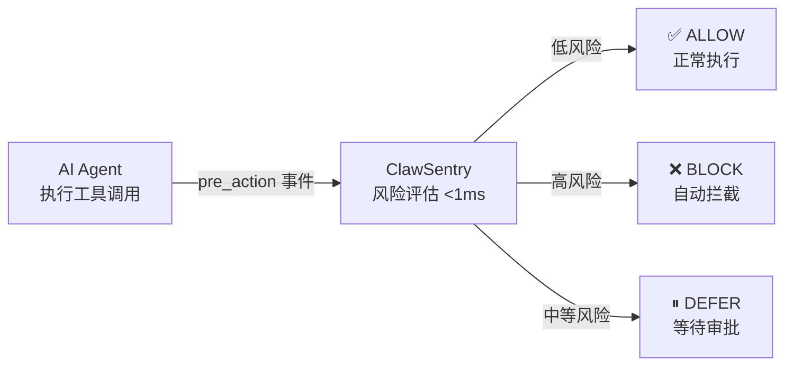

---
hide:
  - navigation
  - toc
---

<style>
  .md-typeset h1 { display: none; }

  .hero {
    text-align: center;
    padding: 2rem 1rem 1rem;
  }
  .hero h2 {
    font-size: 2.8rem;
    font-weight: 700;
    margin-bottom: 0.5rem;
  }
  .hero .tagline {
    font-size: 1.25rem;
    opacity: 0.85;
    margin-bottom: 2rem;
  }

  .grid-cards {
    display: grid;
    grid-template-columns: repeat(auto-fit, minmax(220px, 1fr));
    gap: 1rem;
    margin: 2rem 0;
  }
  .grid-cards .card {
    border: 1px solid var(--md-default-fg-color--lightest);
    border-radius: 8px;
    padding: 1.2rem;
    text-align: center;
  }
  .grid-cards .card h3 { margin-top: 0.5rem; }
  .framework-cards {
    display: grid;
    grid-template-columns: repeat(auto-fit, minmax(240px, 1fr));
    gap: 1rem;
    margin: 1.5rem 0;
  }
  .framework-card {
    border: 1px solid var(--md-default-fg-color--lightest);
    border-radius: 8px;
    padding: 1.2rem;
  }
  .framework-card h3 { margin-top: 0.5rem; }
  .latch-banner {
    background: var(--md-code-bg-color);
    border-left: 4px solid var(--md-accent-fg-color);
    border-radius: 4px;
    padding: 1rem 1.4rem;
    margin: 1rem 0 2rem;
  }
</style>

<div class="hero" markdown>

## :shield: ClawSentry

**AI Agent 会执行危险命令。ClawSentry 在执行前拦截。**
{ .tagline }

面向 Claude Code、a3s-code、OpenClaw、Codex 的实时安全监督网关。<br>
三层递进决策（规则 → 语义 → Agent 审查），毫秒级响应，零代码侵入。
{ .tagline }

[:octicons-rocket-16: 选择你的框架开始](#choose-framework){ .md-button .md-button--primary }
[:octicons-book-16: 查看文档](getting-started/quickstart.md){ .md-button }
[:octicons-mark-github-16: GitHub](https://github.com/Elroyper/ClawSentry){ .md-button }

</div>

---

<div class="grid-cards" markdown>

<div class="card" markdown>
### :shield: 拦截，而不只是记录
AI 执行 `rm -rf` 或试图外传密钥前，ClawSentry 自动阻止——不是事后告警。
</div>

<div class="card" markdown>
### :zap: 不拖慢你的工作流
L1 规则引擎 &lt;1ms 完成大多数决策；L2/L3 语义分析仅在必要时触发。
</div>

<div class="card" markdown>
### :eye: 全链路可见
每条工具调用都有记录、决策原因和完整审计轨迹，支持 CLI 终端 / Web 仪表板 / 移动端。
</div>

</div>

---

## 选择你的框架 { #choose-framework }

<div class="framework-cards" markdown>

<div class="card framework-card" markdown>
### :material-console-line: Claude Code
通过原生 Hook 系统接入，**自动拦截**高危操作。

- 零侵入注入，不改动 Claude Code 本身
- `PreToolUse` 阻塞式安全审查
- 一键初始化 + 一键卸载

[:octicons-arrow-right-24: Claude Code 快速开始](getting-started/quickstart.md)
</div>

<div class="card framework-card" markdown>
### :material-console: a3s-code
通过 stdio / HTTP 传输协议接入，**自动拦截**高危操作。

- stdio harness 作为 Hook 进程
- 支持 UDS（主）+ HTTP（备）双通道
- 一键初始化配置

[:octicons-arrow-right-24: a3s-code 快速开始](getting-started/quickstart.md)
</div>

<div class="card framework-card" markdown>
### :material-web: OpenClaw
通过 WebSocket 实时事件流接入，**自动拦截**高危操作。

- 监听 `exec.approval.requested` 事件
- 自动检测 OpenClaw 配置
- 支持交互式 DEFER 审批

[:octicons-arrow-right-24: OpenClaw 快速开始](getting-started/quickstart.md)
</div>

<div class="card framework-card" markdown>
### :material-code-braces: Codex
通过 session 日志监控接入，**实时风险评估**。

- 自动监控 session 日志目录
- 无原生 Hook，不自动拦截，提供评估建议
- 建议配合 `--approval-policy untrusted`

[:octicons-arrow-right-24: Codex 快速开始](getting-started/quickstart.md)
</div>

</div>

<div class="latch-banner" markdown>

:material-cellphone: **Latch 移动监控（可选增强）**

随时随地在手机上查看安全事件，远程审批 DEFER 操作。支持所有框架，需单独安装。

[:octicons-arrow-right-24: 了解 Latch 集成](integration/latch.md)

</div>

---

## 核心亮点

<div class="grid-cards" markdown>

<div class="card" markdown>
### :zap: 深度防御
**L1 规则** (<1ms) → **L2 语义** (<3s) → **L3 Agent** (<30s)

逐层升级，绝大多数决策在 L1 毫秒级完成。
</div>

<div class="card" markdown>
### :link: 统一多种 AI 框架
**a3s-code** + **Claude Code** + **Codex** + **OpenClaw**

统一 AHP 协议归一化所有框架事件。
</div>

<div class="card" markdown>
### :satellite: 多端实时可见
**CLI 终端** + **Web 仪表板** + **移动端（Latch）**

决策/告警/会话三端同步，全链路可观测。
</div>

<div class="card" markdown>
### :lock: 安全优先
**Fail-closed 高危** + **Bearer Token** + **HMAC 签名**

生产级安全加固
</div>

</div>

---

## 工作原理



??? note "查看完整架构图"
    <figure markdown>
      
      <figcaption>ClawSentry — 统一 AI Agent 安全监督网关</figcaption>
    </figure>

---

## 快速安装

=== "基础安装"

    ```bash
    pip install clawsentry
    ```

=== "含 LLM 支持"

    ```bash
    pip install clawsentry[llm]
    ```

=== "完整安装"

    ```bash
    pip install clawsentry[all]
    ```

=== "开发环境"

    ```bash
    git clone https://github.com/Elroyper/ClawSentry.git
    cd ClawSentry
    pip install -e ".[dev]"
    ```

!!! info "环境要求"
    - Python >= 3.11
    - 核心依赖：FastAPI, Uvicorn, Pydantic v2
    - 可选依赖组：`[llm]`（Anthropic / OpenAI）、`[enforcement]`（WebSocket）、`[dev]`（测试）

---

??? info "三层决策模型详解"
    | 层级 | 名称 | 延迟 | 机制 | 适用场景 |
    |:---:|:---|:---:|:---|:---|
    | **L1** | 规则引擎 | <1ms | D1-D6 六维评分（命令危险度/参数敏感度/命令模式/历史行为/作用域权限/注入检测） | 明确的黑白名单、已知危险模式、注入尝试 |
    | **L2** | 语义分析 | <3s | RuleBased / LLM / Composite 三种实现，SemanticAnalyzer 协议 | 需要上下文理解的灰度命令 |
    | **L3** | 审查 Agent | <30s | AgentAnalyzer + ReadOnlyToolkit + SkillRegistry，多轮工具调用推理 | 复杂意图判断、需要取证分析 |

    ```
                      ┌─ ALLOW/DENY ──→ 直接返回
      Event ──→ L1 ──┤
                      └─ 不确定 ──→ L2 ──┬─ ALLOW/DENY ──→ 返回
                                          └─ 不确定 ──→ L3 ──→ 最终判决
    ```

    !!! note "升级策略"
        每层仅在无法确定时才向上升级，保证绝大多数请求在 L1 毫秒级完成。L3 是终审，**永不降级**——任何 L3 内部失败将降级为 `confidence=0.0`（fail-closed）。

---

??? info "各框架接入详情"
    === "a3s-code"

        通过 **stdio harness**（主通道）或 **HTTP Transport**（备通道）接入。

        ```bash
        # stdio 模式 — 作为 a3s-code hook 进程
        clawsentry-harness

        # HTTP 模式 — POST /ahp/a3s
        clawsentry-gateway
        ```

        详见 [a3s-code 集成指南](integration/a3s-code.md)

    === "Claude Code"

        通过 **Hook 系统** + **stdio harness** 接入，自动注入 `settings.json`。

        ```bash
        clawsentry init claude-code   # 一键配置 hooks
        source .env.clawsentry
        clawsentry gateway &          # 启动 Gateway
        claude                        # 正常使用，所有工具调用自动监控
        ```

        详见 [Claude Code 集成指南](integration/claude-code.md)

    === "Codex CLI"

        通过 **HTTP Transport**（`POST /ahp/codex`）接入，简化 JSON 请求格式。

        ```bash
        clawsentry init codex         # 生成配置
        source .env.clawsentry
        clawsentry gateway            # 启动 Gateway
        ```

        详见 [Codex CLI 集成指南](integration/codex.md)

    === "OpenClaw"

        通过 **WebSocket 实时监听** + **Webhook 接收** + **审批执行器** 接入。

        ```bash
        # 一键启动（自动检测 OpenClaw 配置）
        clawsentry gateway
        ```

        详见 [OpenClaw 集成指南](integration/openclaw.md)

---

## CLI 与 API

- [CLI 命令参考 →](cli/index.md) — `init / gateway / watch / doctor / audit / config / start / stop / latch`
- [REST API 文档 →](api/decisions.md) — 决策端点、报表监控、SSE 推送、认证

---


## Web 安全仪表板

内置 **React 18 + TypeScript + Vite** 单页应用，暗色 SOC（安全运营中心）主题。

| 页面 | 功能 |
|:---|:---|
| **Dashboard** | 实时决策 feed、指标卡、饼图/柱状图 |
| **Sessions** | 会话列表、D1-D5 雷达图、风险曲线、决策时间线 |
| **Alerts** | 告警表格、过滤、确认、SSE 自动推送 |
| **DEFER Panel** | 审批倒计时、Allow/Deny 操作、503 降级提示 |

Gateway 在 `/ui` 路径自动挂载静态文件，无需额外配置。

详见 [Web 仪表板文档](dashboard/index.md)

---

## 项目数据

| 指标 | 数据 |
|:---:|:---:|
| 测试用例 | **2144+** |
| 测试耗时 | **~32s** |
| 协议版本 | `sync_decision.1.0` |
| Python 版本 | >= 3.11 |
| 许可证 | MIT |

---

## 文档导航

<div class="grid-cards" markdown>

<div class="card" markdown>
### [:material-rocket-launch: 入门指南](getting-started/installation.md)
安装、快速开始、核心概念
</div>

<div class="card" markdown>
### [:material-connection: 集成接入](integration/a3s-code.md)
a3s-code / Claude Code / Codex / OpenClaw 集成
</div>

<div class="card" markdown>
### [:material-cog: 配置参考](configuration/env-vars.md)
环境变量、策略调优、LLM 配置
</div>

<div class="card" markdown>
### [:material-api: REST API](api/decisions.md)
决策端点、报表监控、认证
</div>

<div class="card" markdown>
### [:material-layers-triple: 决策详解](decision-layers/l1-rules.md)
L1 规则 / L2 语义 / L3 Agent
</div>

<div class="card" markdown>
### [:material-monitor-dashboard: Web 仪表板](dashboard/index.md)
暗色主题安全运营仪表板
</div>

</div>
