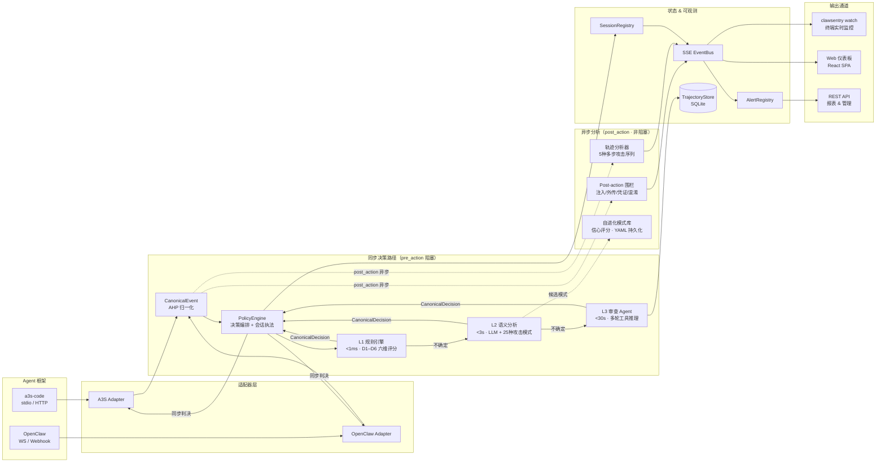

---
hide:
  - navigation
  - toc
---

<style>
  .md-typeset h1 { display: none; }

  .hero {
    text-align: center;
    padding: 2rem 1rem 1rem;
  }
  .hero h2 {
    font-size: 2.8rem;
    font-weight: 700;
    margin-bottom: 0.5rem;
  }
  .hero .tagline {
    font-size: 1.25rem;
    opacity: 0.85;
    margin-bottom: 2rem;
  }

  .grid-cards {
    display: grid;
    grid-template-columns: repeat(auto-fit, minmax(220px, 1fr));
    gap: 1rem;
    margin: 2rem 0;
  }
  .grid-cards .card {
    border: 1px solid var(--md-default-fg-color--lightest);
    border-radius: 8px;
    padding: 1.2rem;
    text-align: center;
  }
  .grid-cards .card h3 { margin-top: 0.5rem; }
</style>

<div class="hero" markdown>

# ClawSentry

## :shield:{ .lg } ClawSentry

**Agent Harness Protocol (AHP) 参考实现**
{ .tagline }

面向 AI Agent 运行时的统一安全监督网关 —— 归一化多框架事件，三层递进决策，实时可视化监控。
{ .tagline }

[:octicons-download-16: 快速安装](#_3){ .md-button .md-button--primary }
[:octicons-book-16: 快速开始](getting-started/quickstart.md){ .md-button }
[:octicons-mark-github-16: GitHub](https://github.com/Elroyper/ClawSentry){ .md-button }

</div>

---

## 什么是 ClawSentry？

**AHP（Agent Harness Protocol）** 是一套开放的 AI Agent 安全监督协议规范，定义了事件归一化、风险评估和决策执行的标准接口。

**ClawSentry** 是该协议的 Python 参考实现。它以 Sidecar 形式部署，拦截 Agent 运行时的工具调用事件，通过三层递进式决策模型（规则 → 语义 → Agent 审查）做出 ALLOW / DENY / DEFER 判决，并提供实时监控仪表板。

!!! tip "核心定位"
    AHP 是**协议**，ClawSentry 是**实现**。协议定义"说什么"，实现决定"怎么做"。

---

## 核心亮点

<div class="grid-cards" markdown>

<div class="card" markdown>
### :zap: 三层决策
**L1 规则** (<1ms) → **L2 语义** (<3s) → **L3 Agent** (<30s)

逐层升级，兼顾速度与深度
</div>

<div class="card" markdown>
### :link: 双框架接入
**a3s-code** + **OpenClaw**

统一 AHP 协议归一化事件
</div>

<div class="card" markdown>
### :satellite: 实时监控
**SSE 推送** + **CLI Watch** + **Web 仪表板**

决策/告警/会话全链路可观测
</div>

<div class="card" markdown>
### :lock: 安全优先
**Fail-closed 高危** + **Bearer Token** + **HMAC 签名**

生产级安全加固
</div>

</div>

---

## 架构总览

<figure markdown>
  
  <figcaption>ClawSentry — 统一 AI Agent 安全监督网关</figcaption>
</figure>

### 完整数据流



---

## 快速安装

=== "基础安装"

    ```bash
    pip install clawsentry
    ```

=== "含 LLM 支持"

    ```bash
    pip install clawsentry[llm]
    ```

=== "完整安装"

    ```bash
    pip install clawsentry[all]
    ```

=== "开发环境"

    ```bash
    git clone https://github.com/Elroyper/ClawSentry.git
    cd ClawSentry
    pip install -e ".[dev]"
    ```

!!! info "环境要求"
    - Python >= 3.11
    - 核心依赖：FastAPI, Uvicorn, Pydantic v2
    - 可选依赖组：`[llm]`（Anthropic / OpenAI）、`[enforcement]`（WebSocket）、`[dev]`（测试）

---

## 三层决策模型

| 层级 | 名称 | 延迟 | 机制 | 适用场景 |
|:---:|:---|:---:|:---|:---|
| **L1** | 规则引擎 | <1ms | D1-D6 六维评分（命令危险度/参数敏感度/命令模式/历史行为/作用域权限/注入检测） | 明确的黑白名单、已知危险模式、注入尝试 |
| **L2** | 语义分析 | <3s | RuleBased / LLM / Composite 三种实现，SemanticAnalyzer 协议 | 需要上下文理解的灰度命令 |
| **L3** | 审查 Agent | <30s | AgentAnalyzer + ReadOnlyToolkit + SkillRegistry，多轮工具调用推理 | 复杂意图判断、需要取证分析 |

```
                  ┌─ ALLOW/DENY ──→ 直接返回
  Event ──→ L1 ──┤
                  └─ 不确定 ──→ L2 ──┬─ ALLOW/DENY ──→ 返回
                                      └─ 不确定 ──→ L3 ──→ 最终判决
```

!!! note "升级策略"
    每层仅在无法确定时才向上升级，保证绝大多数请求在 L1 毫秒级完成。L3 是终审，**永不降级**——任何 L3 内部失败将降级为 `confidence=0.0`（fail-closed）。

---

## 双框架支持

=== "a3s-code"

    通过 **stdio harness**（主通道）或 **HTTP Transport**（备通道）接入。

    ```bash
    # stdio 模式 — 作为 a3s-code hook 进程
    clawsentry-harness

    # HTTP 模式 — POST /ahp/a3s
    clawsentry-gateway
    ```

    详见 [a3s-code 集成指南](integration/a3s-code.md)

=== "OpenClaw"

    通过 **WebSocket 实时监听** + **Webhook 接收** + **审批执行器** 接入。

    ```bash
    # 一键启动（自动检测 OpenClaw 配置）
    clawsentry gateway
    ```

    详见 [OpenClaw 集成指南](integration/openclaw.md)

---

## CLI 命令一览

| 命令 | 说明 |
|:---|:---|
| `clawsentry init <framework>` | 零配置初始化（`--auto-detect` / `--setup` / `--dry-run`） |
| `clawsentry gateway` | 启动 Gateway（智能检测框架，按需启用 WS/Webhook） |
| `clawsentry watch` | SSE 实时终端监控（`--interactive` 支持 DEFER 运维确认） |
| `clawsentry-gateway` | 直接启动 HTTP Gateway 服务 |
| `clawsentry-harness` | 启动 a3s-code stdio harness |
| `clawsentry-stack` | 全栈启动（Gateway + Adapter + 可选 WS） |

---

## REST API 概览

| 端点 | 方法 | 说明 |
|:---|:---:|:---|
| `/health` | GET | 健康检查 |
| `/ahp` | POST | OpenClaw Webhook 决策 |
| `/ahp/a3s` | POST | a3s-code HTTP Transport |
| `/ahp/resolve` | POST | DEFER 决策代理（allow-once / deny） |
| `/ahp/patterns` | GET | 查询自进化模式库列表（需 `CS_EVOLVING_ENABLED=true`） |
| `/ahp/patterns/confirm` | POST | 确认/拒绝进化模式，用于反馈驱动的模式学习 |
| `/report/summary` | GET | 跨框架聚合统计 |
| `/report/stream` | GET | SSE 实时推送 |
| `/report/sessions` | GET | 活跃会话列表 |
| `/report/session/{id}` | GET | 会话轨迹回放 |
| `/report/session/{id}/risk` | GET | 会话风险详情 |
| `/report/session/{id}/enforcement` | GET/POST | 会话执法状态 |
| `/report/alerts` | GET | 告警列表 |
| `/report/alerts/{id}/acknowledge` | POST | 确认告警 |
| `/ui/*` | GET | Web 仪表板静态文件 |

详见 [REST API 文档](api/decisions.md)

---

## Web 安全仪表板

内置 **React 18 + TypeScript + Vite** 单页应用，暗色 SOC（安全运营中心）主题。

| 页面 | 功能 |
|:---|:---|
| **Dashboard** | 实时决策 feed、指标卡、饼图/柱状图 |
| **Sessions** | 会话列表、D1-D5 雷达图、风险曲线、决策时间线 |
| **Alerts** | 告警表格、过滤、确认、SSE 自动推送 |
| **DEFER Panel** | 审批倒计时、Allow/Deny 操作、503 降级提示 |

Gateway 在 `/ui` 路径自动挂载静态文件，无需额外配置。

详见 [Web 仪表板文档](dashboard/index.md)

---

## 项目数据

| 指标 | 数据 |
|:---:|:---:|
| 测试用例 | **1663+** |
| 测试耗时 | **~24s** |
| 协议版本 | `sync_decision.1.0` |
| Python 版本 | >= 3.11 |
| 许可证 | MIT |

---

## 文档导航

<div class="grid-cards" markdown>

<div class="card" markdown>
### [:material-rocket-launch: 入门指南](getting-started/installation.md)
安装、快速开始、核心概念
</div>

<div class="card" markdown>
### [:material-connection: 集成接入](integration/a3s-code.md)
a3s-code / OpenClaw 框架集成
</div>

<div class="card" markdown>
### [:material-cog: 配置参考](configuration/env-vars.md)
环境变量、策略调优、LLM 配置
</div>

<div class="card" markdown>
### [:material-api: REST API](api/decisions.md)
决策端点、报表监控、认证
</div>

<div class="card" markdown>
### [:material-layers-triple: 决策详解](decision-layers/l1-rules.md)
L1 规则 / L2 语义 / L3 Agent
</div>

<div class="card" markdown>
### [:material-monitor-dashboard: Web 仪表板](dashboard/index.md)
暗色主题安全运营仪表板
</div>

</div>
