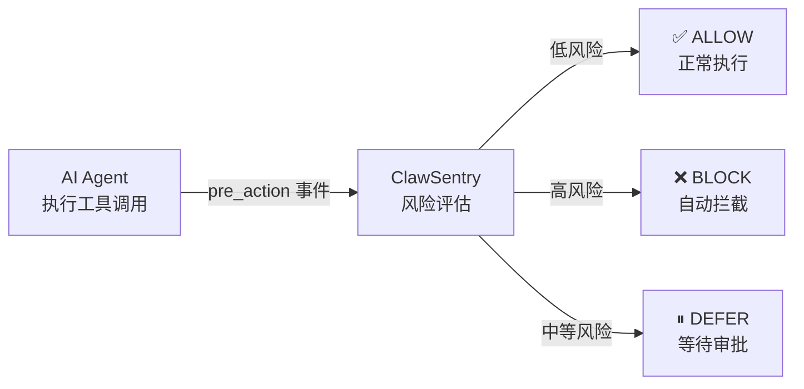

---
hide:
  - navigation
  - toc
---


<div class="hero" markdown>

<div class="cs-eyebrow">AI Agent Security Gateway</div>

<div class="cs-hero-brand"><span class="cs-hero-icon"><svg xmlns="http://www.w3.org/2000/svg" viewBox="0 0 48 48"><defs><linearGradient id="csg" x1="0%" y1="0%" x2="100%" y2="100%"><stop offset="0%" style="stop-color:#0891b2"/><stop offset="100%" style="stop-color:#16a34a"/></linearGradient></defs><path d="M24 3L6 10v13c0 10.5 7.7 20.3 18 22.5C34.3 43.3 42 33.5 42 23V10L24 3z" fill="url(#csg)" opacity="0.92"/><path d="M18 24.5l4.5 4.5 8-9" stroke="white" stroke-width="2.8" fill="none" stroke-linecap="round" stroke-linejoin="round"/></svg></span><h2>ClawSentry</h2></div>

**为 AI Agent 工具调用提供统一安全网关：能拦截的框架前置阻断，不能完全拦截的框架清晰标注为监控或可选增强。**
{ .tagline }

三层递进决策（L1 规则 → L2 语义 → L3 审查）在安全性、延迟与可解释性之间取得平衡。
{ .tagline-sub }

<div class="cs-pill-row" markdown>
<span class="cs-version-badge">v0.8.7</span>
<span class="cs-pill">stable public docs</span>
<span class="cs-pill">6 frameworks</span>
<span class="cs-pill">sync_decision.1.0</span>
</div>

[:octicons-rocket-16: 5 分钟快速开始](getting-started/quickstart.md){ .md-button .md-button--primary }
[:octicons-book-16: 核心概念](getting-started/concepts.md){ .md-button }
[:octicons-code-square-16: API Reference](api/reference.md){ .md-button }
[:octicons-mark-github-16: GitHub](https://github.com/Elroyper/ClawSentry){ .md-button }

</div>

!!! tip "v0.8.7 — Runtime supervision hardening"
    本版本增强嵌套工具输出的间接注入分析、上下文驱动的 L2/L3 升级，以及跨工具 effect 和敏感值外传的统一策略证据。[查看完整更新日志 →](changelog.md)

---

## 三大核心能力

<div class="grid-cards" markdown>

<div class="card" markdown>
### :shield: 拦截优先，监控兜底
Claude Code、a3s-code 和 OpenClaw 支持高危操作**前置阻断**；Codex 通过 managed hooks + session watcher 接入；Gemini CLI 和 Kimi CLI 通过 native hooks 接入。每个集成页都会说明可阻断范围、监控范围和 fallback 行为。
</div>

<div class="card" markdown>
### :zap: 不拖慢你的工作流
L1 规则引擎优先处理确定性风险；L2 语义分析和 L3 审查 Agent 仅在需要更多上下文时触发，避免把所有请求都送入重型审查。
</div>

<div class="card" markdown>
### :eye: 从事件到证据
每条工具调用都有记录、决策原因和审计轨迹。CLI `watch`、Web 仪表板（按 framework / workspace / session 分组）和移动端 Latch 三端同步，全链路可观测。
</div>

</div>

---

## 支持的框架 { #choose-framework }

<div class="framework-cards" markdown>

<div class="card framework-card" markdown>
### :material-console-line: Claude Code
通过原生 Hook 系统接入，支持高危操作前阻断。

- 零侵入注入，不改动 Claude Code 本身
- `PreToolUse` 阻塞式安全审查
- 一键初始化 + 一键卸载

[:octicons-arrow-right-24: Claude Code 集成指南](integration/claude-code.md)
</div>

<div class="card framework-card" markdown>
### :material-console: a3s-code
通过显式 SDK stdio / HTTP Transport 接入，支持高危操作前阻断。

- `StdioTransport` 通过 harness + UDS 本地决策
- `HttpTransport` 直连 `/ahp/a3s`
- 只通过显式 SDK 传输接入

[:octicons-arrow-right-24: a3s-code 集成指南](integration/a3s-code.md)
</div>

<div class="card framework-card" markdown>
### :material-web: OpenClaw
通过 WebSocket 实时事件流接入，支持高危操作前阻断和人工审批。

- 监听 `exec.approval.requested` 事件
- 自动检测 OpenClaw 配置
- 支持交互式 DEFER 审批

[:octicons-arrow-right-24: OpenClaw 集成指南](integration/openclaw.md)
</div>

<div class="card framework-card" markdown>
### :material-code-braces: Codex
默认通过 session 日志监控接入，可选启用 Bash preflight / approval gate。

- 自动监控 session 日志目录
- `clawsentry init codex --setup` 非破坏式安装 managed native hooks
- 同步阻断范围：`PreToolUse(Bash)`、`PermissionRequest(Bash)`；其他事件默认异步观察
- 建议配合 `--approval-policy untrusted`

[:octicons-arrow-right-24: Codex 集成指南](integration/codex.md)
</div>

<div class="card framework-card" markdown>
### :material-moon-waxing-crescent: Kimi CLI
通过 Kimi native `[[hooks]]` 接入，可阻断 prompt 和危险 Shell。

- `clawsentry init kimi-cli --setup` 写入配置，保留非 ClawSentry hooks
- 可阻断 `UserPromptSubmit` 和 `PreToolUse` 高危调用
- post / session / subagent / compact / notification 作为观察面

[:octicons-arrow-right-24: Kimi CLI 集成指南](integration/kimi-cli.md)
</div>

<div class="card framework-card" markdown>
### :material-creation: Gemini CLI
通过 Gemini CLI native command hooks 接入，覆盖 prompt / model / tool 阶段安全检查。

- `clawsentry init gemini-cli --setup` 默认写项目级 `.gemini/settings.json`
- 同步 hook 覆盖 prompt / model / tool 入口

[:octicons-arrow-right-24: Gemini CLI 集成指南](integration/gemini-cli.md)
</div>

</div>

<div class="latch-banner" markdown>

:material-cellphone: **Latch 移动监控（可选增强）** — 随时随地在手机上查看安全事件、远程审批 DEFER 操作，支持所有框架。[了解 Latch 集成 →](integration/latch.md)

</div>

---

## 工作原理


```mermaid
flowchart LR
    A["AI Agent\n执行工具调用"] -->|"pre_action 事件"| B["ClawSentry\n风险评估"]
    B -->|"低风险"| C["✅ ALLOW\n正常执行"]
    B -->|"高风险"| D["❌ BLOCK\n自动拦截"]
    B -->|"中等风险"| E["⏸ DEFER\n等待审批"]
```

| 层级 | 触发条件 | 延迟 |
|:---:|:---|:---:|
| **L1** 规则引擎 | 所有事件，确定性黑白名单与注入检测 | 本地快速判断 |
| **L2** 语义分析 | L1 不确定、medium+ 风险、上下文歧义 | 按需触发 |
| **L3** 审查 Agent | HIGH+ 风险、累积异常、显式触发 | 按需触发 |

每层仅在无法确定时向上升级；L3 为终审，永不降级。L3 内部失败降级为 `confidence=0.0`（fail-closed）。

---

## 快速安装

=== "基础安装"

    ```bash
    pip install clawsentry
    ```

=== "含 LLM 支持（L2/L3）"

    ```bash
    pip install clawsentry[llm]
    ```

=== "完整安装"

    ```bash
    pip install clawsentry[all]
    ```

=== "开发环境"

    ```bash
    git clone https://github.com/Elroyper/ClawSentry.git
    cd ClawSentry
    pip install -e ".[dev]"
    ```

!!! info "环境要求"
    Python >= 3.11，核心依赖：FastAPI、Uvicorn、Pydantic v2。可选依赖组 `[llm]`（Anthropic / OpenAI）、`[enforcement]`（WebSocket）、`[metrics]`（Prometheus）。

安装完成后运行 `clawsentry --help` 验证，然后继续阅读 [安装指南](getting-started/installation.md) 或直接进入 [快速开始](getting-started/quickstart.md)。

---

## Web 安全仪表板

内置 React 18 + TypeScript + Vite 单页应用，Gateway 在 `/ui` 自动挂载，无需额外配置。

| 页面 | 功能 |
|:---|:---|
| **Dashboard** | Operator Brief、实时决策 feed、token-first LLM 用量、风险概览 |
| **Sessions** | Framework / workspace / session 分组，Unbound workspace fallback |
| **Session Detail** | 最新优先决策时间线、D1-D6 风险构成、L3 narrative analysis |
| **Alerts** | 告警表格、过滤、确认、SSE 自动推送 |
| **DEFER Panel** | 审批倒计时、Allow / Deny 操作、503 降级提示 |

[Web 仪表板文档 →](dashboard/index.md)

---

??? info "三层决策模型详解"
    | 层级 | 名称 | 延迟 | 机制 | 适用场景 |
    |:---:|:---|:---:|:---|:---|
    | **L1** | 规则引擎 | <0.3ms | D1-D6 六维评分（命令危险度 / 参数敏感度 / 命令模式 / 历史行为 / 作用域权限 / 注入检测） | 明确的黑白名单、已知危险模式、注入尝试 |
    | **L2** | 语义分析 | <3s | RuleBased / LLM / Composite 三种实现，SemanticAnalyzer 协议 | 需要上下文理解的灰度命令 |
    | **L3** | 审查 Agent | <30s | AgentAnalyzer + ReadOnlyToolkit + SkillRegistry，多轮工具调用推理 | 复杂意图判断、取证分析 |

    ```
                      ┌─ ALLOW/DENY ──→ 直接返回
      Event ──→ L1 ──┤
                      └─ 不确定 ──→ L2 ──┬─ ALLOW/DENY ──→ 返回
                                          └─ 不确定 ──→ L3 ──→ 最终判决
    ```

??? info "各框架接入方式速查"
    === "a3s-code"

        通过显式 SDK **StdioTransport** 或 **HttpTransport** 接入。

        ```python
        # stdio 模式 — SDK 启动 clawsentry-harness
        StdioTransport(program="clawsentry-harness", args=[])

        # HTTP 模式 — SDK 直连 POST /ahp/a3s
        HttpTransport("http://127.0.0.1:8080/ahp/a3s?token=...")
        ```

        [a3s-code 集成指南 →](integration/a3s-code.md)

    === "Claude Code"

        通过 **Hook 系统** + **stdio harness** 接入，自动注入 `settings.json`。

        ```bash
        clawsentry init claude-code
        clawsentry gateway &
        claude  # 所有工具调用自动监控
        ```

        [Claude Code 集成指南 →](integration/claude-code.md)

    === "Codex CLI"

        默认通过 **Session 日志监控**接入；如需最小同步防护，可安装 managed native hooks。

        ```bash
        clawsentry init codex --setup
        clawsentry gateway
        codex --approval-policy untrusted
        ```

        [Codex CLI 集成指南 →](integration/codex.md)

    === "Gemini CLI"

        通过 **Gemini native command hooks** 接入，默认写项目级 `.gemini/settings.json`。

        ```bash
        clawsentry init gemini-cli --setup
        clawsentry gateway
        gemini --prompt "say hello"
        ```

        [Gemini CLI 集成指南 →](integration/gemini-cli.md)

    === "OpenClaw"

        通过 **WebSocket 实时监听** + **Webhook 接收** + **审批执行器** 接入。

        ```bash
        clawsentry gateway  # 自动检测 OpenClaw 配置
        ```

        [OpenClaw 集成指南 →](integration/openclaw.md)
