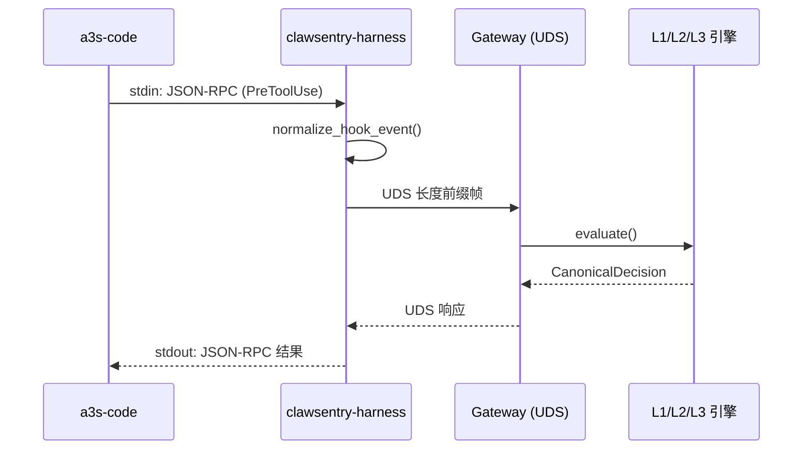
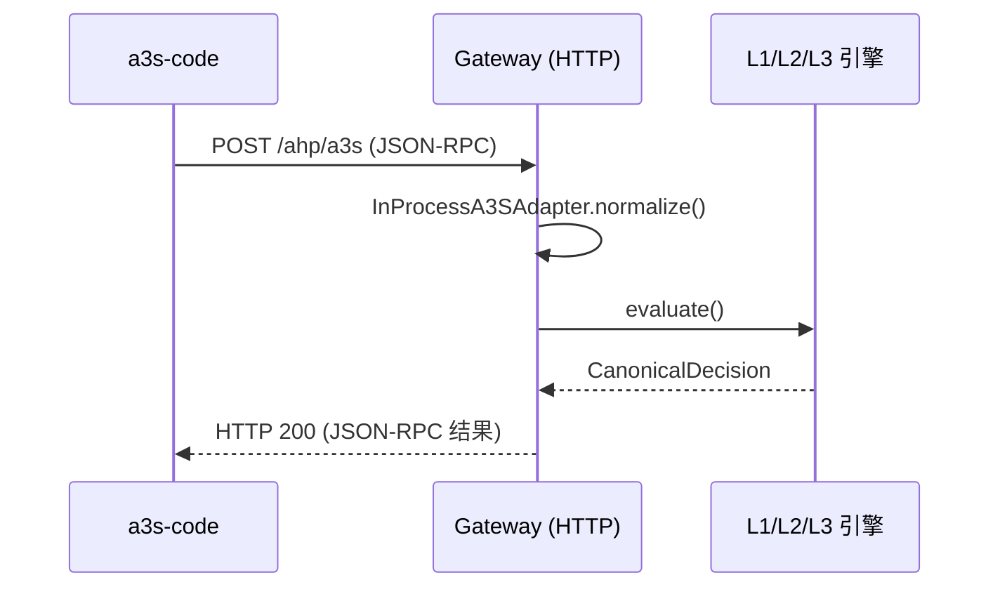

# a3s-code 集成

!!! tip "本页怎么读"
    这页面向需要在 Agent 代码里显式接入 AHP Transport 的开发者。优先看 Stdio / HTTP 两种方式怎么选，然后按验证步骤确认事件进入 Gateway。

将 a3s-code AI 编码代理框架接入 ClawSentry，实现工具调用的实时安全监督。

---

## 概述

a3s-code 是一个 AI 编码代理框架，拥有完整的 Hook 系统（11 种事件类型）。ClawSentry 通过 **AHP (Agent Harness Protocol)** 协议拦截 a3s-code 的 `PreToolUse` / `PostToolUse` 等事件，由三层决策引擎（L1 规则 / L2 语义 / L3 Agent）实时评估风险并返回 allow / block / defer 判决。

ClawSentry 当前只把 a3s-code 的 **显式 SDK AHP Transport** 作为公开支持路径：

| 特性 | SDK StdioTransport（推荐） | SDK HttpTransport（已验证） |
|------|:--------------------------:|:---------------------------:|
| **当前可用性** | 已验证可用 | 已验证可用 |
| **延迟** | ~3-5ms | ~5-10ms |
| **可靠性** | 高，显式 SDK 配置 | 高，显式 SDK 配置；需避免本地代理干扰 |
| **配置复杂度** | 低（纯代码 + harness） | 低（纯代码 + HTTP URL） |
| **网络依赖** | 无 HTTP 依赖，harness 通过 UDS 访问 Gateway | 需要访问 Gateway HTTP 端口 |
| **决策链路** | Agent SDK → `StdioTransport` → `clawsentry-harness` → Gateway(UDS) → 决策 → SDK | Agent SDK → `HttpTransport` → Gateway `/ahp/a3s` → 决策 → SDK |
| **适用场景** | 本地开发、默认主路径 | 希望走 HTTP、容器/跨进程 Gateway |

!!! info "2026-04-08 最新可用性结论（实测）"
    **真实可用**：显式 SDK `SessionOptions().ahp_transport` 路径，包括 `StdioTransport(program="clawsentry-harness")` 和 `HttpTransport("http://127.0.0.1:8080/ahp/a3s?...")`。在跨进程验证中，`HttpTransport` 指向真实 ClawSentry Gateway 时观测到 `request_count=2`、`handshake_status=200`、`has_runtime_error=false`、`timed_out=false`。

---

## 前置条件

!!! info "环境要求"
    - Python 3.10+
    - a3s-code 已安装并可运行
    - ClawSentry 已安装

```bash
# 安装 ClawSentry
pip install clawsentry

# 验证安装
clawsentry --help
which clawsentry-harness  # stdio 模式需要此命令在 PATH 中
```

---

## 快速开始

### 最简单路径

日常接入时优先使用 `clawsentry start`，不要先手动拆 `init` / `gateway` / `watch`：

```bash
clawsentry start --framework a3s-code
```

它会自动完成 ClawSentry 侧的工作：

- 生成或增量合并当前项目的 `.env.clawsentry`
- 加载配置并启动 Gateway（UDS + HTTP）
- 在前台显示 `clawsentry watch` 实时事件流

!!! important "a3s-code 还需要一行 SDK 配置"
    `clawsentry start` 负责启动 ClawSentry，不会自动改写你的 a3s-code Agent 代码。请在创建 session 前显式设置 `SessionOptions().ahp_transport`。

### 配置 a3s-code Transport

默认推荐 `StdioTransport`，让 a3s-code 启动 `clawsentry-harness` 并通过本机 UDS 访问 Gateway：

```python
from a3s_code import Agent, SessionOptions, StdioTransport

agent = Agent.create("agent.hcl")
opts = SessionOptions()
opts.ahp_transport = StdioTransport(program="clawsentry-harness", args=[])
session = agent.session(".", opts, permissive=True)
```

如需 HTTP 方式，可以使用已验证的 `HttpTransport` 直连 Gateway HTTP 端点：

```python
import os
from a3s_code import Agent, HttpTransport, SessionOptions

agent = Agent.create("agent.hcl")
opts = SessionOptions()
token = os.environ["CS_AUTH_TOKEN"]
opts.ahp_transport = HttpTransport(
    f"http://127.0.0.1:8080/ahp/a3s?token={token}"
)
session = agent.session(".", opts, permissive=True)
```

!!! tip "HTTP 本地回环代理"
    如果你的 shell 设置了 `HTTP_PROXY` / `HTTPS_PROXY` / `ALL_PROXY`，建议同时设置 `NO_PROXY=127.0.0.1,localhost`，避免本地 Gateway 请求被代理劫持。

!!! note "工作原理"
    SDK 路径下，a3s-code 在每次工具调用前后自动发送 AHP 事件。

### 运行 Agent

完成 `SessionOptions().ahp_transport` 配置后，直接运行你的 a3s-code Agent 脚本即可。使用 `clawsentry start` 时，ClawSentry 已经在当前终端显示实时事件流，不需要再额外打开一个 `clawsentry watch` 终端。

```bash
python your_agent_script.py
```

如果你选择手动拆分命令，才需要在另一个终端运行 `clawsentry watch`。

---

## 手动拆分命令（高级）

如果你要把 `start` 拆开运行，命令关系如下：

```bash
clawsentry init a3s-code     # 只生成/合并 .env.clawsentry
source .env.clawsentry      # 手动加载 token、UDS、端口等环境变量
clawsentry gateway          # 只启动 Gateway 服务，不显示事件流
clawsentry watch            # 可选：仅在手动拆分时另开终端观察事件流
```

Gateway 默认监听：

| 端点 | 协议 | 用途 |
|------|------|------|
| `/tmp/clawsentry.sock` | UDS (JSON-RPC 2.0, 长度前缀帧) | `StdioTransport` / `clawsentry-harness` 连接 |
| `http://127.0.0.1:8080/ahp` | HTTP (JSON-RPC 2.0) | 通用 RPC 端点 |
| `http://127.0.0.1:8080/ahp/a3s` | HTTP (JSON-RPC AHP) | a3s-code `HttpTransport` 直连 |

!!! tip "已有配置？"
    如果 `.env.clawsentry` 已存在，`clawsentry init a3s-code` 默认会增量合并，不会轮换已有 `CS_AUTH_TOKEN`。只有明确要替换整个文件时才使用 `--force`。

---

## 禁用集成

```bash
clawsentry init a3s-code --uninstall
```

此命令会从当前项目 `.env.clawsentry` 的 `CS_ENABLED_FRAMEWORKS` 中移除 `a3s-code`。它不会删除共享 `CS_AUTH_TOKEN` 或整个 env 文件，因此同一项目里的 Codex、Claude Code、OpenClaw 配置不会受影响。

---

## 手动配置详解

### Transport 1: stdio 管道模式

**事件流向：**



**Harness 环境变量：**

| 变量 | 默认值 | 说明 |
|------|--------|------|
| `CS_UDS_PATH` | `/tmp/clawsentry.sock` | Gateway UDS 套接字路径 |
| `A3S_GATEWAY_DEFAULT_DEADLINE_MS` | `4500` | 决策超时（毫秒） |
| `A3S_GATEWAY_MAX_RPC_RETRIES` | `1` | RPC 最大重试次数 |
| `A3S_GATEWAY_RETRY_BACKOFF_MS` | `50` | 重试退避间隔（毫秒） |
| `A3S_GATEWAY_DEFAULT_SESSION_ID` | `ahp-session` | 默认会话 ID |
| `A3S_GATEWAY_DEFAULT_AGENT_ID` | `ahp-agent` | 默认 Agent ID |

**Harness 命令行参数：**

```bash
clawsentry-harness \
  --uds-path /tmp/clawsentry.sock \
  --default-deadline-ms 4500 \
  --max-rpc-retries 1 \
  --retry-backoff-ms 50
```

!!! warning "超时与容错"
    当 Gateway 不可达或超时时，harness 自动降级为本地决策：

    - 含 `destructive_pattern` 或 `shell_execution` 风险提示 → **block**
    - 其他 `pre_action` → **defer**（等待人工或重试）

    此策略确保 a3s-code 不会因 Monitor 故障而完全停摆。

### Transport 2: HTTP 直连模式

**事件流向：**



该模式对应显式 SDK `HttpTransport` 时已通过跨进程 Gateway 验证。建议首次接入仍做一次验收（握手 + 真实工具调用），尤其是在存在代理环境变量或自定义 Gateway 地址时。

如果 Gateway 启用了认证（`CS_AUTH_TOKEN` 不为空），a3s-code 的 `HttpTransport` 可使用任一方式认证：
- `Authorization: Bearer <token>` 请求头
- URL 查询参数 `?token=<token>`（初始化器默认采用）

!!! warning "失败签名与回退"
    若日志出现 `failed to create AHP executor ... continuing without AHP`，工具调用会在“无 AHP”模式继续执行。请先确认 `NO_PROXY=127.0.0.1,localhost`、Gateway 独立进程可达，并用 `POST /ahp/a3s` 握手排除端点问题；仍失败时再回退到 `SDK + StdioTransport` 并提交运行时信息。

---

## Hook 事件映射

a3s-code 的 11 种 Hook 事件类型映射到 AHP 规范事件：

| a3s-code Hook | AHP 事件类型 | 阻塞？ | 说明 |
|---------------|-------------|:------:|------|
| `PreToolUse` | `pre_action` | :material-check: | **核心** — 工具执行前拦截 |
| `PostToolUse` | `post_action` | :material-close: | 工具执行后审计 |
| `PrePrompt` | `pre_prompt` | :material-check: | 提示词发送前拦截 |
| `GenerateStart` | `pre_prompt` | :material-check: | LLM 生成开始前 |
| `PostResponse` | `post_response` | :material-close: | LLM 响应后审计 |
| `SessionStart` | `session` | :material-close: | 会话启动（子类型 `session:start`） |
| `SessionEnd` | `session` | :material-close: | 会话结束（子类型 `session:end`） |
| `OnError` | `error` | :material-close: | 错误事件 |
| `GenerateEnd` | — | — | 未映射（跳过） |
| `SkillLoad` | — | — | 未映射（跳过） |
| `SkillUnload` | — | — | 未映射（跳过） |

!!! info "阻塞 vs 非阻塞"
    - **阻塞事件**（`pre_action`、`pre_prompt`）：a3s-code 等待 ClawSentry 返回判决后才继续执行。判决为 `block` 时工具调用被拒绝。
    - **非阻塞事件**（`post_action`、`session` 等）：异步记录审计日志，不影响执行流程。

---

## AHP 协议格式

a3s-code 与 ClawSentry 之间使用 JSON-RPC 2.0 格式通信。

### 握手请求

```json
{
  "jsonrpc": "2.0",
  "id": 1,
  "method": "ahp/handshake",
  "params": {}
}
```

响应：

```json
{
  "jsonrpc": "2.0",
  "id": 1,
  "result": {
    "protocol_version": "2.0",
    "harness_info": {
      "name": "a3s-gateway-harness",
      "version": "1.0.0",
      "capabilities": ["pre_action", "post_action", "pre_prompt", "session", "error"]
    }
  }
}
```

### 事件请求

```json
{
  "jsonrpc": "2.0",
  "id": 2,
  "method": "ahp/event",
  "params": {
    "event_type": "pre_action",
    "session_id": "my-session-123",
    "payload": {
      "tool": "Bash",
      "command": "rm -rf /tmp/test"
    }
  }
}
```

### 决策响应

```json
{
  "jsonrpc": "2.0",
  "id": 2,
  "result": {
    "action": "block",
    "decision": "block",
    "reason": "L1: destructive_pattern detected — rm with recursive force flag",
    "metadata": {
      "source": "clawsentry-gateway-harness",
      "policy_id": "l1-rule-engine",
      "risk_level": "high",
      "decision_source": "l1_rule",
      "final": true
    }
  }
}
```

`action` 字段取值：

| action | 含义 | a3s-code 行为 |
|--------|------|--------------|
| `continue` | 允许执行 | 正常执行工具调用 |
| `block` | 阻止执行 | 跳过此工具调用 |
| `defer` | 等待人工审批 | 暂停执行，等待运维确认 |
| `modify` | 修改参数后执行 | 使用 `modified_payload` 中的修改后参数 |

---

## 启动 Gateway

Gateway 是 ClawSentry 的核心服务进程，提供 UDS + HTTP 双通道入口。

```bash
# 最简启动（仅 Gateway，无 OpenClaw）
clawsentry gateway

# 自定义端口和地址
clawsentry gateway --gateway-host 0.0.0.0 --gateway-port 9090

# 启用会话级强制策略
AHP_SESSION_ENFORCEMENT_ENABLED=true \
AHP_SESSION_ENFORCEMENT_THRESHOLD=3 \
  clawsentry gateway

# 启用 LLM 语义分析（L2）
CS_LLM_PROVIDER=openai \
CS_LLM_BASE_URL=https://api.openai.com/v1 \
CS_LLM_MODEL=gpt-4o \
  clawsentry gateway

# 启用 SSL/TLS
AHP_SSL_CERTFILE=/path/to/cert.pem \
AHP_SSL_KEYFILE=/path/to/key.pem \
  clawsentry gateway
```

### Gateway 核心环境变量

| 变量 | 默认值 | 说明 |
|------|--------|------|
| `CS_HTTP_HOST` | `127.0.0.1` | HTTP 监听地址 |
| `CS_HTTP_PORT` | `8080` | HTTP 监听端口 |
| `CS_FRAMEWORK` | `a3s-code` | `clawsentry init a3s-code` 写入的框架标识 |
| `CS_AUTH_TOKEN` | *(空)* | Bearer Token 认证（空=禁用） |
| `CS_UDS_PATH` | `/tmp/clawsentry.sock` | UDS 套接字路径 |
| `CS_TRAJECTORY_DB_PATH` | `/tmp/clawsentry-trajectory.db` | SQLite 轨迹数据库路径 |
| `CS_RATE_LIMIT_PER_MINUTE` | `300` | 每分钟请求速率限制 |
| `AHP_SSL_CERTFILE` | *(空)* | SSL 证书文件路径 |
| `AHP_SSL_KEYFILE` | *(空)* | SSL 私钥文件路径 |

---

## 实时监控

### CLI 终端监控

```bash
# 彩色实时输出
clawsentry watch

# 按事件类型过滤
clawsentry watch --filter decision,alert

# JSON 格式输出（适合脚本处理）
clawsentry watch --json

# 无颜色输出（适合日志重定向）
clawsentry watch --no-color

# 交互模式 — 对 DEFER 决策手动审批
clawsentry watch --interactive
```

!!! tip "交互模式"
    使用 `--interactive` 时，遇到 DEFER 决策会提示操作员选择：

    - ++a++ **Allow** — 放行本次操作
    - ++d++ **Deny** — 拒绝本次操作
    - ++s++ **Skip** — 跳过（让 DEFER 自然超时）

### Web 仪表板

```bash
# 在浏览器中打开
open http://127.0.0.1:8080/ui
```

仪表板提供实时决策流、会话风险雷达图、告警管理和 DEFER 审批面板。

### REST API 查询

```bash
# 聚合统计
curl http://127.0.0.1:8080/report/summary

# 活跃会话列表（按风险排序）
curl http://127.0.0.1:8080/report/sessions

# 会话风险详情 + 时间线
curl http://127.0.0.1:8080/report/session/{session_id}/risk

# SSE 实时事件流
curl -N http://127.0.0.1:8080/report/stream
```

---

## 验证集成

### 步骤 1: 确认 Gateway 启动

```bash
curl http://127.0.0.1:8080/health
```

预期响应：`{"status": "healthy"}`

### 步骤 2: 发送测试握手

```bash
curl -X POST http://127.0.0.1:8080/ahp/a3s \
  -H 'Content-Type: application/json' \
  -d '{
    "jsonrpc": "2.0",
    "id": 1,
    "method": "ahp/handshake",
    "params": {}
  }'
```

预期响应包含 `protocol_version` 和 `harness_info`。

### 步骤 3: 发送安全命令

```bash
curl -X POST http://127.0.0.1:8080/ahp/a3s \
  -H 'Content-Type: application/json' \
  -d '{
    "jsonrpc": "2.0",
    "id": 2,
    "method": "ahp/event",
    "params": {
      "event_type": "pre_action",
      "session_id": "test-session",
      "payload": {
        "tool": "Read",
        "command": "cat README.md"
      }
    }
  }'
```

预期结果：`"action": "continue"`, `"decision": "allow"` — 安全的读操作被放行。

### 步骤 4: 发送危险命令

```bash
curl -X POST http://127.0.0.1:8080/ahp/a3s \
  -H 'Content-Type: application/json' \
  -d '{
    "jsonrpc": "2.0",
    "id": 3,
    "method": "ahp/event",
    "params": {
      "event_type": "pre_action",
      "session_id": "test-session",
      "payload": {
        "tool": "Bash",
        "command": "rm -rf /"
      }
    }
  }'
```

预期结果：`"action": "block"`, `"decision": "block"` — 破坏性命令被阻止。

### 步骤 5: 验证 SDK `HttpTransport`（可选）

如需使用 HTTP SDK 路径，可运行项目自带的 CS-028 复核脚本。该脚本会以子进程启动真实 ClawSentry Gateway，并在父进程创建 `Agent.session(..., HttpTransport(...))`：

```bash
python issues/issue_submission_2026-04-08/repros/05_a3s_http_transport_runtime_failure.py
```

通过时应看到 `reproduced=false`，并包含 `request_count>=1`、`handshake_status=200`、`has_runtime_error=false`、`timed_out=false`。

---

## 会话级强制策略

当一个会话累积触发多次高风险事件时，可以自动升级该会话的安全等级。

| 变量 | 默认值 | 说明 |
|------|--------|------|
| `AHP_SESSION_ENFORCEMENT_ENABLED` | `false` | 启用会话级强制策略 |
| `AHP_SESSION_ENFORCEMENT_THRESHOLD` | `3` | 触发阈值（高风险事件次数） |
| `AHP_SESSION_ENFORCEMENT_ACTION` | `defer` | 触发动作：`defer` / `block` / `l3_require` |
| `AHP_SESSION_ENFORCEMENT_COOLDOWN_SECONDS` | `600` | 冷却时间（秒），到期自动释放 |

```bash
# 启用示例：3 次高危事件后强制所有操作进入 DEFER 审批
AHP_SESSION_ENFORCEMENT_ENABLED=true \
AHP_SESSION_ENFORCEMENT_THRESHOLD=3 \
AHP_SESSION_ENFORCEMENT_ACTION=defer \
  clawsentry gateway
```

### 手动查询与释放

```bash
# 查询会话强制执行状态
curl http://127.0.0.1:8080/report/session/{session_id}/enforcement

# 手动释放强制执行
curl -X POST http://127.0.0.1:8080/report/session/{session_id}/enforcement \
  -H 'Content-Type: application/json' \
  -d '{"action": "release"}'
```

---

## 故障排查

??? question "Gateway 端口 8080 连接被拒绝"
    1. 确认 `clawsentry gateway` 正在运行
    2. 检查是否使用了自定义端口：`echo $CS_HTTP_PORT`
    3. 检查端口是否被占用：`lsof -i :8080`

??? question "clawsentry-harness 命令未找到"
    1. 确认 ClawSentry 已正确安装：`pip show clawsentry`
    2. 确认命令在 PATH 中：`which clawsentry-harness`
    3. 如果使用虚拟环境，确保已激活：`source venv/bin/activate`

??? question "Harness 无响应（stdio 模式卡住）"
    1. 检查 Gateway 是否正在运行
    2. 确认 UDS 套接字存在：`ls -la /tmp/clawsentry.sock`
    3. 检查 harness 的 stderr 输出（a3s-code 通常会转发 stderr）
    4. 检查 UDS 路径是否一致：`echo $CS_UDS_PATH`

??? question "HttpTransport 超时/连接失败，但 Gateway 已启动"
    1. 检查代理环境变量：`env | grep -i proxy`
    2. 对本地回环地址禁用代理：`export NO_PROXY=127.0.0.1,localhost`
    3. 重试 `curl http://127.0.0.1:8080/health`
    4. 再重试 `POST /ahp/a3s` 握手请求确认连通性
    5. 若 stderr 出现 `failed to create AHP executor ... continuing without AHP`：
       - 说明当前 a3s 运行时的 `HttpTransport` 初始化未成功，工具调用会在“无 AHP”模式继续执行。
       - 先确认本地代理未劫持回环地址，并用上方 CS-028 脚本按跨进程拓扑复核。
       - 仍失败时，改用显式 `StdioTransport(program="clawsentry-harness")`，并附上脚本 JSON 输出重报 issue。

??? question "所有命令都被 block"
    1. 默认 L1 策略会阻止包含 `destructive_pattern` 的 Bash 命令
    2. 安全工具（Read、Glob、Grep）应该被放行
    3. 使用 `clawsentry watch` 查看具体决策原因
    4. 检查是否触发了会话级强制策略：
       ```bash
       curl http://127.0.0.1:8080/report/session/{session_id}/enforcement
       ```

??? question "决策延迟过高"
    1. 检查是否启用了 L2/L3（LLM 调用会增加延迟）
    2. L1 纯规则引擎延迟 <1ms
    3. 调整 harness 超时：`A3S_GATEWAY_DEFAULT_DEADLINE_MS=200`
    4. 优先使用 stdio 模式（~3-5ms）而非 HTTP 模式（~5-10ms）

??? question "Gateway 日志提示 'ENGINE_UNAVAILABLE'"
    这表示 Gateway 尚未完成初始化或速率限制已触发。

    1. 等待 Gateway 完全启动后再发送请求
    2. 检查速率限制配置：`echo $CS_RATE_LIMIT_PER_MINUTE`（默认 300/分钟）

---

## 下一步

- [核心概念](../getting-started/concepts.md) — 深入理解 AHP 协议和三层决策模型
- [检测管线配置](../configuration/detection-config.md) — 调整 D1-D6 阈值和安全预设
- [L1 规则引擎](../decision-layers/l1-rules.md) — 了解规则策略详情
- [Web 仪表板](../dashboard/index.md) — 实时可视化监控
- [Latch 集成](latch.md) — 移动端远程审批（可选）
