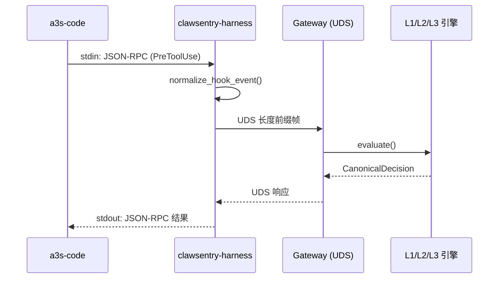
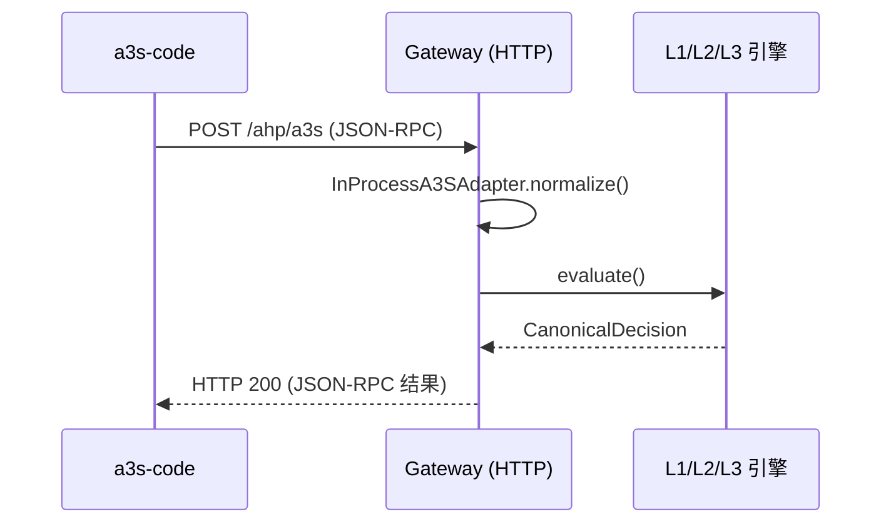

# a3s-code 集成

将 a3s-code AI 编码代理框架接入 ClawSentry，实现工具调用的实时安全监督。

---

## 概述

a3s-code 是一个 AI 编码代理框架，拥有完整的 Hook 系统（11 种事件类型）。ClawSentry 通过 **AHP (Agent Harness Protocol)** 协议拦截 a3s-code 的 `PreToolUse` / `PostToolUse` 等事件，由三层决策引擎（L1 规则 / L2 语义 / L3 Agent）实时评估风险并返回 allow / block / defer 判决。

ClawSentry 提供两种 Transport 模式接入 a3s-code：

| 特性 | stdio 管道 (推荐) | HTTP 直连 |
|------|:------------------:|:---------:|
| **延迟** | ~3-5ms | ~5-10ms |
| **可靠性** | 高（本地进程） | 高（HTTP 请求） |
| **配置复杂度** | 中等 | 低 |
| **网络依赖** | 无（UDS 本地套接字） | 需要网络访问 Gateway |
| **决策链路** | a3s-code → stdin → harness → Gateway(UDS) → 决策 → stdout → a3s-code | a3s-code → HTTP POST → Gateway → 决策 → HTTP 响应 |
| **适用场景** | 生产环境、需要最低延迟 | 快速验证、远程 Gateway |

---

## 前置条件

!!! info "环境要求"
    - Python 3.10+
    - a3s-code 已安装并可运行
    - ClawSentry 已安装

```bash
# 安装 ClawSentry
pip install clawsentry

# 验证安装
clawsentry --help
which clawsentry-harness  # stdio 模式需要此命令在 PATH 中
```

---

## 快速开始

### 一键初始化

使用 `clawsentry init` 自动生成集成配置：

```bash
clawsentry init a3s-code --auto-detect
```

此命令会在当前目录生成：

- **`.env.clawsentry`** — 包含 UDS 路径和认证 Token 的环境变量文件（权限 `600`）

生成的 `.env.clawsentry` 内容示例：

```ini
# ClawSentry — a3s-code integration config
CS_UDS_PATH=/tmp/clawsentry.sock
CS_AUTH_TOKEN=<自动生成的安全 token>
```

!!! tip "已有配置？"
    如果 `.env.clawsentry` 已存在，使用 `--force` 覆盖：
    ```bash
    clawsentry init a3s-code --auto-detect --force
    ```

### 启动 Gateway

```bash
# 加载环境变量
source .env.clawsentry

# 启动 Gateway（监听 UDS + HTTP）
clawsentry gateway
```

启动后日志输出：

```
INFO [ahp-stack] Gateway-only starting: gateway=http://127.0.0.1:8080/ahp uds=/tmp/clawsentry.sock
```

Gateway 同时监听以下端点：

| 端点 | 协议 | 用途 |
|------|------|------|
| `/tmp/clawsentry.sock` | UDS (JSON-RPC 2.0, 长度前缀帧) | stdio harness 连接 |
| `http://127.0.0.1:8080/ahp` | HTTP (JSON-RPC 2.0) | 通用 RPC 端点 |
| `http://127.0.0.1:8080/ahp/a3s` | HTTP (AHP stdio 协议) | a3s-code HTTP 直连 |

### 配置 a3s-code Hook

a3s-code 通过 Hook 系统将工具调用事件发送给 ClawSentry。在 a3s-code 的配置文件（`.a3s-code/settings.json` 或等效配置）中添加 Hook：

=== "stdio 管道（推荐）"

    ```json
    {
      "hooks": {
        "PreToolUse": [
          {
            "type": "command",
            "command": "clawsentry-harness"
          }
        ],
        "PostToolUse": [
          {
            "type": "command",
            "command": "clawsentry-harness"
          }
        ]
      }
    }
    ```

    !!! note "工作原理"
        a3s-code 将每个 Hook 事件以 JSON-RPC 格式写入 `clawsentry-harness` 的 stdin，harness 解析后通过 UDS 转发到 Gateway，收到判决后将 JSON-RPC 响应写回 stdout。

=== "HTTP 直连"

    ```json
    {
      "hooks": {
        "PreToolUse": [
          {
            "type": "http",
            "url": "http://127.0.0.1:8080/ahp/a3s"
          }
        ],
        "PostToolUse": [
          {
            "type": "http",
            "url": "http://127.0.0.1:8080/ahp/a3s"
          }
        ]
      }
    }
    ```

    !!! note "工作原理"
        a3s-code 直接向 Gateway 的 `/ahp/a3s` 端点发送 HTTP POST 请求。Gateway 内部使用 `InProcessA3SAdapter` 处理事件，无需 UDS 中转。

### 验证集成

```bash
# 在另一个终端，启动实时监控
clawsentry watch
```

然后正常使用 a3s-code，你将在 `watch` 终端看到每个工具调用的实时决策输出。

---

## 手动配置详解

### Transport 1: stdio 管道模式

**事件流向：**



**Harness 环境变量：**

| 变量 | 默认值 | 说明 |
|------|--------|------|
| `CS_UDS_PATH` | `/tmp/clawsentry.sock` | Gateway UDS 套接字路径 |
| `A3S_GATEWAY_DEFAULT_DEADLINE_MS` | `100` | 决策超时（毫秒） |
| `A3S_GATEWAY_MAX_RPC_RETRIES` | `1` | RPC 最大重试次数 |
| `A3S_GATEWAY_RETRY_BACKOFF_MS` | `50` | 重试退避间隔（毫秒） |
| `A3S_GATEWAY_DEFAULT_SESSION_ID` | `ahp-session` | 默认会话 ID |
| `A3S_GATEWAY_DEFAULT_AGENT_ID` | `ahp-agent` | 默认 Agent ID |

**Harness 命令行参数：**

```bash
clawsentry-harness \
  --uds-path /tmp/clawsentry.sock \
  --default-deadline-ms 100 \
  --max-rpc-retries 1 \
  --retry-backoff-ms 50
```

!!! warning "超时与容错"
    当 Gateway 不可达或超时时，harness 自动降级为本地决策：

    - 含 `destructive_pattern` 或 `shell_execution` 风险提示 → **block**
    - 其他 → **allow**（fail-open 策略）

    此策略确保 a3s-code 不会因 Monitor 故障而完全停摆。

### Transport 2: HTTP 直连模式

**事件流向：**



只需设置 a3s-code 的 Hook URL 即可，无需启动独立的 harness 进程。

如果 Gateway 启用了认证（`CS_AUTH_TOKEN` 不为空），a3s-code 的 HTTP Hook 需要携带 `Authorization: Bearer <token>` 头。

---

## Hook 事件映射

a3s-code 的 11 种 Hook 事件类型映射到 AHP 规范事件：

| a3s-code Hook | AHP 事件类型 | 阻塞？ | 说明 |
|---------------|-------------|:------:|------|
| `PreToolUse` | `pre_action` | :material-check: | **核心** — 工具执行前拦截 |
| `PostToolUse` | `post_action` | :material-close: | 工具执行后审计 |
| `PrePrompt` | `pre_prompt` | :material-check: | 提示词发送前拦截 |
| `GenerateStart` | `pre_prompt` | :material-check: | LLM 生成开始前 |
| `PostResponse` | `post_response` | :material-close: | LLM 响应后审计 |
| `SessionStart` | `session` | :material-close: | 会话启动（子类型 `session:start`） |
| `SessionEnd` | `session` | :material-close: | 会话结束（子类型 `session:end`） |
| `OnError` | `error` | :material-close: | 错误事件 |
| `GenerateEnd` | — | — | 未映射（跳过） |
| `SkillLoad` | — | — | 未映射（跳过） |
| `SkillUnload` | — | — | 未映射（跳过） |

!!! info "阻塞 vs 非阻塞"
    - **阻塞事件**（`pre_action`、`pre_prompt`）：a3s-code 等待 ClawSentry 返回判决后才继续执行。判决为 `block` 时工具调用被拒绝。
    - **非阻塞事件**（`post_action`、`session` 等）：异步记录审计日志，不影响执行流程。

---

## AHP 协议格式

a3s-code 与 ClawSentry 之间使用 JSON-RPC 2.0 格式通信。

### 握手请求

```json
{
  "jsonrpc": "2.0",
  "id": 1,
  "method": "ahp/handshake",
  "params": {}
}
```

响应：

```json
{
  "jsonrpc": "2.0",
  "id": 1,
  "result": {
    "protocol_version": "2.0",
    "harness_info": {
      "name": "a3s-gateway-harness",
      "version": "1.0.0",
      "capabilities": ["pre_action", "post_action", "pre_prompt", "session", "error"]
    }
  }
}
```

### 事件请求

```json
{
  "jsonrpc": "2.0",
  "id": 2,
  "method": "ahp/event",
  "params": {
    "event_type": "pre_action",
    "session_id": "my-session-123",
    "payload": {
      "tool": "Bash",
      "command": "rm -rf /tmp/test"
    }
  }
}
```

### 决策响应

```json
{
  "jsonrpc": "2.0",
  "id": 2,
  "result": {
    "action": "block",
    "decision": "block",
    "reason": "L1: destructive_pattern detected — rm with recursive force flag",
    "metadata": {
      "source": "clawsentry-gateway-harness",
      "policy_id": "l1-rule-engine",
      "risk_level": "high",
      "decision_source": "l1_rule",
      "final": true
    }
  }
}
```

`action` 字段取值：

| action | 含义 | a3s-code 行为 |
|--------|------|--------------|
| `continue` | 允许执行 | 正常执行工具调用 |
| `block` | 阻止执行 | 跳过此工具调用 |
| `defer` | 等待人工审批 | 暂停执行，等待运维确认 |
| `modify` | 修改参数后执行 | 使用 `modified_payload` 中的修改后参数 |

---

## 启动 Gateway

Gateway 是 ClawSentry 的核心服务进程，提供 UDS + HTTP 双通道入口。

```bash
# 最简启动（仅 Gateway，无 OpenClaw）
clawsentry gateway

# 自定义端口和地址
clawsentry gateway --gateway-host 0.0.0.0 --gateway-port 9090

# 启用会话级强制策略
AHP_SESSION_ENFORCEMENT_ENABLED=true \
AHP_SESSION_ENFORCEMENT_THRESHOLD=3 \
  clawsentry gateway

# 启用 LLM 语义分析（L2）
AHP_LLM_PROVIDER=openai \
AHP_LLM_BASE_URL=https://api.openai.com/v1 \
AHP_LLM_MODEL=gpt-4o \
  clawsentry gateway

# 启用 SSL/TLS
AHP_SSL_CERTFILE=/path/to/cert.pem \
AHP_SSL_KEYFILE=/path/to/key.pem \
  clawsentry gateway
```

### Gateway 核心环境变量

| 变量 | 默认值 | 说明 |
|------|--------|------|
| `CS_HTTP_HOST` | `127.0.0.1` | HTTP 监听地址 |
| `CS_HTTP_PORT` | `8080` | HTTP 监听端口 |
| `CS_AUTH_TOKEN` | *(空)* | Bearer Token 认证（空=禁用） |
| `CS_UDS_PATH` | `/tmp/clawsentry.sock` | UDS 套接字路径 |
| `CS_TRAJECTORY_DB_PATH` | `/tmp/clawsentry-trajectory.db` | SQLite 轨迹数据库路径 |
| `AHP_RATE_LIMIT_PER_MINUTE` | `300` | 每分钟请求速率限制 |
| `AHP_SSL_CERTFILE` | *(空)* | SSL 证书文件路径 |
| `AHP_SSL_KEYFILE` | *(空)* | SSL 私钥文件路径 |

---

## 实时监控

### CLI 终端监控

```bash
# 彩色实时输出
clawsentry watch

# 按事件类型过滤
clawsentry watch --filter decision,alert

# JSON 格式输出（适合脚本处理）
clawsentry watch --json

# 无颜色输出（适合日志重定向）
clawsentry watch --no-color

# 交互模式 — 对 DEFER 决策手动审批
clawsentry watch --interactive
```

!!! tip "交互模式"
    使用 `--interactive` 时，遇到 DEFER 决策会提示操作员选择：

    - ++a++ **Allow** — 放行本次操作
    - ++d++ **Deny** — 拒绝本次操作
    - ++s++ **Skip** — 跳过（让 DEFER 自然超时）

### Web 仪表板

```bash
# 在浏览器中打开
open http://127.0.0.1:8080/ui
```

仪表板提供实时决策流、会话风险雷达图、告警管理和 DEFER 审批面板。

### REST API 查询

```bash
# 聚合统计
curl http://127.0.0.1:8080/report/summary

# 活跃会话列表（按风险排序）
curl http://127.0.0.1:8080/report/sessions

# 会话风险详情 + 时间线
curl http://127.0.0.1:8080/report/session/{session_id}/risk

# SSE 实时事件流
curl -N http://127.0.0.1:8080/report/stream
```

---

## 验证集成

### 步骤 1: 确认 Gateway 启动

```bash
curl http://127.0.0.1:8080/health
```

预期响应：`{"status": "ok"}`

### 步骤 2: 发送测试握手

```bash
curl -X POST http://127.0.0.1:8080/ahp/a3s \
  -H 'Content-Type: application/json' \
  -d '{
    "jsonrpc": "2.0",
    "id": 1,
    "method": "ahp/handshake",
    "params": {}
  }'
```

预期响应包含 `protocol_version` 和 `harness_info`。

### 步骤 3: 发送安全命令

```bash
curl -X POST http://127.0.0.1:8080/ahp/a3s \
  -H 'Content-Type: application/json' \
  -d '{
    "jsonrpc": "2.0",
    "id": 2,
    "method": "ahp/event",
    "params": {
      "event_type": "pre_action",
      "session_id": "test-session",
      "payload": {
        "tool": "Read",
        "command": "cat README.md"
      }
    }
  }'
```

预期结果：`"action": "continue"`, `"decision": "allow"` — 安全的读操作被放行。

### 步骤 4: 发送危险命令

```bash
curl -X POST http://127.0.0.1:8080/ahp/a3s \
  -H 'Content-Type: application/json' \
  -d '{
    "jsonrpc": "2.0",
    "id": 3,
    "method": "ahp/event",
    "params": {
      "event_type": "pre_action",
      "session_id": "test-session",
      "payload": {
        "tool": "Bash",
        "command": "rm -rf /"
      }
    }
  }'
```

预期结果：`"action": "block"`, `"decision": "block"` — 破坏性命令被阻止。

---

## 会话级强制策略

当一个会话累积触发多次高风险事件时，可以自动升级该会话的安全等级。

| 变量 | 默认值 | 说明 |
|------|--------|------|
| `AHP_SESSION_ENFORCEMENT_ENABLED` | `false` | 启用会话级强制策略 |
| `AHP_SESSION_ENFORCEMENT_THRESHOLD` | `3` | 触发阈值（高风险事件次数） |
| `AHP_SESSION_ENFORCEMENT_ACTION` | `defer` | 触发动作：`defer` / `block` / `l3_require` |
| `AHP_SESSION_ENFORCEMENT_COOLDOWN_SECONDS` | `600` | 冷却时间（秒），到期自动释放 |

```bash
# 启用示例：3 次高危事件后强制所有操作进入 DEFER 审批
AHP_SESSION_ENFORCEMENT_ENABLED=true \
AHP_SESSION_ENFORCEMENT_THRESHOLD=3 \
AHP_SESSION_ENFORCEMENT_ACTION=defer \
  clawsentry gateway
```

### 手动查询与释放

```bash
# 查询会话强制执行状态
curl http://127.0.0.1:8080/report/session/{session_id}/enforcement

# 手动释放强制执行
curl -X POST http://127.0.0.1:8080/report/session/{session_id}/enforcement \
  -H 'Content-Type: application/json' \
  -d '{"action": "release"}'
```

---

## 故障排查

??? question "Gateway 端口 8080 连接被拒绝"
    1. 确认 `clawsentry gateway` 正在运行
    2. 检查是否使用了自定义端口：`echo $CS_HTTP_PORT`
    3. 检查端口是否被占用：`lsof -i :8080`

??? question "clawsentry-harness 命令未找到"
    1. 确认 ClawSentry 已正确安装：`pip show clawsentry`
    2. 确认命令在 PATH 中：`which clawsentry-harness`
    3. 如果使用虚拟环境，确保已激活：`source venv/bin/activate`

??? question "Harness 无响应（stdio 模式卡住）"
    1. 检查 Gateway 是否正在运行
    2. 确认 UDS 套接字存在：`ls -la /tmp/clawsentry.sock`
    3. 检查 harness 的 stderr 输出（a3s-code 通常会转发 stderr）
    4. 检查 UDS 路径是否一致：`echo $CS_UDS_PATH`

??? question "所有命令都被 block"
    1. 默认 L1 策略会阻止包含 `destructive_pattern` 的 Bash 命令
    2. 安全工具（Read、Glob、Grep）应该被放行
    3. 使用 `clawsentry watch` 查看具体决策原因
    4. 检查是否触发了会话级强制策略：
       ```bash
       curl http://127.0.0.1:8080/report/session/{session_id}/enforcement
       ```

??? question "决策延迟过高"
    1. 检查是否启用了 L2/L3（LLM 调用会增加延迟）
    2. L1 纯规则引擎延迟 <1ms
    3. 调整 harness 超时：`A3S_GATEWAY_DEFAULT_DEADLINE_MS=200`
    4. 优先使用 stdio 模式（~3-5ms）而非 HTTP 模式（~5-10ms）

??? question "Gateway 日志提示 'ENGINE_UNAVAILABLE'"
    这表示 Gateway 尚未完成初始化或速率限制已触发。

    1. 等待 Gateway 完全启动后再发送请求
    2. 检查速率限制配置：`echo $AHP_RATE_LIMIT_PER_MINUTE`（默认 300/分钟）

---

## 下一步

- [核心概念](../getting-started/concepts.md) — 深入理解 AHP 协议和三层决策模型
- [检测管线配置](../configuration/detection-config.md) — 调整 D1-D6 阈值和安全预设
- [L1 规则引擎](../decision-layers/l1-rules.md) — 了解规则策略详情
- [Web 仪表板](../dashboard/index.md) — 实时可视化监控
- [Latch 集成](latch.md) — 移动端远程审批（可选）
