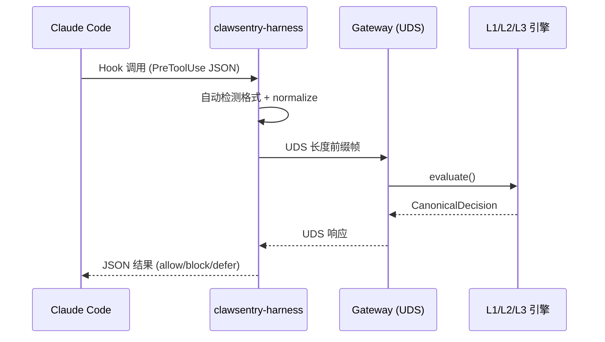

# Claude Code 集成

!!! tip "本页怎么读"
    这页面向已经使用 Claude Code 的用户。你会看到：适用场景、最短接入路径、如何验证 Hook 生效、以及如何安全卸载。

将 Claude Code AI 编码助手接入 ClawSentry，实现工具调用的实时安全监督。

---

## 概述

Claude Code 是 Anthropic 官方的 CLI 编码助手，内置 Hook 系统支持在工具调用前后注入自定义命令。ClawSentry 通过 **AHP (Agent Harness Protocol)** 协议拦截 Claude Code 的工具调用事件，由三层决策引擎（L1 规则 / L2 语义 / L3 Agent）实时评估风险并返回 allow / block / defer 判决。



### 关键架构特征

- **零侵入** — 通过 `~/.claude/settings.json` 注入 hooks，不修改 Claude Code 自身
- **阻塞 + 异步混合** — `PreToolUse` 阻塞等待决策，`PostToolUse` / `SessionStart` / `SessionEnd` 异步审计
- **双格式自动检测** — harness 自动识别 Claude Code 原生 hook JSON 与 JSON-RPC 2.0 格式
- **DEFER 超时策略** — 可配置超时后自动 block 或 allow，避免无人审批时无限阻塞

---

## 前置条件

!!! info "环境要求"
    - Python 3.11+
    - Claude Code 已安装并可运行（`claude --version`）
    - ClawSentry 已安装（`pip install clawsentry`）

```bash
# 安装 ClawSentry
pip install clawsentry

# 验证安装
clawsentry --help
which clawsentry-harness  # 确认 harness 命令在 PATH 中
```

---

## 快速开始

### 一键初始化

使用 `clawsentry init claude-code` 生成/合并项目策略；需要本机密钥或端口覆盖时，另建显式 env file：

```bash
cd your-project/
clawsentry init claude-code
```

此命令会自动：

- 生成/合并 **`.clawsentry.env.example`** — 把 `claude-code` 输出 `CS_FRAMEWORK` / `CS_ENABLED_FRAMEWORKS` 建议，不包含密钥
- 注入 hooks 到 **`~/.claude/settings.json`** — 智能合并，不覆盖已有 hooks

本机运行时值示例（可选，文件名固定为 `.clawsentry.env.local`，不要提交）：

```ini
CS_UDS_PATH=/tmp/clawsentry.sock
CS_AUTH_TOKEN = <本机安全 token>
```

!!! tip "已有配置？"
    `clawsentry init claude-code` 默认输出 env 建议并合并 managed hooks。只有明确要覆盖 managed 配置时才使用 `--force`；密钥仍请放在进程/部署环境或显式 env file。

### 启动 Gateway

```bash
# 加载环境变量
clawsentry start --env-file .clawsentry.env.local

# 启动 Gateway（监听 UDS + HTTP）
clawsentry gateway
```

启动后日志输出：

```
INFO [ahp-stack] Gateway-only starting: gateway=http://127.0.0.1:8080/ahp uds=/tmp/clawsentry.sock
```

### 正常使用 Claude Code

```bash
claude   # hooks 自动加载，所有工具调用经过 ClawSentry 评估
```

!!! success "就这么简单"
    三步完成：`clawsentry init claude-code` → `clawsentry start --env-file .clawsentry.env.local`（或使用进程环境） → `clawsentry gateway`，然后正常使用 `claude` 即可。所有工具调用自动经过安全评估。

---

## 工作原理

### Hook 注入机制

ClawSentry 在 `~/.claude/settings.json` 中注入以下 hook 配置：

```json
{
  "hooks": {
    "PreToolUse": [
      {
        "matcher": "",
        "hooks": [
          {
            "type": "command",
            "command": "clawsentry-harness --framework claude-code"
          }
        ]
      }
    ],
    "PostToolUse": [
      {
        "matcher": "",
        "hooks": [
          {
            "type": "command",
            "command": "clawsentry-harness --framework claude-code --async"
          }
        ]
      }
    ],
    "SessionStart": [
      {
        "matcher": "",
        "hooks": [
          {
            "type": "command",
            "command": "clawsentry-harness --framework claude-code --async"
          }
        ]
      }
    ],
    "SessionEnd": [
      {
        "matcher": "",
        "hooks": [
          {
            "type": "command",
            "command": "clawsentry-harness --framework claude-code --async"
          }
        ]
      }
    ]
  }
}
```

!!! note "智能合并"
    如果 `settings.json` 中已有其他 hooks（如其他工具的 hooks），ClawSentry 会**追加**而非覆盖，确保不影响已有配置。若检测到 ClawSentry hooks 已存在，则跳过该 hook 类型。

### Hook 事件类型

| Hook 类型 | 阻塞？ | `--async` | 说明 |
|-----------|:------:|:---------:|------|
| `PreToolUse` | :material-check: | 否 | **核心** — 工具执行前拦截，等待决策 |
| `PostToolUse` | :material-close: | 是 | 工具执行后异步审计，不阻塞执行 |
| `SessionStart` | :material-close: | 是 | 会话启动，异步记录 |
| `SessionEnd` | :material-close: | 是 | 会话结束，异步记录 |

!!! info "阻塞 vs 异步"
    - **阻塞事件**（`PreToolUse`）：Claude Code 等待 ClawSentry 返回判决后才执行工具。判决为 `block` 时工具调用被拒绝。
    - **异步事件**（`PostToolUse`、`SessionStart`、`SessionEnd`）：harness 使用 `--async` 标志立即返回，后台异步发送审计数据，不影响 Claude Code 执行流程。

### 通信链路

harness 通过 UDS（Unix Domain Socket）与 Gateway 通信：

1. Claude Code 触发 hook，将事件 JSON 传给 `clawsentry-harness`
2. harness 自动检测 Claude Code 原生 JSON 格式，归一化为 AHP 规范事件
3. 通过 UDS 长度前缀帧发送到 Gateway
4. Gateway 经 L1/L2/L3 决策引擎评估
5. 判决返回给 harness，再传回 Claude Code

### --async 非阻塞模式

`PostToolUse`、`SessionStart`、`SessionEnd` 等非关键 Hook 使用 `--async` 模式运行，Harness 立即返回不等待 Gateway 响应：

```bash
clawsentry-harness --framework claude-code --async
```

- **非阻塞**：后台 dispatch 到 Gateway，不影响 Claude Code 执行流
- **仅用于审计和监控事件**，不产生拦截决策
- `PreToolUse` **必须**使用同步模式以确保拦截能力

### env-first 预设

如需为当前项目保留安全预设，把 dotenv 变量写入显式 env file，并在启动时传入：

```bash title=".clawsentry.env.local"
CS_PRESET=high
CS_FRAMEWORK=claude-code
CS_ENABLED_FRAMEWORKS=claude-code
```

```bash
clawsentry start --env-file .clawsentry.env.local --framework claude-code
```

详见 [配置概览](../configuration/configuration-overview.md) 与 [配置模板](../configuration/templates.md)。

---

## 配置参考

### 核心环境变量

| 变量 | 默认值 | 说明 |
|------|--------|------|
| `CS_UDS_PATH` | `/tmp/clawsentry.sock` | Gateway UDS 套接字路径 |
| `CS_AUTH_TOKEN` | *(自动生成)* | Bearer Token 认证 |
| `CS_FRAMEWORK` | *(空)* | 旧版迁移字段；正常启用请使用 `CS_FRAMEWORK / CS_ENABLED_FRAMEWORKS` |
| `CS_DEFER_TIMEOUT_ACTION` | `block` | DEFER 超时行为：`block` 或 `allow` |
| `CS_DEFER_TIMEOUT_S` | `86400` | normal mode DEFER 软超时秒数；benchmark mode 不等待人工审批 |

### DEFER 超时策略

当某个工具调用被判定为 DEFER（需人工审批）时，ClawSentry 会等待操作员通过 `clawsentry watch --interactive` 或 Web UI 进行审批。如果在超时时间内无人响应：

=== "block（默认）"

    超时后自动阻止该操作，确保安全优先。

    ```bash
    CS_DEFER_TIMEOUT_ACTION=block
    CS_DEFER_TIMEOUT_S=86400
    ```

=== "allow"

    超时后自动放行该操作，适合低风险环境下的开发体验优先场景。

    ```bash
    CS_DEFER_TIMEOUT_ACTION=allow
    CS_DEFER_TIMEOUT_S=600
    ```

### Gateway 环境变量

| 变量 | 默认值 | 说明 |
|------|--------|------|
| `CS_HTTP_HOST` | `127.0.0.1` | HTTP 监听地址 |
| `CS_HTTP_PORT` | `8080` | HTTP 监听端口 |
| `CS_TRAJECTORY_DB_PATH` | `/tmp/clawsentry-trajectory.db` | SQLite 轨迹数据库路径 |
| `CS_RATE_LIMIT_PER_MINUTE` | `300` | 每分钟请求速率限制 |

!!! tip "更多配置"
    完整的环境变量列表请参阅 [环境变量参考](../configuration/env-vars.md)，检测管线调优请参阅 [检测管线配置](../configuration/detection-config.md)。

---

## 实时监控

### CLI 终端监控

在另一个终端窗口启动实时事件流：

```bash
# 彩色实时输出
clawsentry watch --token "$CS_AUTH_TOKEN"

# 按事件类型过滤
clawsentry watch --filter decision,alert --token "$CS_AUTH_TOKEN"

# JSON 格式输出（适合脚本处理）
clawsentry watch --json --token "$CS_AUTH_TOKEN"

# 无颜色输出（适合日志重定向）
clawsentry watch --no-color --token "$CS_AUTH_TOKEN"
```

### 交互模式处理 DEFER

```bash
clawsentry watch --interactive --token "$CS_AUTH_TOKEN"
```

!!! tip "交互模式"
    使用 `--interactive` 时，遇到 DEFER 决策会提示操作员选择：

    - ++a++ **Allow** — 放行本次操作
    - ++d++ **Deny** — 拒绝本次操作
    - ++s++ **Skip** — 跳过（让 DEFER 自然超时）

### Web 仪表板

```bash
# 在浏览器中打开
open http://127.0.0.1:8080/ui
```

仪表板提供实时决策流、会话风险雷达图、告警管理和 DEFER 审批面板。

---

## 一键启动

使用 `clawsentry start` 命令可以一步完成初始化、启动 Gateway 和监控：

```bash
# 自动检测框架并启动
clawsentry start

# 明确指定框架
clawsentry start --framework claude-code

# 启用交互式 DEFER 审批
clawsentry start --framework claude-code --interactive

# 仅启动 Gateway（不启动 watch）
clawsentry start --framework claude-code --no-watch
```

!!! note "自动检测"
    如果省略 `--framework`，ClawSentry 会自动检测：

    1. 检查 `~/.claude/settings.json` 中是否包含 ClawSentry hooks
    2. 检查当前目录 `CS_FRAMEWORK / CS_ENABLED_FRAMEWORKS` 是否启用 `claude-code`
    3. 检测到 `claude-code` 后自动使用对应配置

`clawsentry start` 的完整流程：

1. 读取或生成 `.clawsentry.env.example` 项目策略
2. 合成 CLI、进程环境、显式 env file 与项目策略
3. 后台启动 Gateway 进程
4. 等待 health check 通过
5. 前台启动 `watch` 事件流（可用 `--no-watch` 跳过）

---

## 卸载

移除 ClawSentry 对 Claude Code 的所有 hook 注入：

```bash
clawsentry init claude-code --uninstall
```

此命令会：

- 从 `~/.claude/settings.json`（及旧版 `settings.local.json`）中**精确移除** ClawSentry hooks
- 从你的 explicit env file / deployment env 中移除 `claude-code`
- 保留其他工具的 hooks 不受影响
- 保留其他框架配置和共享 `CS_AUTH_TOKEN` 不受影响
- 如果移除后 `hooks` 字段为空，自动清理该字段

!!! warning "重启生效"
    卸载后需要重启 Claude Code 才能生效。

---

## 验证集成

### 步骤 1: 确认 Gateway 启动

```bash
curl http://127.0.0.1:8080/health
```

预期响应包含：`{"status": "healthy", ...}`

### 步骤 2: 确认 hooks 已注入

```bash
# 检查 settings.json 中是否包含 ClawSentry hooks
cat ~/.claude/settings.json | python -m json.tool
```

预期输出中应包含 `clawsentry-harness` 相关的 hook 条目。

### 步骤 3: 使用配置检查工具

```bash
clawsentry doctor
```

`doctor` 命令会检查 12+ 项配置，包括 UDS 路径、Token、Gateway 可达性等，快速定位问题。

---

## 故障排查

??? question "Claude Code 启动后 hooks 未生效"
    1. 确认 `~/.claude/settings.json` 中包含 ClawSentry hooks：
       ```bash
       cat ~/.claude/settings.json
       ```
    2. 确认 `clawsentry-harness` 在 PATH 中：
       ```bash
       which clawsentry-harness
       ```
    3. 如果使用虚拟环境，确保 Claude Code 能访问该环境的 PATH

??? question "Gateway 连接被拒绝"
    1. 确认 `clawsentry gateway` 正在运行
    2. 检查 UDS 套接字是否存在：`ls -la /tmp/clawsentry.sock`
    3. 确认环境变量已加载：`echo $CS_UDS_PATH`
    4. 运行 `clawsentry doctor` 快速诊断

??? question "所有工具调用都被 block"
    1. 使用 `clawsentry watch` 查看具体决策原因
    2. 默认 L1 策略会阻止包含破坏性模式的 Bash 命令（如 `rm -rf`）
    3. 安全工具（Read、Glob、Grep）应被正常放行
    4. 检查是否触发了会话级强制策略

??? question "DEFER 超时导致操作被阻止"
    1. normal mode 默认软超时为 86400 秒（24 小时），可通过 `CS_DEFER_TIMEOUT_S` 调整；CI/benchmark 请使用 benchmark mode 避免人工等待
    2. 设置 `CS_DEFER_TIMEOUT_ACTION=allow` 可在超时后自动放行
    3. 使用 `clawsentry watch --interactive` 及时处理 DEFER 审批

??? question "harness 报 'UDS connection refused'"
    1. 确认 Gateway 已启动且 UDS 套接字路径一致
    2. harness 在 Gateway 不可达时会降级为本地决策：
        - 含 `destructive_pattern` 或 `shell_execution` 风险 → **block**
        - 其他 → **allow**（fail-open 策略）

---

## 下一步

- [核心概念](../getting-started/concepts.md) — 深入理解 AHP 协议和三层决策模型
- [检测管线配置](../configuration/detection-config.md) — 调整安全预设和检测阈值
- [策略调优](../configuration/policy-tuning.md) — 精细控制判决行为
- [Latch 集成](latch.md) — 手机端实时审批（可选增强）
- [a3s-code 集成](a3s-code.md) — 了解其他框架接入方式
