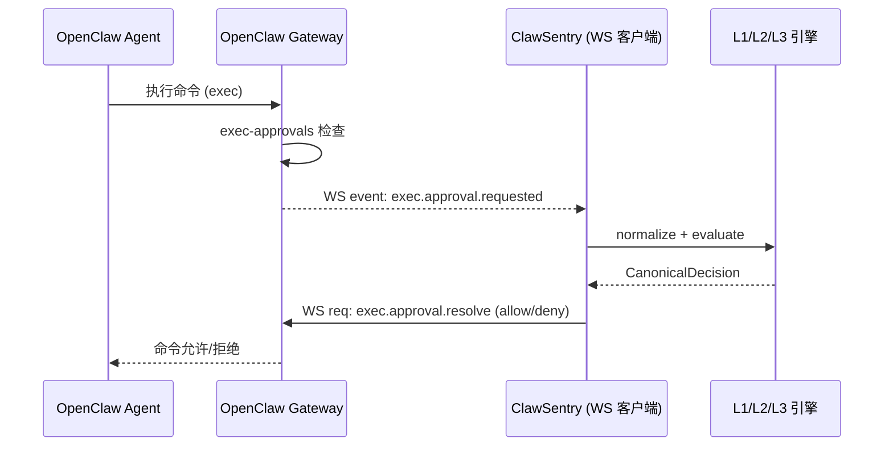

# OpenClaw 集成

!!! tip "本页怎么读"
    这页面向 OpenClaw 用户和二次开发者。先确认你使用 WebSocket、Webhook 还是审批回写，再查看 [Webhook API](../api/webhooks.md) 的 token/HMAC/idempotency 细节。

将 OpenClaw 代理框架接入 ClawSentry，实现命令执行审批的实时安全监督。

---

## 概述

OpenClaw 是一个 AI 代理框架，提供 Gateway 模式下的命令执行审批系统。ClawSentry 通过 **WebSocket** 实时连接 OpenClaw Gateway，作为 operator 客户端监听 `exec.approval.requested` 事件，经三层决策引擎评估后调用 `exec.approval.resolve` 返回 allow / deny 判决。



### 关键架构特征

- **增量级集成** — ClawSentry 不修改 OpenClaw 也能独立工作；OpenClaw 侧的配置是可选增强层
- **双向 WS 通信** — 既接收 approval 事件，也主动发送 resolve RPC
- **优雅降级** — 当 OpenClaw 不支持 `reason` 字段时，自动去除 reason 重试

---

## 前置条件

!!! info "环境要求"
    - Python 3.10+
    - ClawSentry 已安装
    - OpenClaw Gateway 已运行（Docker 或本地部署）
    - OpenClaw Gateway Token（位于 `~/.openclaw/openclaw.json`）

```bash
# 安装 ClawSentry
pip install clawsentry

# 验证安装
clawsentry --help
```

---

## 快速开始

### 一键初始化

默认初始化只生成或合并项目 `.clawsentry.toml`，不会写入密钥，也不会修改 `~/.openclaw/`：

```bash
clawsentry init openclaw --auto-detect
```

如需自动配置 OpenClaw 侧文件，显式使用 `--setup`。建议先 dry-run：

```bash
# 预览将要执行的配置变更（不修改任何文件）
clawsentry init openclaw --auto-detect --setup --dry-run

# 确认无误后，执行自动配置
clawsentry init openclaw --auto-detect --setup
```

`--setup` 执行以下操作：

| 操作 | 文件 | 变更内容 |
|------|------|----------|
| 设置执行模式 | `~/.openclaw/openclaw.json` | `tools.exec.host` → `"gateway"` |
| 设置审批策略 | `~/.openclaw/exec-approvals.json` | `security` → `"allowlist"`, `ask` → `"always"` |
| 自动备份 | `*.bak` | 修改前自动创建 `.bak` 备份文件 |

如需回退 OpenClaw 侧配置，可先预览再恢复：

```bash
# 预览将从哪些 .bak 文件恢复
clawsentry init openclaw --restore --dry-run

# 从 openclaw.json.bak / exec-approvals.json.bak 恢复
clawsentry init openclaw --restore
```

!!! note "恢复范围"
    `--restore` 只恢复 `clawsentry init openclaw --setup` 创建的备份文件，不会删除 `.clawsentry.toml` 或任何显式 env file。如果找不到 `.bak` 文件，命令只输出 warning，不会修改 OpenClaw 配置。

如只想从当前项目配置中禁用 OpenClaw，而保留其他框架和共享 token：

```bash
clawsentry init openclaw --uninstall
```

`--uninstall` 会从 `.clawsentry.toml [frameworks]` 移除 `openclaw`；它不会恢复 OpenClaw 侧配置文件，也不会删除显式 env file。需要回退 `~/.openclaw/` 变更时，请使用上面的 `--restore`。

项目策略写入 `.clawsentry.toml`，例如：

```toml
[frameworks]
enabled = ["openclaw"]
default = "openclaw"
```

本机 webhook token、认证 token 和端口覆盖放在显式 env file，例如：

```ini title=".clawsentry.env.local（不要提交）"
OPENCLAW_WEBHOOK_TOKEN=<本机生成>
CS_AUTH_TOKEN=<本机安全 token>
CS_HTTP_PORT=8080
OPENCLAW_WEBHOOK_PORT=8081
OPENCLAW_ENFORCEMENT_ENABLED=true
OPENCLAW_WS_URL=ws://127.0.0.1:18789
OPENCLAW_OPERATOR_TOKEN=<从 openclaw.json 自动读取>
```

!!! tip "自定义 OpenClaw 配置目录"
    如果 OpenClaw 配置不在默认的 `~/.openclaw/`，可以指定路径：
    ```bash
    clawsentry init openclaw --auto-detect --setup \
      --openclaw-home /path/to/openclaw/config
    ```

### 启动 Gateway

```bash
# 加载环境变量
clawsentry start --env-file .clawsentry.env.local

# 启动 Gateway（自动检测 OpenClaw 配置，启用 WS + Webhook）
clawsentry gateway
```

如果你更习惯一键启动，也可以直接在 `start` 中显式要求配置 OpenClaw 侧文件：

```bash
clawsentry start --framework openclaw --setup-openclaw

# 或和其他框架一起启用
clawsentry start --frameworks codex,openclaw --setup-openclaw --no-watch
```

默认的 `clawsentry start --framework openclaw` 仍然是无副作用模式，只会生成或合并项目 `.clawsentry.toml`。只有显式加上 `--setup-openclaw` 时，才会尝试修改 `~/.openclaw/openclaw.json` 与 `exec-approvals.json`。

当检测到 OpenClaw 配置时，日志输出：

```
INFO [ahp-stack] Full stack starting: gateway=http://127.0.0.1:8080/ahp uds=/tmp/clawsentry.sock webhook=http://127.0.0.1:8081/webhook/openclaw
INFO [openclaw-approval-client] Connected to OpenClaw Gateway at ws://127.0.0.1:18789
INFO [openclaw-approval-client] WS event listener started
```

如果没有检测到 OpenClaw 配置：

```
INFO [ahp-stack] Gateway-only starting: gateway=http://127.0.0.1:8080/ahp uds=/tmp/clawsentry.sock (no OpenClaw config detected)
```

---

## 手动配置详解

如果不使用 `--setup` 自动配置，需要手动完成以下步骤。

### 步骤 1: 配置 OpenClaw Gateway

#### openclaw.json

!!! danger "关键配置"
    `tools.exec.host` **必须**设为 `"gateway"`。默认值 `"sandbox"` 会跳过所有审批检查，命令直接执行。

编辑 `~/.openclaw/openclaw.json`：

```json
{
  "tools": {
    "exec": {
      "host": "gateway"
    }
  },
  "gateway": {
    "auth": {
      "token": "<your-gateway-token>"
    },
    "controlUi": {
      "allowedOrigins": ["http://127.0.0.1:18789"]
    }
  }
}
```

各字段说明：

| 字段 | 必须 | 说明 |
|------|:----:|------|
| `tools.exec.host` | :material-check: | 必须为 `"gateway"` — 启用审批事件广播 |
| `gateway.auth.token` | :material-check: | Gateway 认证 Token，ClawSentry 用此连接 WS |
| `gateway.controlUi.allowedOrigins` | :material-check: | WS Origin 白名单，需包含 Gateway 地址 |

!!! warning "sandbox 模式陷阱"
    `tools.exec.host` 默认为 `"sandbox"`。在 sandbox 模式下，OpenClaw 会直接在沙箱中执行命令，完全跳过 `processGatewayAllowlist()` 和审批流程。这意味着 ClawSentry 永远收不到任何事件。

#### exec-approvals.json

编辑 `~/.openclaw/exec-approvals.json`：

```json
{
  "security": "allowlist",
  "ask": "always"
}
```

| 字段 | 推荐值 | 说明 |
|------|--------|------|
| `security` | `"allowlist"` | 所有命令进入审批流程 |
| `ask` | `"always"` | 每次执行都需要审批 |

!!! warning "`security: deny` 的坑"
    如果设为 `"deny"`，OpenClaw 会在审批前直接拒绝命令，不会触发 WS 广播。ClawSentry 将无法拦截任何事件。

### 步骤 2: 配置 ClawSentry 环境变量

```bash
export OPENCLAW_WS_URL=ws://127.0.0.1:18789
export OPENCLAW_OPERATOR_TOKEN=<your-gateway-token>
export OPENCLAW_ENFORCEMENT_ENABLED=true
export CS_HTTP_PORT=8080
```

### 步骤 3: 启动服务

```bash
# 启动 ClawSentry Gateway（自动连接 OpenClaw WS）
clawsentry gateway
```

---

## 环境变量参考

### OpenClaw 连接

| 变量 | 默认值 | 说明 |
|------|--------|------|
| `OPENCLAW_WS_URL` | `ws://127.0.0.1:18789` | OpenClaw Gateway WebSocket 地址 |
| `OPENCLAW_OPERATOR_TOKEN` | *(空)* | 认证 Token（来自 `openclaw.json` 的 `gateway.auth.token`） |
| `OPENCLAW_ENFORCEMENT_ENABLED` | `false` | 启用 WS 连接和审批拦截 |

### Webhook 接收器

| 变量 | 默认值 | 说明 |
|------|--------|------|
| `OPENCLAW_WEBHOOK_TOKEN` | *(空)* | Webhook 回调认证 Token |
| `OPENCLAW_WEBHOOK_PORT` | `8081` | Webhook HTTP 接收端口 |
| `AHP_WEBHOOK_IP_WHITELIST` | *(空)* | 允许的 Webhook 来源 IP（逗号分隔） |
| `AHP_WEBHOOK_TOKEN_TTL_SECONDS` | *(空)* | Token 有效期（秒） |

### Gateway 服务

| 变量 | 默认值 | 说明 |
|------|--------|------|
| `CS_HTTP_HOST` | `127.0.0.1` | HTTP 监听地址 |
| `CS_HTTP_PORT` | `8080` | HTTP 监听端口 |
| `CS_AUTH_TOKEN` | *(空)* | Bearer Token 认证 |
| `CS_TRAJECTORY_DB_PATH` | `/tmp/clawsentry-trajectory.db` | SQLite 轨迹数据库 |

### 会话级强制策略

| 变量 | 默认值 | 说明 |
|------|--------|------|
| `AHP_SESSION_ENFORCEMENT_ENABLED` | `false` | 启用会话级强制策略 |
| `AHP_SESSION_ENFORCEMENT_THRESHOLD` | `3` | 高风险事件触发阈值 |
| `AHP_SESSION_ENFORCEMENT_ACTION` | `defer` | 触发动作：`defer` / `block` / `l3_require` |
| `AHP_SESSION_ENFORCEMENT_COOLDOWN_SECONDS` | `600` | 冷却时间（秒） |

### LLM 语义分析（可选）

| 变量 | 默认值 | 说明 |
|------|--------|------|
| `CS_LLM_PROVIDER` | *(空)* | LLM 提供商：`anthropic` / `openai` |
| `CS_LLM_BASE_URL` | *(提供商默认)* | 自定义 API 地址 |
| `CS_LLM_MODEL` | *(提供商默认)* | 模型标识符 |

---

## 状态自检

完成初始化后，可以用 `integrations status` 检查当前项目和 OpenClaw 侧状态：

```bash
clawsentry integrations status
clawsentry integrations status --json
```

其中与 OpenClaw 直接相关的诊断包括：

- `OpenClaw env`：进程环境或显式 env file 是否提供 `OPENCLAW_*` 运行时配置
- `OpenClaw restore`：`~/.openclaw/` 下是否存在可供 `--restore` 使用的 `.bak` 文件
- `OpenClaw restore files`：检测到的备份文件路径
- `framework_readiness.openclaw.checks.openclaw_exec_host_gateway`：`openclaw.json` 是否已经把 `tools.exec.host` 设为 `"gateway"`
- `framework_readiness.openclaw.checks.exec_approvals_configured`：`exec-approvals.json` 是否已经把 `security="allowlist"` 且 `ask="always"` 配好

如果项目同时启用了 Claude Code 或 Codex，状态命令还会一并显示 Claude hooks 来源文件、Codex session 目录可达性，以及统一的 `framework_readiness` verdict。`clawsentry start --frameworks ...` 的启动 banner 会复用同一份 readiness 摘要，所以你可以在启动时直接看到 OpenClaw 侧是否还缺宿主配置。

---

## 事件流详解

### WebSocket 连接参数

ClawSentry 使用以下参数连接 OpenClaw Gateway：

```python
# WebSocket 连接
ws_url = "ws://127.0.0.1:18789"
headers = {
    "Authorization": "Bearer <operator_token>",
    "Origin": "http://127.0.0.1:18789"
}

# 认证握手
connect_request = {
    "type": "req",
    "method": "connect",
    "params": {
        "minProtocol": 3,
        "maxProtocol": 3,
        "client": {
            "id": "openclaw-control-ui",    # 必须！保留 operator scope
            "version": "1.0.0",
            "platform": "linux",
            "mode": "backend"
        },
        "role": "operator",
        "scopes": ["operator.read", "operator.write", "operator.approvals"],
        "auth": {"token": "<operator_token>"}
    }
}
```

!!! danger "`client.id` 必须为 `openclaw-control-ui`"
    OpenClaw Gateway 的 `message-handler.ts` 通过 `client.id === "openclaw-control-ui"` 判定是否为 controlUi 客户端。非 controlUi 客户端在没有绑定设备时会被清空 scope，导致无法接收 approval 事件。

### 事件格式：exec.approval.requested

当 OpenClaw Agent 执行命令时，Gateway 通过 WS 广播：

```json
{
  "type": "event",
  "event": "exec.approval.requested",
  "payload": {
    "id": "approval-uuid-123",
    "request": {
      "command": "npm install express",
      "sessionKey": "session-abc",
      "agentId": "agent-001"
    }
  }
}
```

!!! note "Payload 结构注意"
    命令字段在 `payload.request.command` 而**不是** `payload.command`。会话标识在 `payload.request.sessionKey`，Agent ID 在 `payload.request.agentId`。

### 决策映射

ClawSentry 内部判决映射到 OpenClaw 审批决策：

| ClawSentry 判决 | OpenClaw 审批 | 行为 |
|----------------|---------------|------|
| `ALLOW` | `allow-once` | 允许本次命令执行 |
| `BLOCK` | `deny` | 拒绝命令执行 |
| `DEFER` | *(不发送 resolve)* | 等待人工审批或自然超时 |

### Resolve 请求格式

```json
{
  "type": "req",
  "id": "<unique-request-id>",
  "method": "exec.approval.resolve",
  "params": {
    "id": "approval-uuid-123",
    "decision": "deny",
    "reason": "L1: destructive_pattern detected"
  }
}
```

---

## DEFER 处理

当 L1/L2 引擎将事件判定为 `DEFER`（中等风险，需人工确认）时，ClawSentry 不会自动 resolve。运维人员可以通过以下方式处理：

### CLI 交互模式

```bash
clawsentry watch --interactive
```

收到 DEFER 事件时，终端提示：

```
[DEFER] session=abc command="npm install express" risk=medium
  [A]llow  [D]eny  [S]kip (timeout 30s) >
```

操作说明：

- ++a++ — 发送 `allow-once` 到 OpenClaw
- ++d++ — 发送 `deny` 到 OpenClaw
- ++s++ — 跳过，让 OpenClaw 超时自动处理

### Web 仪表板

打开 `http://127.0.0.1:8080/ui`，进入 DEFER Panel：

- 实时展示待审批的 DEFER 决策
- 每个条目显示倒计时
- 点击 **Allow** 或 **Deny** 按钮操作
- 当 OpenClaw 不可达时，显示 503 降级提示

### REST API

```bash
# 通过 API 代理 resolve（Gateway 转发到 OpenClaw WS）
curl -X POST http://127.0.0.1:8080/ahp/resolve \
  -H 'Content-Type: application/json' \
  -d '{
    "approval_id": "approval-uuid-123",
    "decision": "allow-once"
  }'
```

!!! info "503 降级"
    如果 OpenClaw WS 连接不可用，`/ahp/resolve` 返回 503 并提示无法代理。

---

## Resolve 优雅降级

OpenClaw 的 `ExecApprovalResolveParamsSchema` 使用 `additionalProperties: false` 配合 AJV 的 `removeAdditional: false`，这意味着额外的 `reason` 字段会导致请求被拒绝。

ClawSentry 的 resolve 实现了自动降级重试：

```
1. 发送 resolve（包含 reason 字段）
2. 如果 OpenClaw 返回 "additional properties" 错误
3. 自动去除 reason 字段，重新发送
4. 记录日志: "OpenClaw rejected reason field, retrying without it"
```

这确保了无论 OpenClaw 版本是否支持 reason 字段，resolve 都能正常工作。

---

## 运行时效果示例

以下示例说明 OpenClaw Gateway 接入后的典型拦截效果；发布验证细节请查看 validation / release evidence：

| 命令 | 风险等级 | 决策 | 响应时间 |
|------|---------|------|---------|
| `rm -rf /important-data` | ==high== | **BLOCK (deny)** | 57ms |
| `sudo chmod 777 /etc/passwd` | ==high== | **BLOCK (deny)** | 54ms |
| `echo hello world` | ==medium== | **DEFER** | 54ms |

!!! success "效果要点"
    - OpenClaw Agent 生成的工具调用会进入 ClawSentry 评估链路
    - 高危命令可在执行前被 deny resolve 阻止
    - Gateway 日志确认 `exec.approval.resolved` 事件被正确广播
    - L1 规则引擎的 `destructive_pattern` 检测在 sub-millisecond 内完成判决

---

## 实时监控

### SSE 事件类型

ClawSentry 通过 SSE 推送以下事件，均可在 `clawsentry watch` 或 Web 仪表板中查看：

| 事件类型 | 说明 |
|---------|------|
| `decision` | 每次决策结果（含 command、reason、risk_level） |
| `session_start` | 新会话开始 |
| `session_risk_change` | 会话风险等级变化 |
| `session_enforcement_change` | 会话强制策略触发/释放 |
| `alert` | 高危告警 |

### 监控命令

```bash
# 实时彩色输出
clawsentry watch

# 仅看 decision 和 alert
clawsentry watch --filter decision,alert

# JSON 格式（适合管道处理）
clawsentry watch --json | jq '.decision'

# SSE 原始流
curl -N http://127.0.0.1:8080/report/stream

# 带认证的 SSE（用于 EventSource）
curl -N "http://127.0.0.1:8080/report/stream?token=<your-token>"
```

### REST 查询

```bash
# 聚合统计
curl http://127.0.0.1:8080/report/summary

# 活跃会话（按风险排序）
curl http://127.0.0.1:8080/report/sessions

# 会话详情 + D1-D5 风险维度
curl http://127.0.0.1:8080/report/session/{session_id}/risk

# 告警列表
curl http://127.0.0.1:8080/report/alerts

# 确认告警
curl -X POST http://127.0.0.1:8080/report/alerts/{alert_id}/acknowledge

# 会话强制执行状态
curl http://127.0.0.1:8080/report/session/{session_id}/enforcement

# 手动释放强制执行
curl -X POST http://127.0.0.1:8080/report/session/{session_id}/enforcement \
  -H 'Content-Type: application/json' \
  -d '{"action": "release"}'
```

---

## OpenClaw Docker 部署参考

如果使用 Docker 运行 OpenClaw Gateway：

```bash
# 构建镜像（需要网络代理时加 --network=host）
DOCKER_BUILDKIT=1 docker build --network=host \
  --progress=plain -t openclaw:local -f Dockerfile .

# 启动容器
docker run -d \
  --name openclaw-gateway \
  --network host \
  --init \
  -e HOME=/home/node \
  -e OPENCLAW_GATEWAY_TOKEN=<your-token> \
  -v ~/.openclaw:/home/node/.openclaw \
  openclaw:local \
  node dist/index.js gateway \
    --bind loopback \
    --port 18789 \
    --allow-unconfigured
```

!!! note "网络模式"
    使用 `--network host` 使容器直接绑定宿主机的 `127.0.0.1:18789`，ClawSentry 可以直接通过 `ws://127.0.0.1:18789` 连接。

---

## 故障排查

??? question "WS 连接失败：scope 被清空"
    **症状**：连接成功但收不到任何 approval 事件。

    **原因**：`client.id` 不是 `openclaw-control-ui`，OpenClaw 在 `message-handler.ts:537` 清空了非 controlUi 客户端的 scope。

    **解决**：

    1. 确认环境变量配置正确 — ClawSentry 默认使用 `client.id = "openclaw-control-ui"`
    2. 确认 `gateway.controlUi.allowedOrigins` 包含了正确的 Origin 地址
    3. 检查日志中是否有 `Connected to OpenClaw Gateway` 输出

??? question "连接成功但没有 approval 事件"
    **可能原因**：

    1. **`tools.exec.host` 不是 `"gateway"`** — 这是最常见的原因。sandbox 模式完全跳过审批。
       ```bash
       # 检查当前配置
       cat ~/.openclaw/openclaw.json | python -m json.tool | grep -A2 '"exec"'
       ```

    2. **`exec-approvals.json` 配置为 `security: "deny"`** — 命令在审批前就被拒绝了。
       ```bash
       cat ~/.openclaw/exec-approvals.json
       ```
       确保设置为 `"security": "allowlist"` + `"ask": "always"`。

    3. **Agent 没有触发工具调用** — 确认 Agent 确实在执行命令。

??? question "Token 认证失败"
    **症状**：日志输出 `OpenClaw Gateway auth failed: ...`

    **解决**：

    1. 确认 `OPENCLAW_OPERATOR_TOKEN` 与 `~/.openclaw/openclaw.json` 中的 `gateway.auth.token` 一致
    2. 注意是 `gateway.auth.token`，不是旧版的 `gateway.token`
    3. 可以使用 `--setup` 自动读取：
       ```bash
       clawsentry init openclaw --auto-detect --setup
       ```

??? question "resolve 失败：additional properties 错误"
    **症状**：日志出现 `OpenClaw rejected reason field, retrying without it`

    **说明**：这是正常的降级行为。OpenClaw 的 `ExecApprovalResolveParamsSchema` 不接受 `reason` 字段，ClawSentry 自动去除后重试。resolve 仍然会成功。

    如果 resolve 完全失败，检查：

    1. Approval ID 是否仍然有效（可能已超时）
    2. WS 连接是否仍然存活
    3. 检查 OpenClaw Gateway 日志

??? question "DEFER 决策超时无人处理"
    **说明**：当 DEFER 事件没有被人工处理时，OpenClaw 会按其自身的超时策略自动处理（通常是拒绝）。

    **建议**：

    1. 使用 `clawsentry watch --interactive` 保持交互模式
    2. 或打开 Web 仪表板 `http://127.0.0.1:8080/ui` 监控 DEFER 面板
    3. 配置会话强制策略，在频繁 DEFER 后自动升级为 BLOCK：
       ```bash
       AHP_SESSION_ENFORCEMENT_ENABLED=true \
       AHP_SESSION_ENFORCEMENT_ACTION=block \
         clawsentry gateway
       ```

??? question "Gateway 检测不到 OpenClaw 配置"
    **症状**：日志输出 `Gateway-only starting ... (no OpenClaw config detected)`

    **解决**：

    1. 确认 `OPENCLAW_ENFORCEMENT_ENABLED=true` 已设置
    2. 确认 `OPENCLAW_OPERATOR_TOKEN` 不为空
    3. 确认 `OPENCLAW_WS_URL` 格式正确（如 `ws://127.0.0.1:18789`）
    4. 加载环境变量：`clawsentry start --env-file .clawsentry.env.local`

??? question "Webhook 接收器收不到事件"
    **说明**：Webhook 是补充通道。主要事件流通过 WS 实现。

    1. 确认 OpenClaw 侧配置了正确的 Webhook URL：`http://127.0.0.1:8081/webhook/openclaw`
    2. 检查 IP 白名单：`AHP_WEBHOOK_IP_WHITELIST`
    3. 检查 Token：`OPENCLAW_WEBHOOK_TOKEN`

---

## 下一步

- [核心概念](../getting-started/concepts.md) — 深入理解 AHP 协议和三层决策模型
- [检测管线配置](../configuration/detection-config.md) — 调整安全预设和检测阈值
- [DEFER 交互式审批](../cli/index.md#clawsentry-watch) — 使用 watch --interactive 处理待审批操作
- [Web 仪表板](../dashboard/index.md) — 实时 DEFER 审批面板
- [Latch 集成](latch.md) — 移动端远程审批（可选增强）
